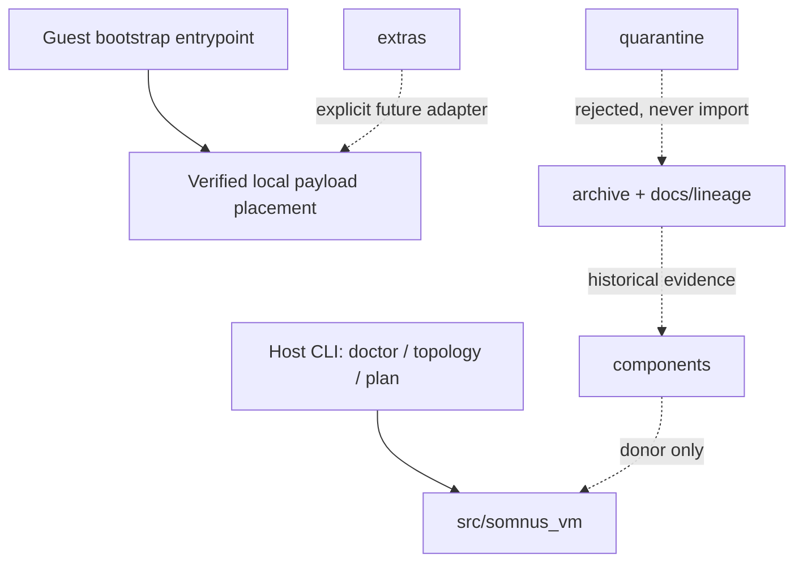

# VM Lab Current Context

**As of:** 2026-08-05
**Branch:** `main` tracking `origin/main`  
**Entry baseline commit:** `f13fb3d32364ac5d57090582c4a826fc9ec6f2b6`
**Promoted snapshot:** `v0.1`  
**Active state owner:** [`TASK.md`](TASK.md)

This is the structured index of current architecture and state. It is not the
long-range plan, raw memory, or session ledger.

---

## Current system

VM Lab currently exposes a standard-library-only Python package with:

- strict TOML configuration;
- pure VM and guest-agent contracts;
- read-only host doctor;
- machine-readable component disposition;
- bind-checked, explicitly non-reserved plan-time ports;
- deterministic shell-free, non-daemonized QEMU argv;
- a separate local-only, hash/size-bound guest bootstrap;
- a direct integration harness that proves checkout and installed-wheel use.

Public host lifecycle mutation is absent by design.

## Current boundaries

| Plane | Current authority | Future handoff |
| --- | --- | --- |
| Host | planning and preflight only | one daemon with registry/QMP ownership |
| Guest | verified payload bootstrap | authenticated agent plus optional cognition |
| Operator | preserved candidate shell | Kerminal control client |
| Artifact processing | cold external code | disposable worker plus ingress manifest |
| VM-Go | separate project | behavior compatibility contract |

## Current proof

The latest sealed run referenced by [`SOTA_RUN.md`](SOTA_RUN.md) is:

- status: pass
- checks: 13 pass, 0 fail, 0 skip
- evidence: `result.json`, `result.md`, and recorded ledger
- provenance: 33 source files preserved
- plan gate: 1,722 direct observations and eight hostile fixtures

This proves the v0.1 boundary only. It does not prove real QEMU lifecycle.

## Current physical block

The next promotion requires actual virtualization evidence. The repository must
not expose lifecycle merely because QEMU argv exists. Required future evidence
includes:

- one long-lived mutation owner;
- transactional registry and durable leases;
- owned qcow2 overlay;
- actual QEMU launch;
- QMP greeting/capabilities/UUID/status;
- authenticated guest readiness;
- graceful shutdown and crash adoption;
- restart reconciliation;
- safe snapshot/rollback with measured file hash.

The exact sequence is in [`PLAN.md`](PLAN.md) §29.

## Current repository activation

The living repository kit is rooted at:

- [`AGENTS.md`](AGENTS.md) — operator kernel and primary entry;
- [`filetree.md`](filetree.md) — navigable filesystem/dependency map;
- [`ARCHITECTURE_MAP.md`](ARCHITECTURE_MAP.md) — source traversal;
- [`TOPOLOGY.md`](TOPOLOGY.md) — invariant structure;
- [`FAILURE_GRAMMAR.md`](FAILURE_GRAMMAR.md) — pre-failure recognition;
- [`MEMORY.md`](MEMORY.md) — durable decisions and rejected paths;
- [`PROVENANCE.md`](PROVENANCE.md) — chronological lineage;
- [`STATE.md`](STATE.md) — current phase and exact unit;
- [`docs/plan-index.json`](docs/plan-index.json) — strict machine phase DAG;
- [`.sovereign/`](.sovereign/) — continuity hint and fingerprint;
- [`.github/`](.github/) — remote event enforcement;
- [`.codex/skills/vm-lab/SKILL.md`](.codex/skills/vm-lab/SKILL.md) —
  conditional Codex entry router.

P0 gate-time verification recorded 2,135 repository-integrity observations.
Final post-transition verification records 1,733 plan observations, 2,174
repository-integrity observations, and all 13 consumed checks passing in
`test/vm_lab/runs/20260805T055444Z`. `GATE-P0` is closed. The next ready unit
is the first P1 protocol composition; no daemon or lifecycle implementation is
active.

## Decision index

| Decision | Canonical detail |
| --- | --- |
| Why lifecycle is absent | [`docs/RECONSTITUTION_AUDIT.md`](docs/RECONSTITUTION_AUDIT.md) |
| Where each original file went | [`docs/MIGRATION_MAP.md`](docs/MIGRATION_MAP.md) |
| What v0.1 claims | [`SNAPSHOT.md`](SNAPSHOT.md) |
| What full SOTA requires | [`PLAN.md`](PLAN.md) |
| What cannot be misunderstood | [`TOPOLOGY.md`](TOPOLOGY.md) |
| What suspicious success looks like | [`FAILURE_GRAMMAR.md`](FAILURE_GRAMMAR.md) |
| What work is active | [`TASK.md`](TASK.md) |
| What phase is current | [`STATE.md`](STATE.md) |
| What dependencies and evidence bind it | [`docs/plan-index.json`](docs/plan-index.json) |

## Update rule

Update this file only when current architecture, promoted state, proof, or active
physical boundary changes. Routine commands and ephemeral session detail belong
elsewhere.
