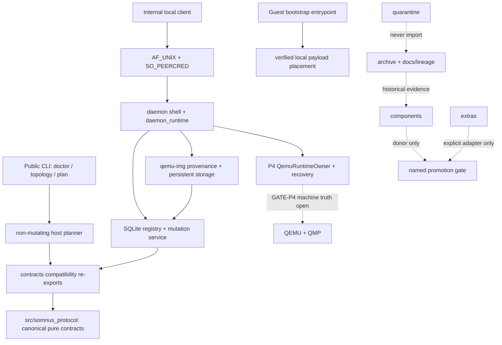

# VM Lab Context Index

> **Current-evidence correction — 2026-08-24:** Historical P3/P4 green bundles
> remain provenance, not current reproducibility. RECOVERY-R0 restored all 33
> manifest-bound source bytes from retained authority; the exact P3 fixture is
> still absent. `SOTA_RUN.md` records 36 pass / 4 fixture-only failures. Physical
> P4 execution remains blocked until fixture authority is independently
> re-established. The external `backend/virtual_machine` system is first-party
> semantic lineage only, never a live VM Lab dependency.

**Current promoted snapshot:** [`v0.1`](SNAPSHOT.md)
**Closed composition:** P1 protocol, P2 local daemon/registry, and P3 verified
image/storage authority
**Current P4 boundary:** daemon-wired internal QEMU/QMP runtime owner, launch
journal, descriptor-bound storage handoff, process/log, doctor, QMP block-graph,
recovery, one-shot disposable launch authority, and the explicit non-public
physical-gate coordinator have direct non-launch proof. All eighteen bounded
phase items are implemented. The coordinator now defines the canonical full
17-scenario matrix, isolated compact roots, strict serial execution/resume,
stop-and-preserve failure handling, and sealed aggregate validation. The valid
full-matrix execute authority, explicit production exclusions, checkpoint
matrix execution, and actual-QEMU `GATE-P4` remain open; see [`TASK.md`](TASK.md)
and [`STATE.md`](STATE.md).
**Source of current truth:** live source, direct proof, then this index.

This is a structured current-state index, not a second plan. Use
[`filetree.md`](filetree.md) to navigate and [`ARCHITECTURE_MAP.md`](ARCHITECTURE_MAP.md)
for exact source anchors.

---

## Live boundary

VM Lab is a persistent-Somnus-AIPC reference boundary with these currently
promoted capabilities:

- **Pure shared protocol:** `src/somnus_protocol/` is the canonical,
  standard-library-only authority for version negotiation, strict validation,
  VM lifecycle records/transitions/migration, guest-agent result shapes,
  control envelopes, error envelopes, and ordered events. Importing it performs
  no host, guest, operator, filesystem, socket, process, or secret work.
- **Public protocol root:** supported values and
  `ProtocolValidationError` are root-public through an exact `__all__`; a
  consumer does not import the private validation module.
- **Compatibility consumption:** `src/somnus_vm/contracts/` re-exports protocol
  types for established imports and owns no independent schema.
- **Host CLI:** `doctor`, `topology`, and non-mutating `plan` only.
- **Host planning:** strict configuration, ephemeral port availability checks,
  and deterministic shell-free QEMU argv.
- **Internal P2 control authority:** bounded AF_UNIX framing, Linux
  `SO_PEERCRED`, a private daemon listener/client, one executable composition
  root, a schema-v3 SQLite registry, serialized mutation, idempotency,
  checkpoints, and deterministic recovery.
- **Internal P3 image/storage authority:** manifest-bound `qemu-img`
  observation, one immutable base slot, independently owned sparse overlays,
  crash-safe publication/reconciliation, and a native parent-death guard.
- **Internal P4 runtime implementation:** daemon composition constructs one
  `QemuRuntimeOwner`, settles runtime launches before generic recovery/listener
  bind, and owns its frozen launch journal, exact P3 overlay/base/marker
  descriptor handoff, QMP identity/client and fdset/block-graph observers,
  process/log guards, runtime disk observation, orphan-emergency state, and
  restart recovery. A one-shot disposable launch permit binds a private marked
  fixture, exact P3 disk/base identity, six configuration roots, and explicit
  production exclusions; its canonical receipt enters the launch journal.
  The daemon exposes a Python-only activation seam unavailable to its public
  CLI and AF_UNIX request vocabulary. `host/p4_gate.py` now coordinates exact
  preflight, one-shot authorization, activation, checkpoint/recovery evidence,
  raw QMP response history, and sealed result validation. It prepares 17 isolated
  compact scenario roots (`00-success` plus every `CHECKPOINT_ORDER` case),
  requires exact checkpoint prefixes and conditional recovery evidence, seals
  successful runtime-log bytes, and enforces cleanup scope
  `runtime-process-only;fixture-retained`. `scripts/run_gate_p4.py` exposes
  `prepare-matrix`, `preflight-matrix`, and `execute-matrix` as the non-public
  driver. The deterministic execution phrase is only an accidental-execution
  fence, not authentication or proof of Daeron authority. Doctor consumes the
  selected QEMU sandbox options without launching a VM. The coordinator and
  direct P4 modules are implementation/non-launch evidence, not physical launch
  evidence.
- **Guest bootstrap:** a separate local-only, one-read hash/size-bounded payload
  installer with hostile archive checks and atomic placement.
- **Current proof:** the sealed P3 promotion bundle remains historical
  `test/vm_lab/runs/20260805T211740Z/` at 26/26. Source preservation is current
  and current focused P4 suites remain green, including real exec-guard
  processes, journal/replay, QMP transport/identity, daemon/runtime composition,
  and selected-QEMU sandbox doctor interrogation. Current aggregate
  `test/vm_lab/runs/20260905T104044Z/` is 36 pass, 4 fail, 0 skip: every failure
  is exact fixture absence. The 2026-09-05 push-trigger reviews repaired latent
  `ae0b077` plan-contract drift (§3.1 recovery items now carry in-grammar
  `BASE-014`…`BASE-018` IDs) and reframed the stale AGENTS.md §9
  "current-HEAD" framing of sealed bundle `20260807T123747Z` as the historical
  fixture-present claim it is; the pre-repair failure bundle
  `test/vm_lab/runs/20260905T101438Z/` is preserved as drift evidence. The
  historical 20260807T123747Z 40/0/0 aggregate followed then-fixture
  restoration; it is not current readiness. The exact fixture is absent from
  `/tmp`, so current matrix preflight/execution is blocked by RECOVERY-R0.
  QMP direct proof remains 14/14 and coordinator full-matrix preflight/denial
  remains 8/8 as non-launch implementation proof.
  The historical matrix identity is
  `b9aca76a-a016-4d0c-9002-f0a90f383b21`, with spec SHA-256
  `9567494af6899c1d2ce5353845950b78a087f4fcf4deb22d67db54950542a104`.
  Conservative exclusions protect the observed operator roots `/home/daeron`
  and `/media/daeron/usb-128gb`; host discovery found no deployed qcow2 or active
  VM authority to name more narrowly.

Public host lifecycle mutation remains absent by design. P1 defines its strict
evidence grammar; P2 durably owns local control and registry state; P3 creates
and reconciles only the verified base/overlay storage declared by that owner.
No current public command starts or stops a VM. P4 implementation contains the
internal launch/QMP path, but no closed gate yet establishes a disposable-QEMU
machine run, mount, guest readiness, resident-runtime deployment, or public
lifecycle capability.



| Plane | Current authority | Later physical handoff |
| --- | --- | --- |
| Shared protocol | versioned pure data/validation membrane | used by host, guest, Kerminal, and parity clients |
| Public host | read-only doctor/topology and non-mutating plan | lifecycle actions only after their physical gates |
| Internal host | one AF_UNIX daemon, schema-v3 registry/service, durable leases, verified base/overlay storage, and daemon-wired P4 runtime owner/recovery modules | physical `GATE-P4` QEMU/QMP machine truth |
| Guest | verified payload bootstrap | authenticated agent plus separately promoted runtime |
| Operator | internal control client plus preserved candidate advanced shell | Kerminal consumer; never QEMU owner |
| Artifact processing | cold external code | disposable worker plus recorded ingress manifest |
| External `backend/virtual_machine` donor | first-party read-only semantic lineage | explicit migration fixtures; never runtime import or lifecycle owner |

---

## P1 protocol composition, current truth

`src/somnus_protocol/` is now the live canonical protocol package:

| Owner | Current responsibility |
| --- | --- |
| `_validation.py` | strict exact types, closed objects, bounded JSON, immutable mappings, canonical JSON; `ProtocolValidationError` is exported by the public root |
| `version.py` | semantic versions; exact same-ID pairwise offer/transcript selection; independent current-package range and schema enforcement |
| `vm.py` | immutable definition/ports/resources/storage/image/process/snapshot/observation values; 16 states and exactly 48 evidence-keyed edges; intent/identity binding; replay-resistant history; secret-free record; exact DECLARED-only legacy v0 migration |
| `agent.py` | seven fixed endpoints and bounded `AgentHealth`, `CommandResult`, and `FileWriteResult` contracts |
| `control.py` | correlated requests/successes carrying operation-owned machine bags; registry-derived public failures with rigid diagnostic references |
| `events.py` | ordered control/lifecycle event envelope |

The protocol has explicit schema and protocol versions, rejects unknown fields
and coercion, accepts only bounded serializable values, and must not carry raw
credentials. Pairwise negotiation commits both explicit range offers and the
highest shared version, but its fingerprints detect mismatch rather than
authenticate a peer. P2 authenticates its local Unix peers with kernel
credentials and persists idempotency/replay state in SQLite; remote
cryptographic authentication remains outside the local-only boundary. Every
ordinary decoded envelope still must fit the current package's supported range
and exact schema.

`VMRecord` binds every transition to VM ID, generation, boot/process identity,
and an `intent_digest` covering declaration, planned runtime, and migration
provenance. Evidence, observation, boot, process, and error-cause identities
cannot be replayed across history. A subsequent authoritative observation of
the active process core must have a strictly later process-observation time;
equal-time reuse is rejected as false freshness. Historical v0 VM records are
migration input, not proof of their weaker `starting`/`running`/`ready` labels.
Only an exact historyless `DECLARED` record migrates; its raw token is removed,
its `legacy_v0` source and reprovision note are retained, and every stronger
legacy state is rejected for later reconciliation.

Control request `payload` and successful response `result` bags are bounded,
canonical, authenticated machine data, not public or log-safe projections.
Their operation-specific schema owns meaning and redaction. Public errors take
the opposite approach: code, category, exit class, detail, retryability,
remediation, evidence kind, and evidence summary all come from closed
registries; caller-controlled prose is absent, P1 `details` is empty, and raw
diagnostics remain behind `diag:<non-nil UUID>` identifiers. The future private
diagnostic store owns resolution and authorization; possession of the
identifier proves neither.

`src/somnus_vm/host/planner.py` now consumes the canonical secret-free immutable
record through compatibility imports. It is still a preview: ports are released,
and returned plan locations do not constitute a durable lifecycle registry.

### Current P1 direct proof owners

- `test/vm_lab/test_protocol_vm_primitives.py` — strict VM definition/ports.
- `test/vm_lab/test_protocol_agent.py` — agent endpoints/results.
- `test/vm_lab/test_protocol_control.py` — validation, pairwise negotiation,
  current-package enforcement, request/response machine bags, closed
  errors/diagnostic references, events, public exports, and cold import.
- `test/vm_lab/test_protocol_settings.py` — typed settings and profile roots.
- `test/vm_lab/test_protocol_host_consumption.py` — planner/CLI canonical-record
  consumption and no protocol secrets.
- `test/vm_lab/test_protocol_vm_lifecycle.py` — lifecycle values, all legal-edge
  evidence, intent/identity binding, equal/stale process-observation rejection,
  replay resistance, terminal/re-generation behavior, strict decode, and exact
  DECLARED-only v0 migration.
- `test/vm_lab/test_vm_lab.py` — aggregates the direct protocol checks with
  CLI/config/plan/bootstrap/doctor/wheel/document/index/source proof.

These are consumed-boundary contract and packaging checks. They do not claim a
physical VM lifecycle gate; those gates remain in [`PLAN.md`](PLAN.md).

---

## P2/P3 host composition and internal P4 runtime, current truth

The public host facade still exports only the non-mutating planner. The live
internal owner graph is:

| Owner | Closed responsibility |
| --- | --- |
| [`transport.py`](src/somnus_vm/transport.py) | bounded AF_UNIX frames and Linux peer credentials |
| [`client.py`](src/somnus_vm/client.py) | one-request identity-matched local control client |
| [`daemon.py`](src/somnus_vm/daemon.py) | private listener, exclusive endpoint ownership, authenticated bounded dispatch |
| [`daemon_runtime.py`](src/somnus_vm/daemon_runtime.py) | single composition root for daemon, registry, mutation service, and storage |
| [`registry.py`](src/somnus_vm/host/registry.py) | single-writer schema-v3 SQLite records, resources, journal, migration, and recovery state |
| [`service.py`](src/somnus_vm/host/service.py) | serialized authenticated metadata/storage mutations, checkpoints, idempotency, and replay/recovery |
| [`images.py`](src/somnus_vm/host/images.py) | strict manifests and shell-free `qemu-img` provenance/inspection primitives |
| [`storage.py`](src/somnus_vm/host/storage.py) | immutable-base and sparse-overlay publication, ownership markers, adoption rejection, and reconciliation |
| [`exec_guard.py`](src/somnus_vm/host/exec_guard.py) | Linux parent-death containment for daemon-owned native image subprocesses |
| [`launch_authority.py`](src/somnus_vm/host/launch_authority.py) | one-shot non-production fixture permit and canonical consumed receipt; no launch or mutation of its own |
| [`qemu_runtime.py`](src/somnus_vm/host/qemu_runtime.py) | one internal QEMU runtime authority: permit consumption, launch intent, process/QMP/disk observation, completion, and restart recovery |
| [`qemu_runtime_journal.py`](src/somnus_vm/host/qemu_runtime_journal.py) | frozen launch facts, disposable-authority receipt, and durable checkpoint prefix |
| [`p4_gate.py`](src/somnus_vm/host/p4_gate.py) | non-public exact preflight, launch activation, checkpoint/recovery, raw-QMP capture, and sealed physical-gate result contract |
| [`qmp.py`](src/somnus_vm/host/qmp.py) / [`qmp_identity.py`](src/somnus_vm/host/qmp_identity.py) | QMP client/framing and QMP machine-identity interpretation |
| [`qemu_process.py`](src/somnus_vm/host/qemu_process.py) / [`qemu_logs.py`](src/somnus_vm/host/qemu_logs.py) | observed process identity and guarded log capture |
| [`qemu_exec_guard.py`](src/somnus_vm/host/qemu_exec_guard.py) / [`qemu_log_guard.py`](src/somnus_vm/host/qemu_log_guard.py) | native child containment for target and log guardian |

### Current P2/P3 direct proof owners

- [`test_daemon_transport_p2.py`](test/vm_lab/test_daemon_transport_p2.py),
  [`test_registry_p2.py`](test/vm_lab/test_registry_p2.py),
  [`test_registry_service_p2.py`](test/vm_lab/test_registry_service_p2.py), and
  [`test_daemon_registry_p2.py`](test/vm_lab/test_daemon_registry_p2.py) — real Unix peers, exclusive writer
  ownership, schema/migration/integrity, concurrent processes, abrupt exit, and
  checkpoint recovery.
- [`test_storage_p3.py`](test/vm_lab/test_storage_p3.py) — six core cases including strict manifest
  authority, two independent sparse 100 GiB overlays, schema-v2-to-v3 storage
  migration, and seven base plus seven overlay kill checkpoints.
- [`test_storage_p3_adversarial.py`](test/vm_lab/test_storage_p3_adversarial.py) — eight adversarial cases covering
  foreign-image non-adoption, alias/tamper rejection, and native child
  parent-death containment.
- [`test_daemon_storage_p3.py`](test/vm_lab/test_daemon_storage_p3.py) — one real daemon/client storage
  composition and startup physical-reconciliation case.
- [`ubuntu-minimal-noble-amd64-20260801.json`](test/vm_lab/fixtures/images/ubuntu-minimal-noble-amd64-20260801.json) — pinned
  qemu-img 8.2.2 fixture manifest for SHA-256
  `b3064efb500d71d6ccbe619b1716062b803e285116e040627b430aaee14cced6`.
- [`20260805T211740Z`](test/vm_lab/runs/20260805T211740Z/) — sealed 26/26 aggregate bundle with zero
  failures and zero skips.

The focused P3 total is 15 tests: six core, eight adversarial, and one
real-daemon case. These prove internal local-control, registry, image, storage,
and recovery authority.

### Current P4 direct implementation proof owners

- [`test_p4_gate_coordinator.py`](test/vm_lab/test_p4_gate_coordinator.py) — 8/8 real-file matrix-spec/preflight, private authorization, missing-source denial, result-validation, cleanup-scope, and pre-daemon fail-closed proofs; it does not launch QEMU.
- [`scripts/run_gate_p4.py`](scripts/run_gate_p4.py) — non-public operator driver for prepare/preflight/execute/recovery/result sealing; not an installed lifecycle command.
- [`test_disposable_launch_authority_p4.py`](test/vm_lab/test_disposable_launch_authority_p4.py) — real-file private-fixture, production-exclusion, hostile-replacement, one-shot consumption, and canonical-receipt proof without QEMU launch.
- [`test_qemu_runtime_p4.py`](test/vm_lab/test_qemu_runtime_p4.py),
  [`test_daemon_runtime_p4.py`](test/vm_lab/test_daemon_runtime_p4.py), and
  [`test_qemu_runtime_journal_p4.py`](test/vm_lab/test_qemu_runtime_journal_p4.py)
  — runtime-owner, daemon composition, durable journal, and recovery behavior.
- [`test_qmp_p4.py`](test/vm_lab/test_qmp_p4.py) and
  [`test_qmp_identity_p4.py`](test/vm_lab/test_qmp_identity_p4.py) — bounded QMP
  protocol and identity evidence behavior.
- [`test_qemu_process_p4.py`](test/vm_lab/test_qemu_process_p4.py),
  [`test_qemu_logs_p4.py`](test/vm_lab/test_qemu_logs_p4.py),
  [`test_qemu_exec_guard_p4.py`](test/vm_lab/test_qemu_exec_guard_p4.py), and
  [`test_storage_runtime_p4.py`](test/vm_lab/test_storage_runtime_p4.py) —
  process, logs, target containment, and runtime-storage boundaries.
- [`test_doctor_p4.py`](test/vm_lab/test_doctor_p4.py) — selected-QEMU
  TCG/KVM sandbox option consumption plus fail-loud unavailable, rejecting,
  silent, and output-flood behavior without launching a VM.

These P4 suites are direct non-launch implementation evidence. They do not prove
a disposable QEMU launch, external QMP machine truth, mount, guest readiness,
deployment, or public lifecycle. The explicit physical-gate coordinator now exists and its non-launch matrix
proof is 8/8. It must still consume the exact source, valid full-matrix
execute authority, explicit production exclusions, and actual qemu-system
execution to drive the daemon-owned success/checkpoint matrix, raw QMP capture,
and sealed bundle; `GATE-P4` remains open.

---

## Foundational intent and two-stage AIPC delivery

[`Somnus-Core-Ideals.md`](Somnus-Core-Ideals.md) is the operator-supplied
foundational architecture source. It is governing product intent, not passive
lineage. Current code and physical evidence determine what is implemented; they
do not demote the intended architecture. Durable constraints include:

- an AIPC is a persistent full virtual computer, not a disposable execution
  container;
- durable identity, installed capabilities, learned state, model weights, and
  model-adjacent memory reside with the VM;
- disposable containers/Artifacts absorb temporary UI, research, build, and
  file-processing work, returning only approved outputs through an ingress;
- host lifecycle, guest control/runtime, operator agency, and Artifact work are
  separate authorities;
- the in-VM agent supplies authenticated control that host PID/port/QMP facts
  alone cannot infer.

Delivery stays two-stage:

1. **Install/provision the computer.** Image provenance, qcow2 ownership,
   first boot, and service activation establish the persistent AIPC. This is
   not repeated for normal runtime changes.
2. **Deploy and operate its resident runtime.** Versioned in-place guest
   payloads, weights/harness, memory, authenticated control, and optional
   modules evolve inside the established computer subject to their future gates.

The target pairs one persistent qcow2 with one resident model. No P1 code
claims exact weight-hash immutability or deployment semantics beyond that
intent; those require their own manifest/binding authority. The immediate
architecture is explicitly plural, not a one-model-does-everything claim:

```text
resident model + Advanced Kerminal/model harness
    -> ASPS cognitive workspace <-> memory core + memory interconnect

ACE: separate OS-agency pillar (filesystem, login, operational literacy)
system cache: parallel result/cache infrastructure
digital twin: operations continuity
advanced shell: human + narrower model Master Control Panel
```

ACE is not a mediator between the two memory owners and cache is not model-near
cognition. `components/guest/runtime/` and `components/operator/` preserve the
relevant source as candidates. `components/operator/ai_advanced_shell.py` is
high-value Kerminal lineage but cannot acquire host lifecycle ownership;
`internal_browser.py`, `web_search_research.py`, and git integration remain
distinct candidate tool lanes until actual consumer evidence calls for adapters.

The configurable capability membrane, credential transition, resident deployment
manifest, Artifact ingress result format, and remote full-parity boundary remain
open design work. They are recorded as questions, not silently automated
behavior. Use [`NOTEPAD.md`](NOTEPAD.md) for active observations and move a
resolved decision into its named contract/plan/ADR owner.

---

## Physical gate boundary

The repository must not expose lifecycle merely because QEMU argv or protocol
types exist. P2 and P3 now establish one long-lived mutation owner, a
transactional registry with durable leases, and owned qcow2 base/overlay
storage with verified backing lineage. All bounded P4 phase items exist, and
the launch boundary now requires a typed disposable permit, but `GATE-P4` still
requires its explicit coordinator plus a disposable machine run whose external
truth includes:

- actual QEMU launch and process identity;
- QMP greeting, capabilities, UUID, status, root disk, fdsets, named nodes, and
  recursive block-graph edges as actually emitted by QEMU 8.2.2;
- retained serial and QEMU output;
- daemon termination at each launch checkpoint with exact child adoption or
  cleanup and no foreign-process signal.

Authenticated guest readiness, durable networking, snapshot/rollback, and
public lifecycle commands remain later named phases and gates.

The exact phase/gate order is [`PLAN.md`](PLAN.md). Closed P2/P3 authority must
not be inflated into satisfaction of P4 QEMU/QMP, later guest, snapshot, or
public lifecycle gates.

---

## Navigation and update rule

- [`AGENTS.md`](AGENTS.md) — execution kernel and authority.
- [`filetree.md`](filetree.md) — semantic dependency/navigation map.
- [`ARCHITECTURE_MAP.md`](ARCHITECTURE_MAP.md) — question-to-owner anchors.
- [`TOPOLOGY.md`](TOPOLOGY.md) — load-bearing invariants and anti-concepts.
- [`FAILURE_GRAMMAR.md`](FAILURE_GRAMMAR.md) — false-success recognition.
- [`TASK.md`](TASK.md), [`STATE.md`](STATE.md), and
  [`docs/plan-index.json`](docs/plan-index.json) — active unit and gates.
- [`tree-codebase.md`](docs/old-filetrees/tree-codebase.md) — point-in-time file inventory only.

Update this index when promoted authority, actual consumption, proof boundary,
or physical boundary changes. Do not use it to mark phases or gates complete;
that authority remains with the active task, plan index, and evidence owners.
