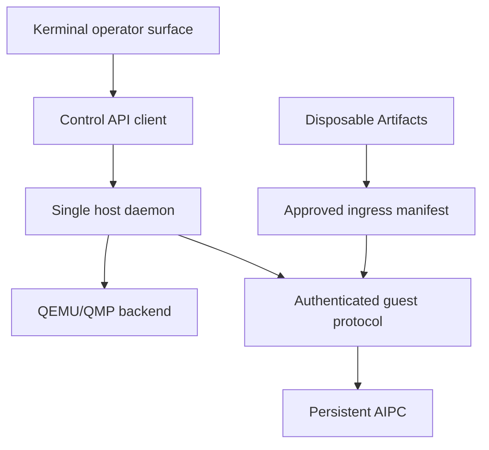
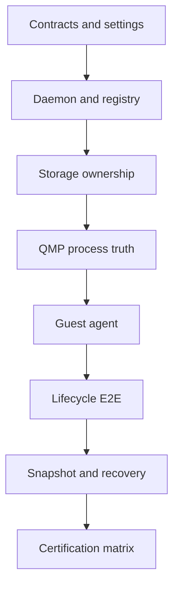

<div align="center">
<svg width="900" height="196" viewBox="0 0 900 196" xmlns="http://www.w3.org/2000/svg">
  <defs>
    <linearGradient id="planGrad" x1="0%" y1="0%" x2="100%" y2="100%">
      <stop offset="0%" style="stop-color:#4ecdc4;stop-opacity:1" />
      <stop offset="48%" style="stop-color:#667eea;stop-opacity:1" />
      <stop offset="100%" style="stop-color:#f093fb;stop-opacity:1" />
    </linearGradient>
    <filter id="planGlow">
      <feGaussianBlur stdDeviation="2.7" result="blur"/>
      <feMerge><feMergeNode in="blur"/><feMergeNode in="SourceGraphic"/></feMerge>
    </filter>
  </defs>
  <rect width="900" height="196" fill="#0d1117" rx="20"/>
  <rect x="14" y="14" width="872" height="168" fill="none" stroke="url(#planGrad)" stroke-width="1.2" rx="16" opacity="0.62"/>
  <text x="450" y="83" font-family="monospace" font-size="39" fill="url(#planGrad)" text-anchor="middle" filter="url(#planGlow)" font-weight="bold">VM LAB: FULL SOTA PLAN</text>
  <text x="450" y="122" font-family="monospace" font-size="15" fill="#c9d1d9" text-anchor="middle">execution authority, physical gates, no synthetic success</text>
  <text x="450" y="151" font-family="monospace" font-size="11" fill="#8b949e" text-anchor="middle">AIPC body · VM lifecycle control · guest protocol · operator integration</text>
</svg>
</div>

# Full SOTA Execution Plan

> **Planning stack:** this file owns the complete destination and physical
> gates. [`TASK.md`](TASK.md) owns exactly one current execution unit;
> [`CONTEXT.md`](CONTEXT.md) indexes current state; [`PROVENANCE.md`](PROVENANCE.md)
> records chronological decisions. Do not duplicate the phase plan into those
> files.
>
> **Current active unit:** [`TASK-P4-020`](TASK.md) — execute the disposable
> GATE-P4 QEMU/QMP matrix. RECOVERY-R0 is closed; P3 remains a sealed
> historical gate. No VM is running and no public lifecycle command is
> promoted.

## 0. Document contract

This file is the execution authority for taking the reorganized VM lab from the verified v0.1 boundary to a production-grade experimental Python VM backend. I use `SCOPE.md` to define the current change, `STATE.md` to record live work once implementation resumes, and this file to preserve the complete destination and critical path.

Future Codex Operators must read these files in this order before editing:

1. `PLAN.md`
2. `SCOPE.md`
3. `README.md`
4. `docs/RECONSTITUTION_AUDIT.md`
5. `docs/MIGRATION_MAP.md`
6. `SNAPSHOT.md`
7. `SOTA_RUN.md`
8. the latest `test/vm_lab/runs/<timestamp>/result.{json,md,log}` bundle

The rules for using this plan are strict:

- `[x]` means the repository contains proof, not that the code merely exists.
- `[ ]` means unpromoted even when a candidate implementation exists elsewhere in the tree.
- A phase closes only when its gate passes and its JSON, Markdown, and terminal-log evidence is sealed.
- A failed gate leaves the capability absent from the public CLI.
- A future Operator may split a phase into smaller scopes, but may not silently weaken its gate.
- A future Operator may supersede a design choice only by recording the replacement, reason, migration, and new proof in this file and the snapshot manifest.
- `archive/`, `components/`, `extras/`, and `quarantine/` are evidence and donor-code zones. Nothing there is live by path alone.
- No command may report success for a simulated operation, a logged command, a sleeping benchmark, or an unverified child process.

## 1. Mission

I am building an honest control plane for a persistent Somnus AIPC: a full virtual computer whose disk, identity, state, guest services, and recovery history survive the host process that controls it. The Python lab is an experimental backend and reference implementation. Its first-party semantic donor is the external `backend/virtual_machine` system, which supplies product intent and migration constraints only; it is never a runtime dependency, source-copy target, or competing lifecycle owner. This lab earns any successor role only through measured consumed-boundary proof.

Full SOTA means the system can prove this lifecycle on real virtualization hardware:

`declare -> provision -> start -> QMP verified -> guest ready -> execute -> write -> quiesce -> snapshot -> mutate -> rollback -> verify -> graceful stop -> supervisor restart -> reconcile -> explicit destroy`

Full SOTA does not mean:

- collecting every historical Somnus module under one package;
- turning the AIPC into a disposable container;
- rebuilding the operating system for every guest-runtime update;
- importing Kerminal into the hypervisor process;
- importing cognitive memory into host lifecycle control;
- treating a QEMU PID, socket pathname, HTTP connection, or zero exit code as sufficient proof by itself;
- advertising hot scaling, live rollback, image building, or collaboration before those paths physically work.

## 2. Non-negotiable architecture invariants

These invariants outrank convenience and implementation reuse.

- [ ] `INV-001` The AIPC is a persistent full computer, not an Artifact container. Its baseline virtual disk target is approximately 100 GB unless a profile explicitly chooses another size.
- [ ] `INV-002` Runtime payloads update in place through a versioned guest deployment path. Normal updates do not reinstall the guest operating system.
- [ ] `INV-003` The normal policy permits one active AIPC. Multi-VM correctness is still required so ports, state, and storage never collide, but a warm pool is a later explicit policy.
- [ ] `INV-004` The external `backend/virtual_machine` donor remains first-party read-only lineage. This lab may recover its AIPC/operator semantics through named contracts, but may not import, overwrite, or silently reinterpret donor code as live authority.
- [ ] `INV-005` Kerminal remains the agency and operator surface. It calls a control API and never constructs or owns QEMU processes.
- [ ] `INV-006` Artifact processors remain outside the qcow2. They are disposable external execution and security workers for inbound or outbound files.
- [ ] `INV-007` The host control plane never imports guest cognition, prompt, memory, model, browser, or file-processing implementations during boot.
- [ ] `INV-008` The guest never imports host hypervisor, registry, QMP, image-builder, or port-allocation code.
- [ ] `INV-009` Exactly one long-lived mutation owner controls the registry, persistent port leases, QEMU processes, and state transitions.
- [ ] `INV-010` Shared protocol code is pure, dependency-light, serializable, versioned, and side-effect free.
- [ ] `INV-011` Local-first operation is the default. Cloud APIs and external credentials are not prerequisites for boot, lifecycle, or guest control.
- [ ] `INV-012` Every destructive action resolves an exact VM identity and exact owned resources before mutation.
- [ ] `INV-013` Every public success state is derived from observed external truth, not an intended command.
- [ ] `INV-014` Every error remains inspectable through structured state, logs, and remediation text without leaking secrets.
- [ ] `INV-015` Quarantine is one-way until a replacement passes the current phase gate. Moving a file is not promotion.

## 3. Current verified baseline

The v0.1 reconstitution is the floor. These items must keep passing throughout all later phases.

- [x] `BASE-001` Current source preservation is exact: all 33 recorded source files match their authoritative bytes. RECOVERY-R0 restored the manifest-bound browser bytes from matching retained local archives and original Git evidence.
- [x] `BASE-002` `src/somnus_vm` is an isolated, installable, standard-library-only package.
- [x] `BASE-003` `python -m somnus_vm doctor` performs read-only host preflight and fails honestly when metal is absent.
- [x] `BASE-004` `python -m somnus_vm topology` reports live, candidate, cold, lineage, and quarantine placement.
- [x] `BASE-005` `python -m somnus_vm plan` emits shell-free, non-daemonized, JSON-blockdev QEMU argv with localhost forwarding.
- [x] `BASE-006` Plan-time ports are explicitly reported as bind-checked and non-reserved.
- [x] `BASE-007` QMP Unix-socket path length and delimiter constraints are validated before plan emission.
- [x] `BASE-008` Guest bootstrap accepts local hash-and-size-bound payloads only and stages them atomically.
- [x] `BASE-009` ZIP and TAR extraction reject traversal, links, devices, duplicates, collisions, and undeclared expansion.
- [x] `BASE-010` Bootstrap copies each source into a private verified area while hashing and never reopens the untrusted source for installation.
- [x] `BASE-011` The wheel runs outside the source checkout.
- [x] `BASE-012` The direct-Python integration harness emits JSON, Markdown, and full log evidence plus `SOTA_RUN.md`.
- [x] `BASE-013` Lifecycle, snapshots, resource scaling, image building, guest agent, cognitive runtime, shell, and file processing remain absent from the promoted CLI.

### 3.1 RECOVERY-R0 — current evidence authority (blocks P4 execution)

**Status:** closed. Source preservation and exact fixture authority are current.
This is not a new promoted phase and does not reopen the sealed historical P3
gate. Physical P4 execution, public lifecycle promotion, source-manifest
rebaselining, and fixture substitution remain prohibited until `GATE-P4`.
Sequence items use `BASE` family IDs (`BASE-014`…`BASE-018`): current evidence
authority is §3 floor truth, not a promoted phase with its own gate. The
original `RECOVERY-R0-00x` item IDs were outside the closed plan-contract
grammar; sealed bundle `test/vm_lab/runs/20260905T101438Z/` preserves that
failure evidence.

**Observed starting state before source repair (2026-08-24):**

- `SOTA_RUN.md` names `test/vm_lab/runs/20260825T011700Z/`: 35 pass, 5 fail.
  The P3 core/adversarial/daemon lanes and P4 runtime-storage lane fail because
  `/tmp/vm-lab-p3-fixture-20260801.qcow2` is absent; the source-manifest lane
  fails independently.
- The manifest requires a regular private fixture with exact size
  264,306,688 bytes and SHA-256
  `b3064efb500d71d6ccbe619b1716062b803e285116e040627b430aaee14cced6`.
  A newer image, a rebuilt qcow2, or a merely bootable image is not equivalent.
- Of 33 source-manifest entries, `components/operator/native_tools/internal_browser.py`
  is the only current mismatch: the manifest names `d27779…cf644e`; the tracked
  current blob is `198917…29a81`. The original reconstitution commit
  `0c1383d6c4e634689d99871a11952471d569bafe` contains a blob matching the
  manifest, while later commit `6aa1357baa82b645299140d4cf27c32f305b449c`
  changed that artifact without changing the manifest. Neither fact authorizes
  an automatic restore or manifest rewrite.

**Source authority resolution (2026-08-24):** two independent retained local
archives (`archive/vm-lab-first-zip.zip` and
`/home/daeron/Downloads/vm_lab_reorganized.zip`) and original Git blob
`0c1383d6c4e634689d99871a11952471d569bafe` all contain the manifest-bound
`d27779…cf644e` bytes. The divergent `198917…29a81` bytes remain preserved in
later Git history and the current `vm-lab.zip`. The live preserved artifact was
atomically restored to the manifest-bound bytes; the repository verifier and
current smoke source-manifest lane now pass. Fresh aggregate
`20260825T043503Z` is 36 pass / 4 fail; every remaining failure is exact fixture
absence. This resolves source authority, not fixture authority or the physical
P4 gate.

**Required sequence:**

- [x] `BASE-014` Freeze P4 matrix execution and public promotion; retain
  the failed `20260825T011700Z` bundle unchanged as current failure evidence.
- [x] `BASE-015` Establish source-preservation authority from an
  authenticated `vm_lab.zip` matching the declared archive SHA-256
  `63f698f7af3ce989de8885a3b3b68b7214dedbffb1ac6671636b1f5d13829f94`, or
  explicitly decide whether the matching original Git blob is sufficient
  first-party recovery authority. Stage and compare bytes before any mutation.
- [x] `BASE-016` If the authoritative original is `d27779…cf644e`,
  restore those exact bytes atomically while preserving the displaced
  `198917…29a81` commit evidence. If the authoritative original is
  `198917…29a81`, prove the manifest transcription defect before changing the
  manifest. Any third result halts for provenance reconciliation.
- [x] `BASE-017` Acquire only a declared-origin or separately
  authenticated byte-identical fixture. Require canonical regular-file,
  private mode/owner, size, hash, and P3 identity checks; do not download,
  synthesize, or substitute an image merely to unblock tests.
  Evidence: Canonical `SHA256SUMS` for
  `ubuntu-24.04-minimal-cloudimg-amd64.img` at
  `release-20260801` equals repository SHA-256
  `b3064efb500d71d6ccbe619b1716062b803e285116e040627b430aaee14cced6`; host file
  `/tmp/vm-lab-p3-fixture-20260801.qcow2` is regular, mode `0600`, uid 1000,
  nlink 1, size 264,306,688.
- [x] `BASE-018` Run the existing structural verifier and all
  fixture-dependent P3/P4 owners. Publish a fresh result bundle. Only that
  bundle may correct task/state/provenance claims; RECOVERY-R0 never closes
  the P4 physical gate.
  Evidence: `test/vm_lab/runs/20260905T111215Z/result.json` — 40 pass, 0 fail,
  0 skip.

**Hard bans:** do not rebaseline a hash without source authority; do not copy a
file from the external donor tree; do not remove failed evidence; do not skip or
weaken fixture checks; do not invoke the P4 execute-matrix driver during this
packet.

## 4. Full-SOTA definition of done

The project reaches full SOTA only when every item in this section is backed by a sealed run.

### 4.1 Control-plane truth

- [ ] `DONE-001` One daemon owns all lifecycle mutations and survives independent CLI invocations.
- [ ] `DONE-002` Registry transactions cannot lose updates or duplicate a VM name, VM ID, disk, QMP socket, or host port.
- [ ] `DONE-003` QEMU identity is verified through QMP UUID/status plus recorded process identity, not `kill(pid, 0)` alone.
- [ ] `DONE-004` A supervisor crash at every lifecycle checkpoint leaves either an adoptable VM or deterministic cleanup evidence.
- [ ] `DONE-005` Normal stop uses guest shutdown or QMP ACPI and waits for a clean exit. Force kill is a separate explicit command.
- [ ] `DONE-006` Restart reconciliation distinguishes running, stopped, crashed, foreign, stale, and orphaned processes without signaling unrelated PIDs.

### 4.2 Persistent AIPC storage

- [ ] `DONE-007` A verified immutable base image creates an owned per-AIPC qcow2 overlay with an approximately 100 GB virtual capacity by default.
- [ ] `DONE-008` Every disk has one owner record and every owner record has one active disk generation.
- [ ] `DONE-009` Snapshot creation switches the active block graph correctly and records the complete backing chain.
- [ ] `DONE-010` Rollback restores a measured guest file hash without copying a child image over its backing file.
- [ ] `DONE-011` Partial create, snapshot, rollback, or destroy failures leave no ambiguous disk ownership.

### 4.3 Authenticated guest control

- [ ] `DONE-012` A per-VM secret is provisioned into the guest with mode `0600` and never appears in plan output, logs, process argv, or registry exports.
- [ ] `DONE-013` Host readiness requires authenticated protocol, VM ID, boot ID, and protocol-version agreement.
- [ ] `DONE-014` Command execution accepts argv, never a shell string, and enforces timeout, output, environment, cwd, and privilege bounds.
- [ ] `DONE-015` File writes are bounded, hashed, path-confined, atomic, and read back for verification.
- [ ] `DONE-016` Guest quiesce and resume participate in snapshot gates.

### 4.4 Boundary integrity

- [ ] `DONE-017` Kerminal reaches the VM only through a stable control-plane client and does not instantiate QEMU.
- [ ] `DONE-018` Guest cognitive modules load only inside the AIPC and remain optional to basic agent readiness.
- [ ] `DONE-019` Artifact file processing runs outside the AIPC and transfers only approved outputs through a recorded ingress manifest.
- [ ] `DONE-020` Donor-semantic compatibility is measured through explicit migration fixtures and consumed behavior without merging repositories or importing donor modules.

### 4.5 Certification evidence

- [ ] `DONE-021` Contract, protocol, package, concurrency, recovery, lifecycle, snapshot, security, and destructive failure suites all pass.
- [ ] `DONE-022` At least one TCG run and one KVM run record real QEMU, kernel, image, and hardware facts.
- [ ] `DONE-023` Every run emits `result.json`, `result.md`, and `result.log`; the latest ledger matches the machine payload.
- [ ] `DONE-024` No mock library, sleep benchmark, broad exception, unbounded response, plaintext default credential, or false-success fallback exists in the live tree.
- [ ] `DONE-025` Wheel installation, console entrypoints, packaged defaults, schema migration, and clean uninstall are proven outside the checkout.
- [ ] `DONE-026` Documentation describes only currently promoted commands and links every unpromoted claim to its gate.
- [ ] `DONE-027` The release snapshot hash, source manifest, migration map, and provenance all agree.

## 5. Target topology



The target package layout is:

```text
src/
  somnus_protocol/
    vm.py
    agent.py
    control.py
    events.py
    version.py
  somnus_vm/
    __main__.py
    cli.py
    config.py
    doctor.py
    topology.py
    client.py
    daemon.py
    host/
      control_plane.py
      supervisor.py
      registry.py
      ownership.py
      recovery.py
      agent_client.py
      qemu/
        command.py
        qmp.py
        process.py
        ports.py
        network.py
        storage.py
        snapshots.py
        images.py
        resources.py
  somnus_guest/
    __main__.py
    bootstrap.py
    installer.py
    agent/
      app.py
      auth.py
      execution.py
      files.py
      health.py
      monitor.py
      quiesce.py
    runtime/
      memory.py
      memory_index.py
      cache.py
      prompts.py
      ace.py
integrations/
  kerminal/
    control_contract.md
  vmgo/
    compatibility_contract.md
extras/
  file_processing/
    contracts.py
    service.py
    processors/
    legacy/
```

Ownership is exact:

| Authority | Owns | Must never own |
| --- | --- | --- |
| `somnus_protocol` | schemas, endpoint names, versions, result envelopes | files, sockets, processes, secrets |
| host daemon | registry, leases, QEMU, QMP, lifecycle, owned disks | cognition, shell sessions, Artifact execution |
| guest agent | authenticated guest control and health | host process state, port allocation, image ownership |
| guest runtime | memory, prompts, ACE, model-facing services | host lifecycle or Artifact policy |
| Kerminal | human/Operator agency and command routing | direct QEMU ownership |
| Artifacts | disposable file inspection and execution | AIPC identity or persistent VM state |

## 6. Execution doctrine

- [ ] `EXEC-001` Create `STATE.md` when implementation resumes. Record active phase, exact unit, last command, current blocker, next action, and dirty files.
- [ ] `EXEC-002` Declare `WRAP`, `EDIT`, or `COMPOSE` in `SCOPE.md` before each implementation unit.
- [ ] `EXEC-003` Work one class or one function at a time and close its direct fixture before opening the next unit.
- [ ] `EXEC-004` Keep live changes inside the declared phase. Record unrelated defects in this plan rather than folding them into the current diff.
- [ ] `EXEC-005` Use domain-specific exceptions and structured result objects. No raw traceback reaches the CLI or control API.
- [ ] `EXEC-006` Use real local sockets, SQLite files, archives, subprocesses, and QEMU fixtures. Do not use mock or response-stubbing libraries.
- [ ] `EXEC-007` Run fail-loud-still-continue orchestration so a failed subsystem does not hide later failures.
- [ ] `EXEC-008` Record exact command, stdout, stderr, duration, environment facts, and artifact hashes in every physical gate.
- [ ] `EXEC-009` Preserve old code in lineage until its replacement passes. Delete only generated residue or explicitly retired duplicates.
- [ ] `EXEC-010` Recompute snapshot and archive hashes after the last write, not before.

## 7. Critical path and releases



| Milestone | Meaning | Promotion boundary |
| --- | --- | --- |
| v0.1 | reconstitution baseline | doctor, topology, plan, local bootstrap |
| v0.2 | single-owner foundation | daemon, SQLite registry, durable leases, no QEMU start yet |
| v0.3 | first physically verified boot | QMP identity, owned overlay, serial evidence |
| v0.4 | authenticated AIPC lifecycle | readiness, command, file, graceful stop, reconciliation |
| v0.5 | storage recovery | quiesced snapshot, rollback, crash recovery, destructive gates |
| v0.6 | ecosystem bridges | Kerminal client, donor-semantic migration fixtures, Artifact ingress |
| v1.0 | certified reference backend | full matrix, final disposition, release packaging, complete evidence |

The stable phase IDs are not the final execution order at the release boundary.
`P18` closes source disposition before `P17` performs the final release seal:

`P0 -> P1 -> ... -> P16 -> P18 -> P17`

## 8. Phase P0 — lock the execution baseline

### Required work

- [x] `P0-001` Add `STATE.md` with the execution fields defined by `EXEC-001`.
- [x] `P0-002` Add a machine-readable `docs/plan-index.json` mapping every phase ID to owner files, dependencies, gate, and status.
- [x] `P0-003` Teach the smoke harness to reject duplicate plan IDs, missing dependencies, missing gates, and completed items without evidence paths.
- [x] `P0-004` Add a `docs/decisions/` directory for short architecture decision records. Start with daemon ownership, SQLite registry, guest package split, and stopped-VM rollback.
- [x] `P0-005` Record the real target platforms: Linux x86_64 KVM, Linux x86_64 TCG, Python 3.12+, QEMU capabilities used, and qcow2 feature expectations.
- [x] `P0-006` Create an explicit disposable-fixture policy. Physical tests may never point at the operator's production AIPC disk.
- [x] `P0-007` Lock the one-active-AIPC configuration contract and document how test fixtures opt into multiple disposable VMs; P1 implements the typed setting before lifecycle mutation exists.
- [x] `P0-008` Define release exit codes and machine-readable error envelopes before mutation commands exist; P1 implements the shared protocol types.

### Gate P0

- [x] `GATE-P0` A direct plan-validation run proves unique IDs, complete dependency references, an explicit gate for every phase, one current phase, and zero falsely completed physical capabilities.

Gate evidence: [`test/vm_lab/runs/20260805T054841Z/result.json`](test/vm_lab/runs/20260805T054841Z/result.json)
records 13 passes, including 1,722 live plan observations and eight hostile
fixture rejections, with zero failures or skips.

## 9. Phase P1 — canonical protocols, states, and settings

### Shared protocol package

- [x] `P1-001` Extract pure shared contracts from `somnus_vm.contracts` into `somnus_protocol` without host or guest imports.
- [x] `P1-002` Add an explicit protocol semantic version and negotiation rules.
- [x] `P1-003` Add request IDs, correlation IDs, VM IDs, boot IDs, generation numbers, and timestamps to all control envelopes.
- [x] `P1-004` Define bounded error envelopes with closed machine codes, registry-derived human detail/retry/remediation, and diagnostic references.
- [x] `P1-005` Define canonical resource specifications, storage references, process identity, image provenance, snapshots, and runtime observations.
- [x] `P1-006` Define canonical JSON-compatible mappings and deterministic wire JSON, rejecting unknown fields where they could hide operator intent.
- [x] `P1-007` Add schema-version migrations and fail-loud behavior for future or corrupt records.

### Lifecycle state machine

- [x] `P1-008` Replace the minimal state set with states that distinguish declaration, provisioning, booting, QMP-running, guest-ready, quiescing, snapshotting, rollback, stopping, stopped, error, and destroyed.
- [x] `P1-009` Define legal transitions in one table and attach required evidence to each transition.
- [x] `P1-010` Make repeated stop, reconcile, readiness, and recovery operations idempotent where appropriate.
- [x] `P1-011` Require an error code and causal record for every transition to `ERROR`.
- [x] `P1-012` Prevent `DESTROYED` records from re-entering active states; restoration creates a new generation or new VM ID.

### Settings

- [x] `P1-013` Split host, daemon, storage, network, agent, security, and policy settings into typed dataclasses.
- [x] `P1-014` Reject unknown TOML keys, truthy non-booleans, control characters, ambiguous QEMU delimiters, unsafe socket paths, and overlapping directories.
- [x] `P1-015` Make installed defaults available through `importlib.resources` or generated per-user configuration without checkout assumptions.
- [x] `P1-016` Define `lab-tcg`, `host-kvm`, and constrained-host profiles without embedding machine-specific paths.
- [x] `P1-017` Add `max_active_vms = 1` as the normal policy and separate it from the correctness of multi-VM allocation.
- [x] `P1-018` Keep secrets out of TOML. Configuration references secret locations or provisioning mechanisms only.
- [x] `P1-019` Validate that state, runtime, image, backup, and log roots are not aliases or unsafe descendants of one another.

### Gate P1

- [x] `GATE-P1` Contract tests round-trip every schema, reject every illegal transition and unknown field, migrate the previous supported schema, and prove zero host or guest side effects during import.

Gate evidence:
[`test/vm_lab/runs/20260805T182129Z/result.json`](test/vm_lab/runs/20260805T182129Z/result.json)
records 19 passes with zero failures or skips, including twelve canonical VM
schemas, sixteen states, forty-eight exact lifecycle edges, strict control,
agent, and settings contracts, real planner/CLI consumption, and an installed
wheel outside the checkout. Independent Terra re-audits found and then
re-probed closed boundaries for wire-size symmetry, public errors, timestamp
normalization, transcript commitment, lifecycle replay, migration provenance,
and process-observation freshness. No daemon, lifecycle mutation, or physical
VM capability was promoted.

## 10. Phase P2 — one daemon, transactional registry, and ownership

### Long-lived owner

- [x] `P2-001` Add `somnus-vm-daemon` as the only mutation-capable process.
- [x] `P2-002` Keep CLI `doctor`, `topology`, and `plan` usable without the
  daemon; provide one Unix-socket client that future lifecycle commands must
  use only after their physical gates pass.
- [x] `P2-003` Refuse UID 0, require an unprivileged deployment identity, and
  create/validate the daemon runtime tree as private. Host account creation and
  service activation remain Daeron-owned deployment actions rather than a
  repository side effect.
- [x] `P2-004` Authenticate local control clients through mode-`0600`
  Unix-socket ownership and Linux `SO_PEERCRED`.
- [x] `P2-005` Ensure the daemon constructs exactly one registry/service
  authority. It constructs no QEMU supervisor before P4; when that owner is
  introduced, this composition root is its only permitted constructor.

### SQLite registry

- [x] `P2-006` Implement a stdlib SQLite registry with explicit schema versioning and migrations.
- [x] `P2-007` Store VM records, lifecycle events, port leases, disk ownership, snapshots, process identities, and idempotency requests in normalized tables.
- [x] `P2-008` Use transactions spanning record load, ownership checks, lease allocation, storage mutation intent, and state update.
- [x] `P2-009` Add unique constraints for VM ID, normalized name, active disk path, QMP socket, SSH port, agent port, and display endpoint.
- [x] `P2-010` Use foreign keys and deletion restrictions so a disk or snapshot cannot outlive its ownership record invisibly.
- [x] `P2-011` Use WAL only after measuring filesystem support; otherwise select and persist the measured safe journal mode.
- [x] `P2-012` Back up the registry atomically before migrations and prove rollback from a failed migration.
- [x] `P2-013` Detect corruption at startup and enter read-only recovery rather than overwriting the registry.

### Operation journal

- [x] `P2-014` Journal intent before owned-state mutation and completion after
  registry readback; this P2 observation is metadata truth, never VM truth.
- [x] `P2-015` Assign each mutating operation an idempotency key and resumable checkpoint.
- [x] `P2-016` Record exact owned paths and leases before they are exposed to another phase.
- [x] `P2-017` Add deterministic recovery for the only P2 mutations—declare,
  lease, revision update, and cancel—and fail every future physical lifecycle
  kind closed until its owning phase supplies an observed-truth handler.

### Gate P2

- [x] `GATE-P2` Twenty or more independent client processes race declare,
  lease, update, and cancel operations against one daemon without lost rows,
  duplicate ports, duplicate disks, stale locks, or contradictory events;
  killing the daemon between every journal checkpoint produces deterministic
  recovery.

Gate evidence:
[`test/vm_lab/runs/20260805T194938Z/result.json`](test/vm_lab/runs/20260805T194938Z/result.json)
records twenty-three consumed checks with zero failures or skips. The P2
boundary includes a real daemon entry point, kernel-authenticated `SO_PEERCRED`
transport, one process-held writer, twenty-four simultaneous declarers and
ninety-six total client-process mutations, exact acquisition/release
provenance, and twelve real `SIGKILL` windows spanning four operations and all
three durable checkpoints. No QEMU binary, qcow2 byte, process identity,
lifecycle event, snapshot, or public lifecycle command was fabricated.

## 11. Phase P3 — image provenance and persistent AIPC storage

### Base image authority

- [x] `P3-001` Define an image manifest containing source URI or local origin, expected SHA256, byte size, format, virtual size, backing chain, architecture, OS metadata, creation tool versions, and guest payload manifest.
- [x] `P3-002` Require `qemu-img info --output=json --backing-chain` and reject non-qcow2, unexpected backing files, corrupt JSON, or mismatched virtual size.
- [x] `P3-003` Treat the base image as immutable and read-only after verification.
- [x] `P3-004` Verify downloaded or imported image bytes before placing them into the image store.
- [x] `P3-005` Use a tiny known cloud-image fixture for physical tests and keep its checksum in fixture metadata.

### Per-AIPC disks

- [x] `P3-006` Create each overlay in a private temporary directory and atomically publish it only after `qemu-img info` and `qemu-img check` pass.
- [x] `P3-007` Set the default AIPC virtual capacity to approximately 100 GB while preserving sparse allocation.
- [x] `P3-008` Store disks only under the exact owner root `vms/<vm_id>/storage/`.
- [x] `P3-009` Record an ownership token, disk generation, base-image hash, and active flag in the registry.
- [x] `P3-010` Reject two records pointing at the same writable image, including paths that resolve through symlinks or hard links.
- [x] `P3-011` Refuse a base image located inside an instance-owned directory.
- [x] `P3-012` Fsync files and parent directories across publish and metadata transitions.
- [x] `P3-013` Define disk import, clone, export, and detach as separate explicit operations.
- [x] `P3-014` Never delete an imported external disk unless it was explicitly transferred into managed ownership.

### Gate P3

- [x] `GATE-P3` A real `qemu-img` run creates two independent sparse overlays from one verified base, proves their backing chains and virtual sizes, rejects alias ownership, and leaves zero partial images after injected failures at every create checkpoint.

Gate evidence:
[`test/vm_lab/runs/20260805T211740Z/result.json`](test/vm_lab/runs/20260805T211740Z/result.json)
records twenty-six consumed checks with zero failures or skips. Fifteen focused
P3 tests used `/usr/bin/qemu-img` 8.2.2 and the checksum-bound Ubuntu 24.04
Minimal fixture
`b3064efb500d71d6ccbe619b1716062b803e285116e040627b430aaee14cced6`
to import one immutable base and create two independent sparse 100 GiB
overlays. The proof observed complete backing chains, virtual sizes, filesystem
allocation, registry ownership, exact daemon restart reconciliation, seven
base-import and seven overlay-create termination checkpoints, foreign-file
non-adoption, symlink/hard-link rejection, stage replacement rejection,
post-publication recovery, and native-child parent-death containment.
`P3-013` and `P3-014` close by executable separation: the storage owner defines
arbitrary import, clone, export, detach, and deletion as distinct unimplemented
operations, while the service accepts only `storage.import_base` and
`storage.create_overlay`; no generic delete path exists. No QEMU VM was
launched, no image was mounted, and no public lifecycle command was promoted.

## 12. Phase P4 — QEMU process truth and QMP

### Command construction

- [x] `P4-001` Split planning from launch: the existing planner stays non-mutating and a process backend consumes only validated records.
- [x] `P4-002` Keep argv shell-free and non-daemonized.
- [x] `P4-003` Use JSON `-blockdev` objects for every path-bearing block configuration.
- [x] `P4-004` Add QEMU sandbox flags appropriate to the chosen feature set and reject incompatible options during doctor checks.
- [x] `P4-005` Disable display by default; expose VNC or SPICE only through an explicit secured profile.
- [x] `P4-006` Add serial and QEMU logs with bounded rotation and secret redaction.
- [x] `P4-007` Create state and runtime directories as `0700`, regular artifacts as `0600`, and sockets inaccessible to other users.

### QMP client

- [x] `P4-008` Implement a framed QMP Unix-socket client with bounded reads and deadlines.
- [x] `P4-009` Parse the QMP greeting and negotiate `qmp_capabilities` before any command.
- [x] `P4-010` Implement `query-status`, `query-name`, `query-uuid`, `query-block`, `query-cpus-fast`, `system_powerdown`, `quit`, and required block-graph commands.
- [x] `P4-011` Correlate command IDs and asynchronously record QMP events without confusing events for responses.
- [x] `P4-012` Reject malformed, oversized, timed-out, mismatched, or unexpected QMP messages.
- [x] `P4-013` Treat socket existence as no evidence until the greeting, capabilities, UUID, and status checks pass.

### Process identity

- [x] `P4-014` Record Popen PID, QEMU pidfile PID, process start time, executable identity, command hash, VM UUID, and QMP-reported UUID.
- [x] `P4-015` Require those identities to agree before entering the QMP-running state.
- [x] `P4-016` Verify the process survived a bounded stabilization window after QMP negotiation.
- [x] `P4-017` On launch failure, prove the child exited; if it cannot be terminated, record an orphan emergency instead of losing the PID.
- [x] `P4-018` Never signal a PID after restart until process start time, executable, and QMP identity are revalidated.

P4 implementation checkpoint (2026-08-07): all eighteen bounded implementation
items now have direct current-source tests. The daemon-owned runtime pins the
P3 overlay, immutable base, and owner marker through the exec guard; QEMU
receives the overlay/base only through two fdsets and a four-node block graph;
QMP normalization binds those fdsets, named nodes, recursive edges, and
peer-process descriptors back to storage-owned inodes. Doctor consumes the
selected QEMU sandbox option set without launching a VM, and ambiguous child
recovery persists a named orphan emergency. These implementation closures do
not close the phase or substitute for the Daeron-authorized actual-QEMU
`GATE-P4`.

Gate-readiness correction (2026-08-07): actual launch now additionally requires
a one-shot `DisposableLaunchPermit` minted from a private marked fixture,
explicit production exclusions, the P3 disk/base facts, and all configured
roots. Its canonical consumed receipt is persisted with `runtime.launch`.
`daemon_runtime` exposes the existing owner through a Python-only activation
hook that is absent from the public CLI and AF_UNIX operation vocabulary.
`src/somnus_vm/host/p4_gate.py` and `scripts/run_gate_p4.py` now implement the
non-public coordinator: canonical 17-scenario matrix specification, isolated
compact fixture roots, exact matrix preflight/result validation, one-shot
authorization, daemon activation, strict serial execution/resume only from
sealed scenarios, stop-and-preserve failure behavior, checkpoint/recovery
observation, sealed runtime-log bytes, and aggregate result validation.
`test_p4_gate_coordinator.py` proves 8/8 non-launch cases. Per-scenario
validation requires exact checkpoint prefixes, conditional adoption/cleanup
evidence, and cleanup scope `runtime-process-only;fixture-retained`. Historical
fixture restoration is preserved in the August evidence bundle. Current
declared-origin fixture authority and non-launch aggregate
`test/vm_lab/runs/20260905T111215Z/` (40/0/0) close RECOVERY-R0. Valid
full-matrix execute authority, explicit production exclusions, and a disposable
qemu-system run remain absent; the physical gate remains open. The
deterministic phrase is only an accidental-execution fence, never authentication
or authority proof.

### Gate P4

- [ ] `GATE-P4` Through the explicit non-public physical-gate coordinator and one consumed disposable permit, launch one exact P3 overlay on actual QEMU, complete QMP negotiation, prove matching UUID/process/root-disk/fdset/block-graph identity, capture raw QMP shapes plus retained serial/QEMU output, then terminate the daemon at each launch checkpoint and adopt or clean the child without orphaning or signaling a foreign process; seal exact JSON, Markdown, and terminal-log evidence.

## 12.1 Donor semantic migration boundary

The first-party external `backend/virtual_machine` donor is the origin of the
AIPC/operator system shape, not a dependency. Each future promotion must retain
the semantic in the middle column and reject the mechanism in the final column.
No donor file crosses into the live import graph by convenience.

| Donor semantic | Canonical VM Lab recovery path | Explicitly reject or rebuild |
| --- | --- | --- |
| Named persistent AI computer: disk, identity, resource intent, session association | P2/P3/P4/P8 through canonical protocol, registry, storage, runtime, and public lifecycle owners | in-memory active-VM authority, JSON-as-runtime truth, lifecycle state assigned before QMP observation, broad catches returning false or none |
| QEMU/KVM as machine engine under a sovereign controller | P4 runtime, pinned executable/storage, QMP, process identity, journal, recovery | daemonized child ownership, launcher PID proof, raw path-bearing drive options, pidfile-only authority, output as machine truth |
| Immutable base to independently owned qcow2 overlay | P3 retained; P8 provision consumes it | unpinned base image, unverified qemu-img publication, path-only adoption |
| Reversible machine evolution before capability changes | P7 release activation plus P9 quiesce, block graph, snapshot, rollback, backup | backing snapshot while running without quiesce, copying snapshot bytes over a disk, log-only restore success |
| Local host-to-guest operational bridge | P5 durable loopback endpoints and P6 authenticated guest agent/client | fixed ports, fabricated guest IPs, public binding, unauthenticated readiness |
| In-place evolution of the resident AIPC | P7 content-addressed release activation and P9 rollback receipt | raw capability-pack shell strings, arbitrary post-install hooks, logging an install as completed |
| Operator/session composition around, never inside, lifecycle ownership | P12 Kerminal adapter and separate operator session linkage | direct supervisor construction, default token/endpoint, session/cognition becoming a second lifecycle authority |
| Profiles, cognition, digital twin, and development environment | P9/P13/P16 with control readiness independent of optional cognition | record mutation treated as resource actuation, heavy cognition in guest health path, global unauthenticated endpoints |
| Disposable Artifact work with approved return path | P14 manifest-driven external Artifact ingress | container execution as host authority, unbounded file/network work, simulated scanner success, host/guest boot imports |

Every implementation packet that draws on the donor must name: the exact donor
semantic, the live owner being built, the unsafe donor mechanism rejected, the
consumed-boundary test, and the gate that alone may promote it.

## 13. Phase P5 — networking and durable endpoint allocation

- [ ] `P5-001` Keep QEMU user networking and `127.0.0.1` host forwarding as the default backend.
- [ ] `P5-002` Remove every fabricated `192.168.122.x` assumption from promoted code and documentation.
- [ ] `P5-003` Allocate SSH, guest-agent, and optional display endpoints inside the same registry transaction as declaration.
- [ ] `P5-004` Enforce unique persisted leases across restarts and multiple clients.
- [ ] `P5-005` Recheck the OS bind immediately before launch and retry transactionally on external collision.
- [ ] `P5-006` Release leases only after QEMU exit is observed and recovery confirms no child owns them.
- [ ] `P5-007` Reconcile leases against running QEMU argv and records after daemon restart.
- [ ] `P5-008` Disable guest-agent exposure beyond localhost.
- [ ] `P5-009` Make SSH optional for normal control once the authenticated guest protocol is proven.
- [ ] `P5-010` Disable unrestricted guest egress by policy when the AIPC profile requires isolation.
- [ ] `P5-011` Define an explicit bridge or tap backend separately; do not mix its address model into user networking.
- [ ] `P5-012` Keep display endpoints disabled in headless profiles; if enabled, require authentication or a private Unix socket.

### Gate P5

- [ ] `GATE-P5` Concurrent disposable VMs receive unique durable endpoints; forced external collisions retry cleanly; daemon restart reconstructs leases; no service is reachable on a non-loopback host interface unless an explicit profile says so.

## 14. Phase P6 — authenticated guest agent

### Package and service boundary

- [ ] `P6-001` Create `somnus_guest` as a separately installable guest package. Host boot must not import it.
- [ ] `P6-002` Replace the digital-twin candidate with a small control agent rather than dragging torch, model state, or cognition into readiness.
- [ ] `P6-003` Install the agent under a dedicated non-root guest account with explicit writable roots.
- [ ] `P6-004` Ship a fixed audited systemd unit. Do not accept arbitrary unit bodies or command strings from bootstrap configuration.
- [ ] `P6-005` Prove the unit is enabled, active, restartable, and able to traverse its working directory.

### Authentication and protocol

- [ ] `P6-006` Provision a per-VM token through a mode-`0600` guest secret file, not process argv or world-readable cloud-init data.
- [ ] `P6-007` Require authenticated requests for readiness, status, stats, execute, file write, quiesce, resume, and reboot.
- [ ] `P6-008` Add replay protection or short-lived request signatures using request ID, timestamp, method, path, and body hash.
- [ ] `P6-009` Use constant-time secret comparison and redact secrets from all logs.
- [ ] `P6-010` Return VM ID, boot ID, protocol version, service version, and guest monotonic uptime in readiness.
- [ ] `P6-011` Bound header, body, decoded JSON, response, and concurrent-request sizes.

### Execution

- [ ] `P6-012` Accept an argv array only. Reject shell strings, control characters, and empty programs.
- [ ] `P6-013` Enforce an executable allow policy or explicit privileged capability grant.
- [ ] `P6-014` Enforce cwd roots, environment allowlists, UID/GID, timeout, process-group cancellation, stdout/stderr limits, and return-code reporting.
- [ ] `P6-015` Kill the complete guest process group on timeout and report truncation explicitly.
- [ ] `P6-016` Never return `success=true` when exit code, timeout, or policy says otherwise.

### Files and quiesce

- [ ] `P6-017` Restrict writes to configured guest roots and reject traversal, symlink escapes, device files, and reserved runtime paths.
- [ ] `P6-018` Require expected byte count and SHA256, stream into a private temporary file, fsync, atomically rename, and read back the hash.
- [ ] `P6-019` Enforce ownership and mode policy without trusting arbitrary numeric IDs from the host.
- [ ] `P6-020` Implement guest quiesce and resume with a bounded hook registry and explicit partial-failure reporting.
- [ ] `P6-021` Keep `/health/live` independent from cognitive runtime health; `/health/ready` reflects the exact control capability contract.

### Gate P6

- [ ] `GATE-P6` A disposable guest boots the installed systemd service, rejects missing/bad/replayed authentication, proves bounded argv execution and atomic file round-trip, quiesces and resumes, survives service restart, and returns no secret in logs or process listings.

## 15. Phase P7 — guest bootstrap, provisioning, and in-place updates

### Preserve the safe bootstrap core

- [ ] `P7-001` Keep current one-read hashing, declared packed/unpacked sizes, traversal rejection, collision detection, staging, recovery state, and external marker behavior.
- [ ] `P7-002` Add a signed or explicitly trusted payload-manifest format without weakening SHA256 and size requirements.
- [ ] `P7-003` Store releases content-addressably under `/opt/somnus/releases/<manifest-hash>/` and atomically update `/opt/somnus/current`.
- [ ] `P7-004` Retain the previous known-good release for deterministic rollback.
- [ ] `P7-005` Record payload source, hash, installed files, modes, owner, version, and activation time.
- [ ] `P7-006` Prove interrupted placement and activation recover without refusing all future runs.

### Separate installation from arbitrary commands

- [ ] `P7-007` Do not restore generic `post_install` shell commands.
- [ ] `P7-008` Implement a declarative installer that can install only embedded known service templates and declared ownership/modes.
- [ ] `P7-009` Validate service user existence, directory accessibility, `daemon-reload`, enablement, activation, and endpoint health.
- [ ] `P7-010` Roll back activation if the new service fails its readiness deadline.
- [ ] `P7-011` Keep network acquisition outside the guest bootstrap until a bounded downloader with expected size, checksum, redirect, scheme, timeout, and destination policy passes its own gate.

### Image provisioning

- [ ] `P7-012` Replace the lineage image builder's fake unattended path with a documented cloud-image plus cloud-init flow for the first real fixture.
- [ ] `P7-013` Build the seed from an explicit manifest containing the guest package, service unit, secret provisioning, SSH policy, and first-boot evidence path.
- [ ] `P7-014` Remove hardcoded passwords, passwordless blanket sudo, disabled host-key verification, and unauthenticated agent defaults.
- [ ] `P7-015` Treat every SSH/SCP nonzero status as a failure and honor declared timeouts.
- [ ] `P7-016` Do not package host supervisor, image, or orchestration code into the guest payload.
- [ ] `P7-017` Wait for first-boot completion, agent readiness, and a graceful shutdown before hashing or publishing an image.
- [ ] `P7-018` Run `qemu-img check` and record the final backing chain and guest-payload manifest.

### Gate P7

- [ ] `GATE-P7` A disposable guest installs release A, activates its service, updates in place to release B without OS rebuild, proves readiness and file contents, rolls back to A after a failed B activation, and survives power interruption at each placement checkpoint.

## 16. Phase P8 — complete lifecycle control

### Public operations

- [ ] `P8-001` Add daemon-backed `declare` with exact resolved intent and no process mutation.
- [ ] `P8-002` Add `provision` to create or attach an owned disk and guest secret.
- [ ] `P8-003` Add `start` to journal intent, validate policy, acquire endpoints, launch QEMU, verify QMP, and enter QMP-running.
- [ ] `P8-004` Add `wait-ready` with a bounded deadline, retry schedule, live process checks, authenticated protocol validation, and useful boot diagnostics.
- [ ] `P8-005` Keep a healthy booting VM in the QMP-running state during ordinary connection refusal; do not poison it as `ERROR` on the first retry.
- [ ] `P8-006` Add `status` and `list` from reconciled observed truth, not cached labels alone.
- [ ] `P8-007` Add `execute` and `write-file` through the guest client with bounded machine-readable results.
- [ ] `P8-008` Add `stop` using guest shutdown or QMP `system_powerdown`, then bounded escalation only after recording failure.
- [ ] `P8-009` Add a separate `kill` command with explicit reason and audit record.
- [ ] `P8-010` Add `restart` as composed stop, reconciliation, and start rather than an untracked process replacement.
- [ ] `P8-011` Add idempotent `reconcile` for all stable and transitional states.
- [ ] `P8-012` Add `destroy` only for a stopped, exactly owned VM and require explicit disk-deletion intent.
- [ ] `P8-013` Reject destructive name-only shortcuts when names are ambiguous; prefer VM ID plus generation.
- [ ] `P8-014` Keep normal one-active-AIPC policy enforced before start.

### Recovery matrix

- [ ] `P8-015` Recover `STARTING` with no child, live verified child, dead child, missing QMP, and mismatched QMP identity.
- [ ] `P8-016` Recover `STOPPING` with live child, dead child, missing record fields, and expired graceful deadline.
- [ ] `P8-017` Recover QEMU running with stale daemon state, stale port leases, stale sockets, or stale pidfiles.
- [ ] `P8-018` Detect a foreign QEMU using the configured socket or disk and refuse adoption.
- [ ] `P8-019` Detect registry records whose disk, secret, or runtime paths disappeared and enter deterministic repair states.
- [ ] `P8-020` Provide a read-only recovery report before any automated cleanup action.

### Gate P8

- [ ] `GATE-P8` On real QEMU, complete declare through destroy; prove authenticated command and file round-trip; stop gracefully; restart the daemon while the VM is running and stopped; inject daemon death at every state checkpoint; reconcile truth; and leave no orphan process, lease, socket, secret, or disk.

## 17. Phase P9 — snapshots, rollback, backup, and resources

### Snapshot model

- [ ] `P9-001` Define snapshots as a block-graph operation with snapshot ID, parent generation, active child generation, guest quiesce evidence, QMP transaction ID, and chain manifest.
- [ ] `P9-002` Quiesce the guest before snapshot and always attempt resume in a finally path.
- [ ] `P9-003` Use QMP block-graph commands to switch the running VM to a new overlay; never create an unused child and call it a snapshot.
- [ ] `P9-004` Verify `query-block` and `qemu-img info --backing-chain` agree after the switch.
- [ ] `P9-005` Initial rollback support is stopped-VM rollback: graceful stop, validate target chain, repoint active generation transactionally, boot, verify guest evidence.
- [ ] `P9-006` Keep live rollback absent until a separate live block-graph gate passes.
- [ ] `P9-007` Refuse rollback across base-image, VM ID, or incompatible schema boundaries.
- [ ] `P9-008` Garbage-collect only unreachable generations after a dry-run ownership report.

### Backup is separate

- [ ] `P9-009` Define backup as an exported, independently restorable artifact rather than a snapshot alias.
- [ ] `P9-010` Record backup hashes, image chain, registry subset, guest manifest, tool versions, and restore instructions.
- [ ] `P9-011` Restore into a new VM ID by default so validation cannot overwrite the source AIPC.
- [ ] `P9-012` Encrypt backups only through an explicit key-management contract; never generate an unrecoverable random key silently.

### Resources

- [ ] `P9-013` Remove false live scaling. Initial resource changes apply only while stopped and are verified on the next boot.
- [ ] `P9-014` Verify actual vCPU and memory observations before updating the stable record.
- [ ] `P9-015` Treat hotplug as a later QMP capability with its own guest support and rollback gate.

### Gate P9

- [ ] `GATE-P9` Create a guest file with hash A, quiesce, snapshot, mutate to hash B, roll back through the stopped-VM path, boot, and prove hash A; restart the daemon between each operation; validate every backing chain; restore an exported backup into a new VM ID; leave no self-referential or orphaned image.

## 18. Phase P10 — security hardening

- [ ] `P10-001` Write a threat model covering malicious local users, malicious guest processes, hostile payloads, corrupted images, PID reuse, socket takeover, registry corruption, secret disclosure, command abuse, path traversal, and resource exhaustion.
- [ ] `P10-002` Run the daemon and QEMU under dedicated least-privilege identities or documented isolation scopes.
- [ ] `P10-003` Define exact ownership and mode policy for state, runtime, logs, disks, secrets, sockets, backups, and exported diagnostics.
- [ ] `P10-004` Validate `/dev/kvm` access without broadening unrelated device permissions.
- [ ] `P10-005` Enable QEMU sandbox restrictions compatible with the selected devices.
- [ ] `P10-006` Remove default passwords and blanket passwordless sudo from every live image path.
- [ ] `P10-007` Pin image identity by hash and record package provenance without pinning Python requirement versions in `requirements.txt`.
- [ ] `P10-008` Rotate guest tokens and revoke the previous token without rebuilding the OS.
- [ ] `P10-009` Redact secrets, bearer headers, payload bytes, and sensitive guest paths from logs and diagnostics.
- [ ] `P10-010` Bound QMP, HTTP, command output, file transfer, archive extraction, logs, retries, queues, and concurrent operations.
- [ ] `P10-011` Prevent symlink, hard-link, mount, and path-alias escapes in all host and guest file operations.
- [ ] `P10-012` Apply resource ceilings to QEMU, the daemon, guest execution, and Artifact workers.
- [ ] `P10-013` Default guest egress and inbound services to the minimum required profile.
- [ ] `P10-014` Produce an SBOM or dependency inventory for host, guest, image, and optional extras.
- [ ] `P10-015` Add a secret-pattern scan and permission audit to the release harness.
- [ ] `P10-016` Add explicit operator confirmation and a dry-run manifest for destroy, garbage collection, backup overwrite, and token rotation.

### Gate P10

- [ ] `GATE-P10` The adversarial suite proves another local user cannot use QMP, read logs/secrets, or call the daemon; malicious guest requests cannot escape command/file policy; malformed protocol and resource-exhaustion inputs remain bounded; destructive dry runs identify only exact owned targets.

## 19. Phase P11 — observability and operator diagnostics

- [ ] `P11-001` Emit append-only structured lifecycle events with event ID, operation ID, VM ID, generation, old/new state, evidence, duration, and error code.
- [ ] `P11-002` Separate audit events from high-volume metrics and serial logs.
- [ ] `P11-003` Record QMP events, guest boot ID, readiness attempts, process exits, port leases, disk transitions, and recovery decisions.
- [ ] `P11-004` Collect real CPU, memory, disk, network, and process observations without fabricating unavailable values.
- [ ] `P11-005` Bound and rotate logs while preserving the evidence needed for the current operation.
- [ ] `P11-006` Add `vm-lab inspect <vm-id> --json` for a complete reconciled state view.
- [ ] `P11-007` Add `vm-lab diagnostics <vm-id>` to produce a redacted bundle containing config fingerprint, record, events, QMP facts, image chain, recent serial lines, agent facts, and doctor checks.
- [ ] `P11-008` Expand doctor to inspect SQLite schema, directory permissions, AF_UNIX budget, base-image chain, QEMU features, KVM access, free space, port ranges, guest bundle manifest, and cold-import isolation.
- [ ] `P11-009` Make every CLI error machine-readable under `--json` and concise with remediation in human mode.
- [ ] `P11-010` Add operation progress events without treating progress as completion.

### Gate P11

- [ ] `GATE-P11` A failed boot, agent timeout, QEMU crash, corrupt registry copy, port collision, and failed rollback each produce a bounded redacted diagnostic bundle sufficient to reconstruct the event order and exact unclean resources.

## 20. Phase P12 — Kerminal and operator integration

Kerminal remains a separate project. This phase creates a contract bridge, not a merger.

- [ ] `P12-001` Publish a versioned local control API contract for plan, status, start, wait-ready, execute, file transfer, stop, kill, snapshot, rollback, and diagnostics.
- [ ] `P12-002` Salvage `AIActionClient` and structured result types from `components/operator/ai_action_orchestrator.py`; discard embedded supervisor ownership.
- [ ] `P12-003` Provide a thin Kerminal client adapter that owns no VM state and can reconnect after daemon restart.
- [ ] `P12-004` Keep execution contexts distinct: `HOST_NATIVE`, `GUEST_NATIVE`, `CONTAINER_OVERLAY`, and `MULTI_OPERATOR` may not share enum values.
- [ ] `P12-005` Rename the shell's misleading `AdvancedVMManager` to a host-execution name; guest execution routes through the control API.
- [ ] `P12-006` Make Docker genuinely optional in the operator shell. Absence disables only container overlays.
- [ ] `P12-007` Remove import-time Docker annotation failures and lazy-load optional clients.
- [ ] `P12-008` Add explicit native-tool adapters and registration contracts instead of relying on absent `get_tools()` or `bb7_*` exports.
- [ ] `P12-009` Keep operator sessions separate from VM process records while linking them by VM ID.
- [ ] `P12-010` Prove two Kerminal clients cannot create two lifecycle owners or bypass the one-active-AIPC policy.
- [ ] `P12-011` Define donor-semantic migration fixtures for persistent-AIPC/session/operator behavior without copying or importing donor internals into this tree.

### Gate P12

- [ ] `GATE-P12` A real Kerminal adapter connects to a restarted daemon, selects the persistent AIPC, executes one guest command, writes and reads one file, requests a snapshot, receives structured progress and completion, and never imports or constructs QEMU; donor-derived semantics are tested through explicit fixtures, not donor execution or imports.

## 21. Phase P13 — guest cognitive runtime promotion

Basic VM readiness must remain healthy when every cognitive module is disabled.

### Memory and cache

- [ ] `P13-001` Port `memory_core.py` into package-relative guest runtime modules one bounded class at a time.
- [ ] `P13-002` Require a stable provisioned master key. Never generate a new key on each boot for persisted encrypted memory.
- [ ] `P13-003` Define key rotation, backup, restore, and undecryptable-state behavior.
- [ ] `P13-004` Fix exact user/session isolation and remove wildcard retrieval assumptions that the storage layer cannot satisfy.
- [ ] `P13-005` Choose and document async boundaries for SQLite, embedding, clustering, and HTTP work.
- [ ] `P13-006` Adapt cache contracts explicitly; never await synchronous cache methods or pass incompatible TTL names.
- [ ] `P13-007` Keep optional numpy, sklearn, cryptography, HTTP, and vector dependencies outside the base guest-agent import.

### Prompts and ACE

- [ ] `P13-008` Port modifying-prompts and memory-interconnect code behind package-relative contracts.
- [ ] `P13-009` Remove missing `model_loader`, `prompt_manager`, `memory_integration`, and browser imports or supply separately proven adapters.
- [ ] `P13-010` Define the ACE boundary as an in-guest runtime service; it may call model and memory providers but never the host supervisor directly.
- [ ] `P13-011` Split mixed session schemas into VM metadata, prompt events, model contracts, and operator sessions.
- [ ] `P13-012` Keep torch/model loading out of guest-agent startup and health paths.

### Digital-twin lineage

- [ ] `P13-013` Do not promote the existing digital-twin daemon wholesale.
- [ ] `P13-014` Salvage only independently tested telemetry or state concepts after fixing reentrant-lock, anomaly schema, hashchain byte/string, persistence, and route-registration faults.
- [ ] `P13-015` Never expose unauthenticated shell hooks on `0.0.0.0`.
- [ ] `P13-016` Keep global self-model management distinct from the guest control agent and from host lifecycle.

### Gate P13

- [ ] `GATE-P13` The AIPC reaches control readiness with cognition off; each cognitive module then activates independently, persists across guest restart, fails without taking down control health, preserves encryption keys and user isolation, and emits its own proof artifacts.

## 22. Phase P14 — Artifact and file-processing boundary

File processing is valuable, but it is not a VM boot dependency.

### External Artifact flow

- [ ] `P14-001` Define the flow as `untrusted file -> disposable Artifact -> inspection/result manifest -> policy decision -> approved transfer -> AIPC`.
- [ ] `P14-002` Keep Artifact containers outside the qcow2 and outside the VM daemon process.
- [ ] `P14-003` Give every Artifact an input hash, image hash, capability policy, resource limits, network policy, output hashes, logs, and destruction evidence.
- [ ] `P14-004` Transfer approved output through the authenticated guest file endpoint with expected size and SHA256.
- [ ] `P14-005` Never mark a file clean when antivirus, parser, or policy execution was simulated, unavailable, or errored; report `unknown` or `failed`.

### Processor salvage

- [ ] `P14-006` Extract dependency-free `ProcessingConfig`, `ProcessingResult`, and `BaseFileProcessor` contracts.
- [ ] `P14-007` Build a thin lazy dispatcher that imports a processor only after bounded type/extension selection.
- [ ] `P14-008` Keep `advanced_files.py` and `universal_file_processors.py` cold until each processor has a real fixture and dependency profile.
- [ ] `P14-009` Bound full-file reads, subprocesses, decompression, XML parsing, PCAP/GRIB sniffing, executor work, memory, and output size.
- [ ] `P14-010` Make optional fallbacks truthful; a fallback cannot call unguarded `aiofiles` or another absent package.
- [ ] `P14-011` Rebuild enhanced ingress around streaming limits, deterministic temp cleanup, real classification fallback, explicit extraction failures, and accurate vector-index status.
- [ ] `P14-012` Add cache and memory adapters matching the actual sync/async and method-name contracts.
- [ ] `P14-013` Replace the persistent queue with a small bounded asyncio queue only after a real workload proves queueing is required.
- [ ] `P14-014` Keep semantic chunking quarantined until import-time downloads are removed, CPU work is isolated, matrix complexity is bounded, regex timeouts are real, and chunks are returned through an explicit artifact contract.
- [ ] `P14-015` Do not wire file processing into `somnus_vm` startup, doctor import, or guest-agent readiness.

### Gate P14

- [ ] `GATE-P14` A malicious and a valid fixture run through disposable Artifacts with bounded resources; the malicious output is blocked, the valid output is hash-approved and transferred into a disposable AIPC, the Artifact is destroyed, and clean host/guest boot imports zero file-processing modules.

## 23. Phase P15 — certification and failure matrix

### Contract and package suite

- [ ] `P15-001` Preserve all current baseline checks.
- [ ] `P15-002` Add exhaustive state-transition, schema-migration, unknown-field, and malformed-record checks.
- [ ] `P15-003` Add installed-wheel and installed-service tests from outside the checkout for host, daemon client, and guest package.
- [ ] `P15-004` Prove default configuration generation and packaged resources without repository-relative paths.
- [ ] `P15-005` Prove cold trees cannot be imported through feature flags, plugin discovery, entrypoints, or manipulated `PYTHONPATH` during normal boot.

### Concurrency and recovery suite

- [ ] `P15-006` Race independent processes against declaration, leasing, start requests, cancellation, and destruction.
- [ ] `P15-007` Kill the daemon before and after every external mutation checkpoint.
- [ ] `P15-008` Crash QEMU during boot, ready, execute, snapshot, stop, and rollback.
- [ ] `P15-009` Inject stale pidfiles, stale sockets, PID reuse candidates, mismatched QMP UUIDs, corrupt registry rows, incomplete migrations, missing disks, and external port collisions.
- [ ] `P15-010` Assert every failure ends in deterministic state with a complete ownership report and no untracked resource.

### Real lifecycle suites

- [ ] `P15-011` Run a TCG lifecycle fixture on hosts without KVM.
- [ ] `P15-012` Run a KVM lifecycle fixture and record acceleration proof.
- [ ] `P15-013` Prove authenticated ready, command, bounded file write/readback, quiesce, snapshot, mutation, rollback, graceful stop, restart reconciliation, and destroy.
- [ ] `P15-014` Prove one-active-AIPC policy and multi-disposable-VM allocation correctness separately.
- [ ] `P15-015` Prove stopped resource changes and reject unpromoted hotplug.

### Bootstrap and hostile-input suite

- [ ] `P15-016` Keep traversal, absolute path, link, device, duplicate, collision, size, hash, malformed archive, TOCTOU, marker, recovery, and idempotency checks.
- [ ] `P15-017` Add permission, ownership, service-user accessibility, interrupted activation, disk-full, read-only filesystem, and rollback checks.
- [ ] `P15-018` If bounded network acquisition is later promoted, test endless streams, oversized content, redirect loops, scheme changes, partial downloads, and checksum mismatch.

### Evidence contract

- [ ] `P15-019` Every suite writes `result.json`, `result.md`, and `result.log` under one timestamped run root.
- [ ] `P15-020` `result.md` records what physically ran, what was surprising, unavailable hardware, and exact withheld claims.
- [ ] `P15-021` `result.log` captures commands, stdout, stderr, versions, environment facts, and cleanup verification.
- [ ] `P15-022` `SOTA_RUN.md` matches latest status and counts exactly.
- [ ] `P15-023` A global certification manifest references every suite hash and refuses promotion when any required suite is missing or stale.

### Gate P15

- [ ] `GATE-P15` The entire required matrix passes from a clean install with zero skips for the target platform, zero mock libraries, zero orphan resources, one internally consistent evidence bundle, and a final cleanup scan.

## 24. Phase P16 — measured performance and resource behavior

Correctness comes first. These numbers are recorded only after P15 passes.

- [ ] `P16-001` Replace the sleep-based benchmark with real operations against disposable VMs.
- [ ] `P16-002` Measure overlay creation, QMP-ready time, authenticated-ready time, graceful-stop time, daemon-reconcile time, command latency, bounded file throughput, snapshot time, rollback time, and backup/restore time.
- [ ] `P16-003` Record median, percentiles, variance, failures, host load, image hash, QEMU version, acceleration, RAM, CPU, disk, and guest profile.
- [ ] `P16-004` Add a constrained-host profile appropriate for a 12 GB machine without changing the approximately 100 GB sparse AIPC disk doctrine.
- [ ] `P16-005` Bound daemon and guest-agent idle memory and file-descriptor growth across long runs.
- [ ] `P16-006` Run repeated start/stop/snapshot cycles and detect leaks in processes, ports, sockets, files, overlays, registry rows, and logs.
- [ ] `P16-007` Define performance budgets only after baseline measurement; never convert an unavailable operation into a timing value.
- [ ] `P16-008` Keep warm-pool optimization separate from the normal one-active-AIPC policy and require its own ownership tests.

### Gate P16

- [ ] `GATE-P16` A real repeated-operation benchmark publishes raw observations and summary statistics, completes cleanup verification, and contains no sleeps standing in for measured VM work.

## 25. Phase P17 — packaging, documentation, and release

### Packaging

- [ ] `P17-001` Decide whether host, protocol, and guest ship as one distribution with extras or separate wheels; preserve import isolation either way.
- [ ] `P17-002` Declare host, guest, cognitive-runtime, operator-bridge, and file-processing dependencies in separate optional groups.
- [ ] `P17-003` Keep base protocol and host planning dependency-light and preserve unpinned `requirements.txt` policy.
- [ ] `P17-004` Package service templates, default config resources, schema migrations, and protocol metadata explicitly.
- [ ] `P17-005` Prove wheel contents contain no `components/`, `archive/`, `extras/`, `quarantine/`, test residue, secrets, state, images, or temp workspaces.
- [ ] `P17-006` Add reproducible source and wheel manifests with SHA256 hashes.
- [ ] `P17-007` Prove install, upgrade from the previous supported schema, service start, client use, and uninstall cleanup.

### Documentation

- [ ] `P17-008` Keep `README.md` limited to promoted commands and current truth.
- [ ] `P17-009` Keep `PLAN.md` complete, `STATE.md` current, `SCOPE.md` narrow, and `SOTA_RUN.md` machine-consistent.
- [ ] `P17-010` Add operator runbooks for first install, doctor remediation, AIPC creation, in-place update, recovery, snapshot, backup, restore, diagnostics, and exact destroy.
- [ ] `P17-011` Add protocol and daemon API documentation generated or checked against live endpoint definitions.
- [ ] `P17-012` Label architecture lineage as lineage and remove stale capability claims from active docs.
- [ ] `P17-013` Update `docs/MIGRATION_MAP.md` whenever a candidate is promoted, replaced, or permanently retired.

### Release seal

- [ ] `P17-014` Run the full certification matrix after the final code or documentation write.
- [ ] `P17-015` Verify all active Python with the Somnus SOTA verifier.
- [ ] `P17-016` Verify no placeholder, mock, broad exception, emoji, version pin, generated temp root, `__pycache__`, stale run, or secret remains.
- [ ] `P17-017` Recompute snapshot hash and archive hash after all evidence is written.
- [ ] `P17-018` Produce a release ZIP containing one top-level directory and pass full archive integrity testing.
- [ ] `P17-019` Record exact release size, SHA256, snapshot, source archive, test run, and platform matrix.

### Gate P17

- [ ] `GATE-P17` A clean machine installs the release artifacts, runs doctor, starts the daemon, completes the certified disposable lifecycle, reads the docs without checkout-only paths, uninstalls cleanly, and independently reproduces every published hash.

## 26. Phase P18 — quarantine retirement and optional capability promotion

No quarantined file returns wholesale. Every salvage decision names exact concepts and replacement tests.

### Runtime quarantine

- [ ] `P18-001` Keep `vm_orchestrator.py` as lineage only; rewrite control composition around one real daemon and real session adapter.
- [ ] `P18-002` Extract only validated configuration concepts from `vm_settings.py`; do not revive its manager, background loops, token storage, or duplicate VM records.
- [ ] `P18-003` Keep `collaboration_manager.py` outside this backend. Collaboration is a separate operator capability with its own project boundary.
- [ ] `P18-004` Retire `digital_twin_manager.py` from VM control; any future global self-model gets a separate domain and contract.
- [ ] `P18-005` Replace the synthetic benchmark rather than editing sleep timings into more plausible numbers.
- [ ] `P18-006` Keep the stale 9/9 report as lineage evidence and never cite it as current proof.

### Candidate promotion

- [ ] `P18-007` Salvage image-conversion logic only after the exact format has a real fixture and success is based on inspected output.
- [ ] `P18-008` Salvage operator tools only through explicit lazy adapters and separate dependency gates.
- [ ] `P18-009` Salvage guest runtime modules one domain at a time after the P13 base agent boundary passes.
- [ ] `P18-010` Promote each file processor independently after its P14 Artifact fixture passes.
- [ ] `P18-011` Delete duplicated schemas only after a source-manifest update maps them to the canonical replacement and a migration test proves coverage.

### Gate P18

- [ ] `GATE-P18` Every original file has a final disposition of active replacement, cold optional capability, retained lineage, or explicitly retired evidence; no live import reaches quarantine; every promoted concept has a current physical gate.

## 27. File-by-file implementation map

| Current file | Required destination or action | Promotion condition |
| --- | --- | --- |
| `src/somnus_vm/contracts/vm.py` | split pure records into `somnus_protocol/vm.py`; add storage/process generations | P1 contract gate |
| `src/somnus_vm/contracts/agent.py` | expand into versioned protocol with request/error envelopes | P1 and P6 gates |
| `src/somnus_vm/config.py` | split strict settings domains and package defaults | P1 gate |
| `src/somnus_vm/host/ports.py` | retain plan probe; add persistent leases in registry | P2 and P5 gates |
| `src/somnus_vm/host/qemu.py` | split command, QMP, and process modules | P4 gate |
| `src/somnus_vm/host/planner.py` | remain read-only; consume canonical contracts | baseline plus P1 gate |
| `src/somnus_vm/doctor.py` | expand physical and security checks | P11 gate |
| `src/somnus_vm/cli.py` | become daemon client for mutations; preserve standalone reads | P8 gate |
| `src/somnus_vm/guest/bootstrap.py` | move to `somnus_guest`; add release activation without arbitrary commands | P7 gate |
| `archive/lineage/host/vm_supervisor.py` | historical donor copy only; never import; external donor revisions remain read-only evidence | replacement passes P8/P9 with no donor mechanism leakage |
| `components/host/vm_image_manager.py` | extract verified image concepts; rewrite success semantics | P3/P7 gate |
| `components/guest/agent/digital_twin.py` | do not promote wholesale; salvage isolated telemetry only | P6 first, then P13 |
| `components/guest/runtime/*` | port package-relatively one domain at a time | P13 per-domain proof |
| `components/operator/ai_action_orchestrator.py` | salvage client/results; discard embedded supervisor | P12 gate |
| `components/operator/ai_advanced_shell.py` | preserve monolith; repair execution contexts through adapter | Kerminal-side P12 proof |
| `components/operator/native_tools/*` | add lazy explicit adapters | separate tool proof |
| `components/contracts/*` | split VM, prompt, model, and operator concerns | P1/P13 migration proof |
| `extras/file_processing/processors/*` | cold processors behind Artifact dispatcher | P14 per-processor proof |
| `extras/file_processing/legacy/*` | rewrite or retain quarantine; no boot path | P14 decision |
| `extras/file_processing/sovereignty.py` | replace compile-only validation with capability metadata | P14 proof |
| `quarantine/runtime/*` | never import; salvage named concepts only | P18 gate |
| `quarantine/tests/*` | replace with real physical benchmarks | P16 gate |
| `quarantine/evidence/*` | lineage only | never current proof |

## 28. Required physical test inventory

The following tests are mandatory; they are not interchangeable.

- [ ] `TEST-001` pure contract and serialization tests;
- [ ] `TEST-002` schema migration and corrupt-record tests;
- [ ] `TEST-003` independent-process registry transaction races;
- [ ] `TEST-004` durable port collision and external bind collision tests;
- [ ] `TEST-005` QEMU argv snapshot and unsafe-input tests;
- [ ] `TEST-006` real QMP greeting, capabilities, UUID, status, event, and timeout tests;
- [ ] `TEST-007` process identity, PID reuse defense, and foreign-process refusal tests;
- [ ] `TEST-008` base image and backing-chain validation tests;
- [ ] `TEST-009` overlay ownership and partial-create cleanup tests;
- [ ] `TEST-010` guest token provisioning and log-redaction tests;
- [ ] `TEST-011` agent authentication, replay, malformed body, and bounded-response tests;
- [ ] `TEST-012` argv execution policy and timeout process-group cleanup tests;
- [ ] `TEST-013` atomic guest file write and readback tests;
- [ ] `TEST-014` boot readiness deadline and serial diagnostic tests;
- [ ] `TEST-015` graceful ACPI stop and explicit kill tests;
- [ ] `TEST-016` daemon crash adoption at every lifecycle checkpoint;
- [ ] `TEST-017` stopped/running restart reconciliation tests;
- [ ] `TEST-018` quiesce, snapshot chain switch, mutation, rollback, and hash-reversion tests;
- [ ] `TEST-019` backup export and restore-to-new-identity tests;
- [ ] `TEST-020` destroy dry run, ownership aliases, shared-disk refusal, and partial-destroy tests;
- [ ] `TEST-021` hostile bootstrap archive, TOCTOU, disk-full, permission, recovery, and activation tests;
- [ ] `TEST-022` clean-wheel, packaged-resource, service install, upgrade, and uninstall tests;
- [ ] `TEST-023` cold-import isolation tests;
- [ ] `TEST-024` Kerminal client and donor-semantic migration-contract tests;
- [ ] `TEST-025` disposable Artifact ingress and blocked-malicious-file tests;
- [ ] `TEST-026` cognitive-runtime-off readiness and per-module failure-isolation tests;
- [ ] `TEST-027` TCG full lifecycle;
- [ ] `TEST-028` KVM full lifecycle;
- [ ] `TEST-029` repeated-cycle leak and resource-bound tests;
- [ ] `TEST-030` final release integrity, provenance, snapshot, and cleanup tests.

## 29. Immediate next implementation sequence

This is the sole execution order. It replaces the obsolete P0-first sequence.
No later packet begins because a source file exists, a unit test is green, or a
historical run was green.

1. **RECOVERY-R0: evidence authority.** Closed 2026-09-05: source-manifest
   authority and exact P3 fixture are current; bundle
   `test/vm_lab/runs/20260905T111215Z/` is 40/0/0. This does not close `GATE-P4`.
2. **P4 physical gate.** With explicit disposable-run authority, run
   the existing 17-scenario QEMU/QMP checkpoint matrix. Capture QMP/process/
   fdset/block-graph/log truth and exact adoption-or-cleanup evidence. A
   successful implementation test or preflight is not a substitute.
3. **P5 durable endpoint authority.** Add registry-owned loopback endpoint
   leases, launch-time collision rechecks, and restart reconciliation before
   any host-to-guest service exposure.
4. **P6 authenticated guest control.** Build the resident agent and client with
   secret provisioning, replay resistance, bounded argv execution, atomic
   file operations, quiesce/resume, and consumed receipts.
5. **P7 then P8.** Prove install/release activation and rollback before exposing
   public lifecycle commands. Public declare/start/stop/destroy remains absent
   until it consumes P4–P7 truth through the sole daemon owner.
6. **P9.** Make AIPC history real: guest quiesce, QMP block-graph switch,
   stopped rollback, backup/restore-to-new-identity, resource policy and
   observed actuation.
7. **P10 and P11.** Close adversarial isolation, destructive-action constraints,
   diagnostic bundles, and operator-visible failure evidence.
8. **P12–P14.** Recover donor semantics through Kerminal, optional resident
   cognition, and external Artifacts; each remains independently disableable
   and never acquires host lifecycle ownership.
9. **P15–P16, then P18, then P17.** Run real-machine certification and measured
   behavior; settle every candidate/quarantine disposition; only then package,
   document, snapshot, and release.

Every packet must contain one outcome lock, named owner files, explicit
non-owners, exact input authority, failure states, no-fallback bans, and a
consumed-boundary acceptance command. A failed gate preserves its artifacts,
leaves the public capability absent, and routes to its named recovery owner.

## 30. Final sign-off

I will call this backend full SOTA only when:

- [ ] every `DONE-*` item is checked;
- [ ] every `GATE-*` item is checked;
- [ ] every `TEST-*` item required for the target platform passes;
- [ ] the latest global certification run has zero failures and zero required skips;
- [ ] the one-active-AIPC, persistent-disk, Kerminal, donor-lineage, guest, and Artifact boundaries remain intact;
- [ ] a clean install can reproduce the full disposable lifecycle from the published runbook;
- [ ] the snapshot, provenance, migration map, plan index, source manifest, and release archive hashes agree;
- [ ] no capability is promoted on intent alone.

Until then, the repository is allowed to be excellent, useful, and aggressively experimental. It is not allowed to lie.
