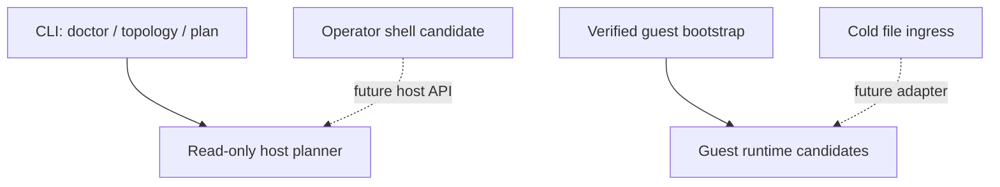

<div align="center">
<svg width="880" height="190" viewBox="0 0 880 190" xmlns="http://www.w3.org/2000/svg">
  <defs>
    <linearGradient id="vmLabGrad" x1="0%" y1="0%" x2="100%" y2="100%">
      <stop offset="0%" style="stop-color:#4ecdc4;stop-opacity:1" />
      <stop offset="50%" style="stop-color:#667eea;stop-opacity:1" />
      <stop offset="100%" style="stop-color:#f093fb;stop-opacity:1" />
    </linearGradient>
    <filter id="vmLabGlow"><feGaussianBlur stdDeviation="2.6" result="b"/><feMerge><feMergeNode in="b"/><feMergeNode in="SourceGraphic"/></feMerge></filter>
  </defs>
  <rect width="880" height="190" fill="#0d1117" rx="20"/>
  <rect x="14" y="14" width="852" height="162" fill="none" stroke="url(#vmLabGrad)" stroke-width="1.2" rx="16" opacity="0.6"/>
  <text x="440" y="82" font-family="monospace" font-size="40" fill="url(#vmLabGrad)" text-anchor="middle" filter="url(#vmLabGlow)" font-weight="bold">VM LAB v0.1</text>
  <text x="440" y="120" font-family="monospace" font-size="15" fill="#c9d1d9" text-anchor="middle">one clean boundary · cold extras · zero synthetic success</text>
  <text x="440" y="149" font-family="monospace" font-size="11" fill="#8b949e" text-anchor="middle">experimental Python control plane; not a replacement claim for VM-Go</text>
</svg>
</div>

# Somnus VM Lab

I kept the real idea in the uploaded layout: host VM mechanics, a durable in-guest AI runtime, and an operator shell are three cooperating runtimes. I removed the accidental assumption that they should all import one another and share lifecycle authority.

The promoted package is deliberately narrower than a VM daemon: canonical contracts, strict configuration, a read-only doctor, bind-checked plan-time ports, fully structured QEMU argv, and a separate verified guest bootstrap. The advanced shell remains monolithic by design, but it is preserved as an operator candidate rather than imported by the host package.

The final adversarial pass removed lifecycle mutation from v0.1. Without real QEMU metal, a trustworthy `start/stop/destroy` surface would still require an interprocess owner, QMP handshake and graceful ACPI shutdown, crash adoption, guest-token provisioning, and destructive recovery tests. Those commands are absent—not simulated.

[`PLAN.md`](PLAN.md) is the execution authority for crossing that gap. It names every phase, invariant, physical gate, failure test, file disposition, and full-SOTA sign-off condition so a future Codex Operator cannot mistake preserved lineage for promoted runtime.

## Current promotion state

| Surface | State | Boot behavior |
| --- | --- | --- |
| `src/somnus_vm/contracts` | live | imported |
| `src/somnus_vm/host` | live | read-only planning only |
| `src/somnus_vm/guest/bootstrap.py` | live | separate guest entrypoint |
| guest memory, ASPS, ACE, cache | candidate | never imported by host boot |
| advanced AI shell and native tools | candidate | never imported by host boot |
| universal and advanced file processors | cold | explicit future adapter only |
| old supervisor and architecture docs | lineage | evidence only |
| mock orchestrator, broken settings/collaboration, synthetic benchmark | quarantine | cannot be enabled |

Guest bootstrap is payload-only in v0.1. Every local artifact requires an exact packed size, unpacked size, and SHA256; it is copied once into a private verification area before bounded extraction. Network downloads, post-install commands, and systemd service mutation are deliberately rejected.

## Run the truthful preflight

<div class="code-block-header"><span class="filename">terminal</span><span class="language">Shell</span></div>

```bash
PYTHONPATH=src python -m somnus_vm doctor --json
```

The doctor is expected to fail on a machine without `qemu-system-x86_64`, `qemu-img`, a base QCOW2, or usable KVM when KVM is enabled. That failure is the contract. Missing metal is never converted into a benchmark number.

## Inspect the placement registry

<div class="code-block-header"><span class="filename">terminal</span><span class="language">Shell</span></div>

```bash
PYTHONPATH=src python -m somnus_vm topology
```

The same commands work from an installed wheel; this is exercised by the integration harness.

## Build a non-mutating QEMU plan

<div class="code-block-header"><span class="filename">terminal</span><span class="language">Shell</span></div>

```bash
PYTHONPATH=src python -m somnus_vm plan \
  --name aeron-lab \
  --disk /absolute/path/to/aeron-lab.qcow2 \
  --memory-mib 4096 \
  --vcpus 2 \
  --tcg \
  --json
```

The generated argv uses no shell and no `-daemonize`. Disk configuration is a JSON `-blockdev` object, so commas in legal paths are not reinterpreted as QEMU options. It includes bind-checked SSH, agent, and VNC candidates, a length-checked QMP socket, pidfile, serial log, and localhost-only host forwarding.

`ports_reserved` is always `false`: planning briefly proves the ports can bind, then releases them. Durable allocation belongs inside the future single-owner lifecycle service.

## Run the integration proof

<div class="code-block-header"><span class="filename">terminal</span><span class="language">Shell</span></div>

```bash
PYTHONPATH=src python test/vm_lab/smoke.py
```

The current proof covers contracts, illegal transitions, strict config, concurrent plan-time ports, comma-safe QEMU planning, safe archive extraction, hash-backed bootstrap idempotency, doctor honesty, checkout-independent CLI behavior, an actual wheel install, the execution-plan contract, and all 33 source-preservation hashes.

## Boundary that now governs the lab



I do not expose lifecycle, image-build, scaling, or snapshot commands. The uploaded snapshot implementation created a QCOW2 child without switching the running VM to it, then copied that child over its backing disk during rollback. Those surfaces return only after a real-metal QMP lifecycle gate exists.

See [the reconstitution audit](docs/RECONSTITUTION_AUDIT.md) and [migration map](docs/MIGRATION_MAP.md) for the full decision record.
