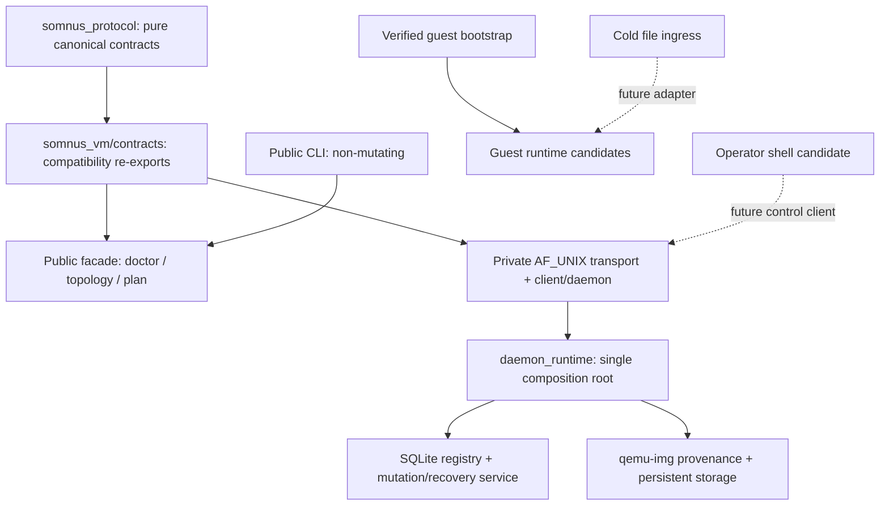

<div align="center">
<svg width="880" height="190" viewBox="0 0 880 190" xmlns="http://www.w3.org/2000/svg">
  <defs>
    <linearGradient id="vmLabGrad" x1="0%" y1="0%" x2="100%" y2="100%">
      <stop offset="0%" style="stop-color:#4ecdc4;stop-opacity:1" />
      <stop offset="50%" style="stop-color:#667eea;stop-opacity:1" />
      <stop offset="100%" style="stop-color:#f093fb;stop-opacity:1" />
    </linearGradient>
    <filter id="vmLabGlow"><feGaussianBlur stdDeviation="2.6" result="b"/><feMerge><feMergeNode in="b"/><feMergeNode in="SourceGraphic"/></feMerge></filter>
  </defs>
  <rect width="880" height="190" fill="#0d1117" rx="20"/>
  <rect x="14" y="14" width="852" height="162" fill="none" stroke="url(#vmLabGrad)" stroke-width="1.2" rx="16" opacity="0.6"/>
  <text x="440" y="82" font-family="monospace" font-size="40" fill="url(#vmLabGrad)" text-anchor="middle" filter="url(#vmLabGlow)" font-weight="bold">VM LAB v0.1</text>
  <text x="440" y="120" font-family="monospace" font-size="15" fill="#c9d1d9" text-anchor="middle">one clean boundary · cold extras · zero synthetic success</text>
  <text x="440" y="149" font-family="monospace" font-size="11" fill="#8b949e" text-anchor="middle">experimental Python control plane; donor semantics, not donor imports</text>
</svg>
</div>

# Somnus VM Lab

I kept the real idea in the uploaded layout: host VM mechanics, a durable in-guest AI runtime, and an operator shell are three cooperating runtimes. I removed the accidental assumption that they should all import one another and share lifecycle authority.

The public `vm-lab` surface remains deliberately non-mutating: `doctor`,
`topology`, and `plan` observe or compose without operating a VM. Behind that
public membrane, P1/P2/P3 now promote a canonical pure protocol, authenticated
local Unix transport, one daemon composition root, a transactional SQLite
registry/mutation service, and manifest-bound `qemu-img` storage publication
and recovery. The separately invoked guest bootstrap is also live. The
advanced shell remains an operator candidate rather than entering host boot.

P1 and P2 are closed; P3 remains a sealed historical gate whose current
reproducibility is restored by declared-origin fixture identity and aggregate
`20260905T111215Z` (40/0/0). P4's internal runtime, QMP/process owner, and
non-public coordinator are source-complete but still lack a disposable
qemu-system machine run. Public `start`, `stop`, `destroy`,
snapshot, scaling, and image-build commands remain absent—not simulated.

[`PLAN.md`](PLAN.md) is the execution authority for crossing that gap. It names every phase, invariant, physical gate, failure test, file disposition, and full-SOTA sign-off condition so a future Codex Operator cannot mistake preserved lineage for promoted runtime.

## Living repository entry

Operators enter through [`AGENTS.md`](AGENTS.md), confirm the selected or ready
unit in [`TASK.md`](TASK.md), and navigate through
[`filetree.md`](filetree.md) or
[`ARCHITECTURE_MAP.md`](ARCHITECTURE_MAP.md). The complete current-state and
failure surfaces are [`CONTEXT.md`](CONTEXT.md),
[`TOPOLOGY.md`](TOPOLOGY.md), and
[`FAILURE_GRAMMAR.md`](FAILURE_GRAMMAR.md).

```bash
python scripts/verify_repository.py
```

That fast structural gate checks the rendered entry packet, topology
fingerprint, source anchors, continuity state, and all 33 preserved source
hashes. It complements—rather than replaces—the runtime proof below.

## Current promotion state

| Surface | State | Boot behavior |
| --- | --- | --- |
| `src/somnus_protocol` | live canonical authority | pure import; schemas and endpoint/version vocabulary only |
| `src/somnus_vm/contracts` | live compatibility | exact canonical object re-exports; no independent schema |
| public `vm-lab` CLI and `src/somnus_vm/host/__init__.py` | live non-mutating facade | `doctor`, `topology`, and `plan`; only planning symbols are re-exported |
| `transport.py`, `client.py`, `daemon.py`, `daemon_runtime.py` | live internal P2 | private AF_UNIX control with Linux peer credentials and one composition root |
| `host/registry.py`, `host/service.py` | live internal P2/P3 | schema-v3 SQLite ownership, serialized mutation, idempotency, checkpoints, and recovery |
| `host/images.py`, `host/storage.py`, `host/exec_guard.py` | live internal P3 | pinned qcow2 provenance, immutable-base/overlay publication, and parent-death containment |
| `src/somnus_vm/guest/bootstrap.py` | live | separate guest entrypoint |
| guest memory, ASPS, ACE, cache | candidate | never imported by host boot |
| advanced AI shell and native tools | candidate | never imported by host boot |
| universal and advanced file processors | cold | explicit future adapter only |
| old supervisor and architecture docs | lineage | evidence only |
| mock orchestrator, broken settings/collaboration, synthetic benchmark | quarantine | cannot be enabled |

Guest bootstrap is payload-only in v0.1. Every local artifact requires an exact packed size, unpacked size, and SHA256; it is copied once into a private verification area before bounded extraction. Network downloads, post-install commands, and systemd service mutation are deliberately rejected.

## Canonical P1 protocol boundary

`src/somnus_protocol/` is the standard-library-only shared authority consumed
by the host and future guest/Kerminal adapters. `somnus_vm.contracts` preserves
the earlier import path by re-exporting canonical objects; it is not a second
place to define schemas. `ProtocolValidationError` and the supported contract
surface are public at the protocol root so consumers do not reach into private
validation helpers.

The current protocol composes:

- exact semantic versions plus two explicit same-ID range offers and a
  transcript selecting their highest shared version;
- independent current-package protocol-range and exact persisted-schema
  enforcement—pairwise overlap does not widen what this implementation can
  decode;
- a secret-free immutable VM record with 16 observed lifecycle states and
  exactly 48 legal evidence-keyed edges;
- evidence bound to VM ID, generation, boot/process identity, and a declaration
  intent digest, with replay rejection and strictly increasing authoritative
  observations of an active process core;
- exact legacy-v0 migration only for a historyless `DECLARED` record, with the
  raw guest token removed and migration provenance retained;
- seven fixed guest-agent endpoints plus bounded health, command, and
  file-write result contracts;
- correlated requests, successes, ordered events, and closed public errors.

Negotiation offer fingerprints detect transcript mismatch; they do not
authenticate a peer or store replay state. P2 supplies local authentication
with Linux `SO_PEERCRED`, and its registry owns request idempotency/replay
records; cryptographic remote authentication remains outside this local-only
boundary. Likewise, the lifecycle grammar records what the host must prove. P3
now owns bounded qcow2 import/overlay storage, but no current component launches
QEMU, queries QMP, or claims guest readiness.

Control request `payload` and success `result` objects are bounded authenticated
machine data whose operation-specific schema owns meaning and redaction. They
are not generic log-safe bags. Public errors instead derive code, category,
exit class, detail, retryability, remediation, evidence kind, and evidence
summary from closed registries. Caller-controlled public prose is absent, P1
`details` is empty, and raw diagnostics remain private behind rigid
`diag:<non-nil UUID>` identifiers. See
[ADR 0005](docs/decisions/0005-errors-and-exit-codes.md).

## Closed P2/P3 internal host boundary

P2 places one mutation authority behind a private mode-`0600` Unix socket.
[`transport.py`](src/somnus_vm/transport.py) performs bounded framing and
kernel peer authentication; [`daemon.py`](src/somnus_vm/daemon.py) owns the
listener; [`daemon_runtime.py`](src/somnus_vm/daemon_runtime.py) composes that
shell with the schema-v3
[`SQLiteRegistry`](src/somnus_vm/host/registry.py) and serialized
[`RegistryMutationService`](src/somnus_vm/host/service.py). This is real
internal daemon/registry behavior, not a public VM lifecycle.

P3 extends that same owner—not a second image daemon—with
[`images.py`](src/somnus_vm/host/images.py),
[`storage.py`](src/somnus_vm/host/storage.py), and the internal
[`exec_guard.py`](src/somnus_vm/host/exec_guard.py). The closed proof uses
`qemu-img` 8.2.2 and the pinned manifest
[`ubuntu-minimal-noble-amd64-20260801.json`](test/vm_lab/fixtures/images/ubuntu-minimal-noble-amd64-20260801.json)
for fixture SHA-256
`b3064efb500d71d6ccbe619b1716062b803e285116e040627b430aaee14cced6`.
It imports one immutable base and materializes two independent sparse 100 GiB
overlays with exact backing chains, ownership markers, and registry identities.
Real child writers are killed after each of seven base and seven overlay
checkpoints, then reopened and recovered. Adversarial and real-daemon checks
also prove foreign-image non-adoption, tamper rejection, parent-death
containment, and startup reconciliation.

Those are storage-authority claims only. The tests never launch QEMU, mount an
image, observe QMP, establish guest readiness, or expose lifecycle commands.

## Run the truthful preflight

<div class="code-block-header"><span class="filename">terminal</span><span class="language">Shell</span></div>

```bash
PYTHONPATH=src python -m somnus_vm doctor --json
```

The doctor is expected to fail on a machine without `qemu-system-x86_64`, `qemu-img`, a base QCOW2, or usable KVM when KVM is enabled. That failure is the contract. Missing metal is never converted into a benchmark number.

## Inspect the placement registry

<div class="code-block-header"><span class="filename">terminal</span><span class="language">Shell</span></div>

```bash
PYTHONPATH=src python -m somnus_vm topology
```

The same commands work from an installed wheel; this is exercised by the integration harness.

## Build a non-mutating QEMU plan

<div class="code-block-header"><span class="filename">terminal</span><span class="language">Shell</span></div>

```bash
PYTHONPATH=src python -m somnus_vm plan \
  --name aeron-lab \
  --disk /absolute/path/to/aeron-lab.qcow2 \
  --memory-mib 4096 \
  --vcpus 2 \
  --tcg \
  --json
```

The generated argv uses no shell and no `-daemonize`. Disk configuration is a JSON `-blockdev` object, so commas in legal paths are not reinterpreted as QEMU options. It includes bind-checked SSH, agent, and VNC candidates, a length-checked QMP socket, pidfile, serial log, and localhost-only host forwarding.

`ports_reserved` is always `false`: the public planner briefly proves the ports
can bind, then releases them. Durable lease ownership exists only inside the
private P2 registry service; this command neither acquires a lease nor starts a
VM.

## Run the integration proof

<div class="code-block-header"><span class="filename">terminal</span><span class="language">Shell</span></div>

```bash
PYTHONPATH=src python test/vm_lab/smoke.py
```

The sealed closure bundle is
[`test/vm_lab/runs/20260805T211740Z/`](test/vm_lab/runs/20260805T211740Z/):
**26/26 aggregate checks passed, with zero failures and zero skips**. In addition
to the P1, CLI, bootstrap, packaging, plan-index, and source-manifest lanes, it
consumes the real P2 transport/registry/daemon and P3 image/storage authority.

The focused P3 boundary is 15 tests:

```bash
PYTHONPATH=src python test/vm_lab/test_storage_p3.py
PYTHONPATH=src python test/vm_lab/test_storage_p3_adversarial.py
PYTHONPATH=src python test/vm_lab/test_daemon_storage_p3.py
```

Those are six core storage cases, eight adversarial cases, and one real-daemon
composition case. Together they cover all seven base and all seven overlay kill
checkpoints, two independent sparse 100 GiB overlays, real `qemu-img` 8.2.2,
and the pinned fixture hash above. These checks establish protocol,
local-control, registry, storage, recovery, and installed-package boundaries;
they do **not** establish QEMU launch, QMP identity, image mounting, guest
readiness, deployment, or public VM lifecycle.

## Boundary that now governs the lab



P4 is the next phase: first QEMU process ownership and QMP truth. I do not
expose lifecycle, image-build, scaling, or snapshot commands. The uploaded
snapshot implementation created a QCOW2 child without switching the running VM
to it, then copied that child over its backing disk during rollback. Those
surfaces return only after their real-machine QEMU/QMP gates exist.

See [the reconstitution audit](docs/RECONSTITUTION_AUDIT.md) and [migration map](docs/MIGRATION_MAP.md) for the full decision record.
