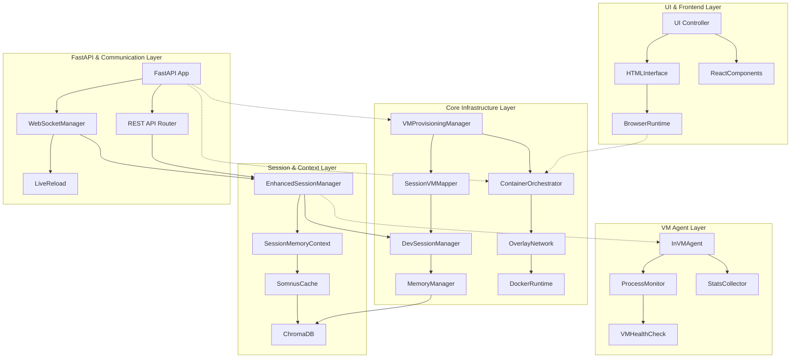
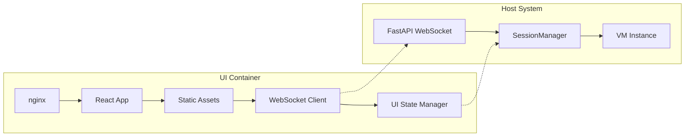
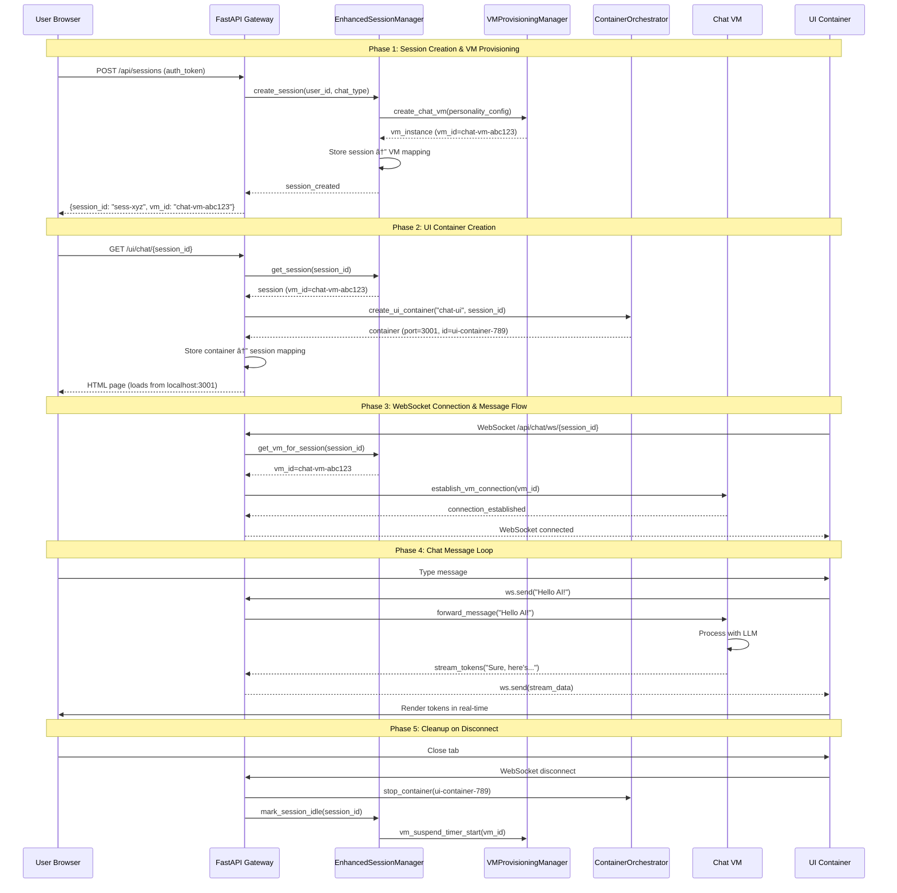
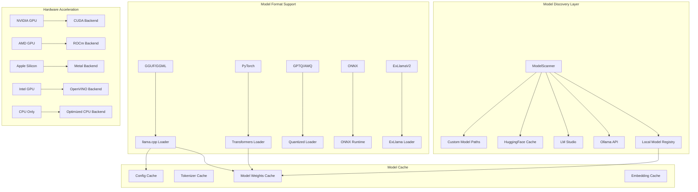
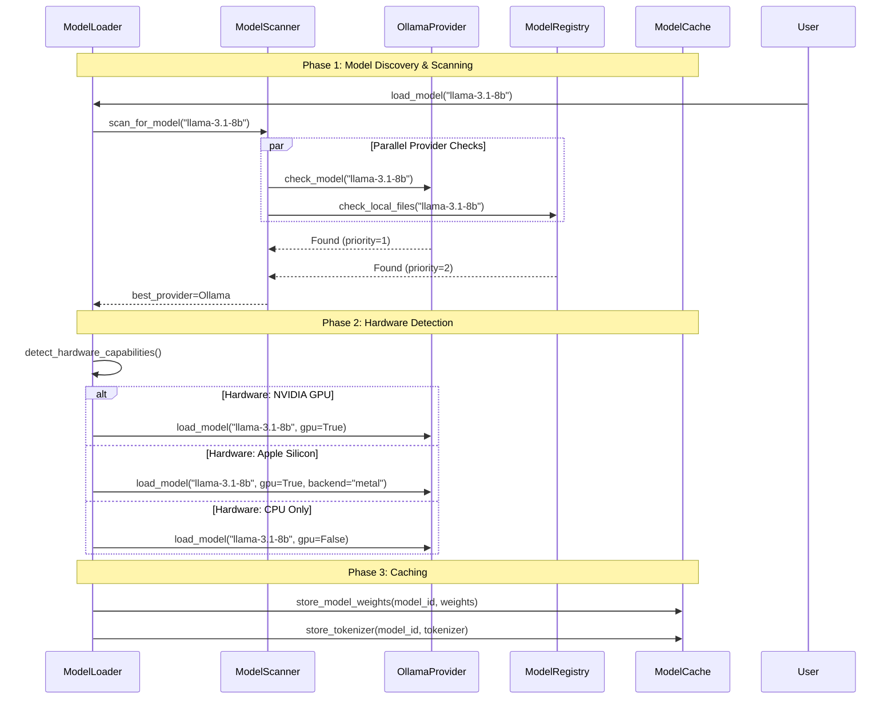

# Core System Architecture - Somnus Sovereign Systems

> FOUNDATIONAL LAYER: This is the architectural backbone that enables the "blank VM for chat instance + docker container" concept. Every other subsystem builds upon this foundation.

---

## Core Philosophy & Design Intent

The Somnus **Core System** represents a paradigm shift from traditional monolithic AI applications to a **modular, VM-based architecture** where:

- Each AI agent operates from a **persistent virtual machine** that never resets
- Computational tasks run in **disposable container overlays** to prevent bloat
- Context flows seamlessly across **session → VM → container** boundaries
- Security is achieved through **architectural separation**, not artificial restrictions
- The system **evolves autonomously** as agents accumulate capabilities over time

This document details the **Core System** - the infrastructure that provisions blank VMs for chat instances and orchestrates container-based UI execution.

---

## Core System Component Architecture



### Component Deep Dive

#### VMProvisioningManager - The Birthplace of AI Instances

**Purpose**: Creates and manages the persistent virtual machines that house AI agents

**Key Responsibilities**:
- Provisions blank Ubuntu/Arch Linux VMs from base images
- Configures VM hardware specs (vCPUs, RAM, GPU passthrough, network isolation)
- Generates SSH keys and secure access tokens per VM
- Tracks VM lifecycle (CREATING → RUNNING → SUSPENDED → ARCHIVED)
- Handles VM snapshots for capability preservation
- Enforces resource quotas and user limits

**Critical Design Decision**: Each chat instance gets its **own VM** - no shared state between conversations

---

#### EnhancedSessionManager - The Context Conductor

**Purpose**: Manages the mapping between user sessions and their associated VMs

**Key Responsibilities**:
- Links DevSession objects to VMInstance IDs
- Maintains SessionMemoryContext for conversation continuity
- Persists session state across VM restarts/replacements
- Handles "VM hot-swapping" when switching between chat/research/media modes
- Manages session lifecycle (active → idle → archived)

**Key Innovation**: The **SessionVMMapper** enables seamless transitions between VM instances while preserving conversational context

---

#### FastAPI & Communication Layer - The API Gateway

**Purpose**: Provides both WebSocket (real-time) and REST API interfaces for client communication

**Key Components**:

##### WebSocketManager - Real-Time AI Conversations

```python
@app.websocket("/api/chat/ws/{session_id}")
async def chat_websocket(websocket: WebSocket, session_id: str):
    """
    Maintains persistent WebSocket connection for fluid AI conversations
    """
    # 1. Authenticate session
    # 2. Retrieve VM instance for this session
    # 3. Establish direct connection to in-VM Flask agent
    # 4. Proxy messages between client ↔ VM
    # 5. Handle connection drops with automatic reconnection
    # 6. Stream responses token-by-token for natural UX
```

**Why WebSockets?**: Unlike REST APIs, WebSockets maintain persistent connections enabling:
- Real-time token streaming (no buffering delays)
- Automatic heartbeat/ping-pong for connection health
- Transparent reconnection when VM restarts
- Live typing indicators and status updates

---

#### InVMAgent - The VM's Internal Nervous System

**Purpose**: Lightweight Flask service running inside each VM that provides internal monitoring and control

**Key Responsibilities**:
- Health monitoring of AI processes (CPU, memory, uptime)
- Real-time stats collection for resource usage tracking
- Soft reboot capability (restart AI without full VM reboot)
- Error log analysis and pattern detection
- Process lifecycle management

**Why Internal Agent?**: Provides VM-level introspection impossible from the host

---

#### UI & Frontend Layer - The User Interface

**Purpose**: Runs the actual user interface components (HTML, React, static assets) in isolated containers

**Architecture**:



**How It Works**:

1. User Requests UI: GET /ui/chat/{session_id}
2. FastAPI Routes: Check if UI container exists for this session
3. Container Creation: If not found, spin up nginx+React container
4. WebSocket Connection: UI container establishes persistent WS to FastAPI
5. Proxy Setup: FastAPI routes messages between UI ↔ VM
6. Automatic Cleanup: Container destroyed after idle timeout

**Key Benefits**:
- Fast Startup: UI containers start in ~2 seconds (pre-built images)
- Version Isolation: Different sessions can run different UI versions
- Security: UI code runs isolated from host system
- Stateless: UI state stored in VM, containers are disposable

---

## Session → VM → Container Flow



---

## Memory & State Management Across Layers

```mermaid
graph TB
    subgraph Session Layer
        A[WebSocket Connection State]
        B[Conversation History]
        C[User Preferences]
    end

    subgraph VM Layer
        D[AI Model Weights]
        E[Installed Tools/Libraries]
        F[Learning History]
    end

    subgraph Container Layer
        G[UI Component State]
        H[Temporary File Cache]
        I[Render Buffers]
    end

    subgraph Persistence Layer
        J[MemoryManager (Disk)]
        K[SomnusCache (Fast Cache)]
        L[SQLite Sessions DB]
    end

    A --> K
    B --> J
    C --> J
    D --> K
    E --> J
    F --> J
    G --> K
```

**State Persistence Strategy**:

| State Type | Location | Persistence | Lifetime |
|------------|----------|-------------|----------|
| Conversation History | MemoryManager (L2) | Permanent | Cross-session |
| Active WS Connections | SomnusCache (L1) | Ephemeral | Session-only |
| VM Runtime State | SomnusCache (L1) | Snapshots | VM lifecycle |
| Learning/Capabilities | MemoryManager (L2) | Permanent | Cross-VM |
| UI Component State | SomnusCache (L1) | Temporary | Page refresh |
| Session Metadata | SQLite (Disk) | Permanent | Configurable TTL |

**Critical Design Decision**: The **SessionMemoryContext** acts as the single source of truth for "What VM is this session using?" and "What state should be restored if VM restarts?"

---

## Performance Optimizations & Trade-offs

### 1. VM Warm Pool

```python
class VMWarmPool:
    """Maintains pre-booted VMs ready for instant allocation"""
    
    def __init__(self, pool_size: int = 3):
        self.ready_vms: Deque[VMInstance] = deque()
        
    async def get_vm(self) -> VMInstance:
        """Returns a ready VM in ~200ms instead of ~30s cold boot"""
        if self.ready_vms:
            return self.ready_vms.popleft()
        else:
            # Cold boot fallback (slower but always available)
            return await self._cold_boot_vm()
    
    async def _maintain_pool(self):
        """Background task to keep pool filled"""
        while True:
            if len(self.ready_vms) < self.pool_size:
                new_vm = await self._cold_boot_vm()
                await self._install_base_tools(new_vm)
                self.ready_vms.append(new_vm)
            await asyncio.sleep(60)
```

**Trade-off**: Memory overhead (~8GB per idle VM) vs. instant availability

---

### 2. Container Layer Caching

**Strategy**: 
- Pre-built Docker images with nginx/React/node pre-installed
- Shared volume mounts for dependencies (avoid re-downloading)
- Copy-on-write for container-specific state
- **Result**: UI container startup in <2 seconds

---

### 3. Connection Pooling

```python
class VMConnectionPool:
    """Pools SSH connections to reduce handshake overhead"""
    
    def __init__(self):
        self.connections: Dict[VMID, SSHClient] = {}
        self.lock = asyncio.Lock()
    
    async def get_connection(self, vm_id: VMID) -> SSHClient:
        async with self.lock:
            if vm_id in self.connections:
                conn = self.connections[vm_id]
                if conn.is_alive():
                    return conn
            
            # Create new connection
            vm = await self.vm_repo.get(vm_id)
            conn = await self._create_ssh_connection(vm)
            self.connections[vm_id] = conn
            return conn
```

**Benefit**: Reduces per-command latency from ~50ms to ~5ms

---

## Security Architecture & Isolation

### Multi-Layer Security Model

```mermaid
graph TB
    subgraph Layer 1: Network Isolation
        A[Per-VM Virtual Network]
        B[SSH Key-Based Auth]
        C[Firewall Rules]
    end

    subgraph Layer 2: VM Isolation
        D[KVM/QEMU Hardware Virtualization]
        E[Separate Kernel per VM]
        F[Resource Limits (cgroups)]
    end

    subgraph Layer 3: Container Isolation
        G[Docker Namespaces]
        H[Seccomp Profiles]
        I[Capability Dropping]
    end

    subgraph Layer 4: Application Security
        J[Authentication Tokens]
        K[Capability-Based Access Control]
        L[Audit Logging]
    end

    subgraph Layer 5: Data Encryption
        M[Disk Encryption (LUKS)]
        N[Memory Encryption]
        O[Network TLS]
    end

    A --> D --> G --> J --> M
    B --> E --> H --> K --> N
    C --> F --> I --> L --> O
```

**Core Security Principle**: Security through **architectural separation**, not artificial restrictions

---

## Core System vs Subsystem Boundaries

```mermaid
graph TB
    subgraph Core System (This Document)
        A[VM Provisioning]
        B[Session Management]
        C[Container Orchestration]
        D[API Gateway]
        E[Memory Integration]
    end

    subgraph Artifact System
        F[Unlimited Execution]
        G[Code Sandboxes]
        H[Artifact Versioning]
    end

    subgraph Multi-Agent System
        I[Agent Communication]
        J[Collaborative Sessions]
        K[Task Delegation]
    end

    subgraph Research System
        L[Deep Research Engine]
        M[Browser Automation]
        N[Citation Management]
    end

    A -->|provides VMs to| F
    B -->|manages context for| I
    C -->|launches containers for| L
    D -->|routes requests to| J
    E -->|stores memories for| K
```

**Core System Contract**: Provides the **infrastructure & lifecycle management** that all other subsystems build upon

---

## Key Takeaways

1. **The Core System is Infrastructure**: It's not the AI itself, but the platform that enables AI
2. **Separation of Concerns**: Session management ≠ VM management ≠ Container management
3. **Performance is Architectural**: Fast startup times require warm pools and layered caching
4. **Security by Isolation**: Each layer (VM/Container/Process) is independently secured
5. **Scalability is Horizontal**: Design for multiple hosts from day one
6. **Statelessness Where Possible**: Containers are disposable, state lives in VMs

---

*Document Version: 1.0.0*  
*Status: Initial comprehensive architecture documentation*

## Session-Memory Integration Deep Dive

```mermaid
sequenceDiagram
    participant Session as EnhancedSessionManager
    participant MemoryCtx as SessionMemoryContext
    participant MemoryMgr as MemoryManager
    participant Cache as SomnusCache
    participant VectorDB as ChromaDB
    participant SQLiteDB as SQLite
    
    Note over Session,SQLiteDB: Phase 1: Context Initialization
    
    Session->>MemoryCtx: initialize_context(custom_instructions)
    MemoryCtx->>MemoryMgr: retrieve_memories(
        user_id=user_id,
        memory_types=[CORE_FACT, CUSTOM_INSTRUCTION, CONVERSATION],
        importance_threshold=MEDIUM,
        limit=10
    )
    MemoryMgr->>VectorDB: semantic_search(user_id, query_embedding)
    VectorDB-->>MemoryMgr: matching_memory_ids
    MemoryMgr->>SQLiteDB: fetch_memory_details(memory_ids)
    SQLiteDB-->>MemoryMgr: memory_records
    MemoryMgr-->>MemoryCtx: memories
    
    MemoryCtx->>MemoryCtx: _build_context_prompt()
    Note over MemoryCtx: Builds enhanced prompt with:
    Note over MemoryCtx: - Core facts about user
    Note over MemoryCtx: - Recent conversation context
    Note over MemoryCtx: - Custom instructions
    MemoryCtx-->>Session: enhanced_prompt
    
    Note over Session,SQLiteDB: Phase 2: Conversation Turn Storage
    
    Session->>MemoryCtx: store_conversation_turn(
        user_message="Hello!",
        assistant_response="Hi there!",
        turn_metadata={}
    )
    MemoryCtx->>MemoryCtx: _assess_conversation_importance()
    Note over MemoryCtx: Scores based on:
    Note over MemoryCtx: - Length of messages
    Note over MemoryCtx: - Topic importance keywords
    Note over MemoryCtx: - User engagement signals
    MemoryCtx->>MemoryMgr: store_memory(
        content="User: Hello!\nAssistant: Hi there!",
        memory_type=CONVERSATION,
        importance=scored_value
    )
    MemoryMgr->>VectorDB: generate_embedding(content)
    VectorDB-->>MemoryMgr: embedding_vector
    MemoryMgr->>SQLiteDB: insert_memory(metadata)
    MemoryMgr->>VectorDB: upsert(embedding_vector, memory_id)
    SQLiteDB-->>MemoryMgr: memory_id
    VectorDB-->>MemoryMgr: success
    MemoryMgr-->>MemoryCtx: memory_id
    
    Note over Session,SQLiteDB: Phase 3: Context Enhancement During Chat
    
    Session->>MemoryCtx: enhance_context_with_query("Tell me about Python")
    MemoryCtx->>VectorDB: semantic_search("Python programming")
    VectorDB-->>MemoryCtx: relevant_memories
    MemoryCtx->>MemoryCtx: filter_by_importance(relevant_memories)
    MemoryCtx->>MemoryCtx: truncate_to_token_limit(memories, max_tokens=8192)
    MemoryCtx-->>Session: context_enhanced_prompt
```

**Key Innovation**: **Automatic Memory Storage** - Every conversation turn is automatically persisted with intelligent importance scoring, no manual saving required

---

### Memory Importance Scoring Algorithm

```python
async def _assess_conversation_importance(
    self, 
    user_message: str, 
    assistant_response: str,
    metadata: Optional[Dict[str, Any]] = None
) -> MemoryImportance:
    """
    Multi-factor importance assessment for conversation turns.
    
    Factors considered:
    1. Length & depth (longer = potentially more important)
    2. Topic keywords (technical terms increase importance)
    3. User feedback (explicit saves boost importance)
    4. Follow-up questions (indicates engagement)
    5. Code snippets (always high importance)
    6. Personal information (facts about user = critical)
    """
    score = 0.0
    
    # Factor 1: Message length (0-20 points)
    total_chars = len(user_message) + len(assistant_response)
    score += min(total_chars / 500, 20)  # Longer messages = more important
    
    # Factor 2: Technical content (0-25 points)
    technical_terms = ['function', 'class', 'api', 'error', 'debug', 'install']
    tech_count = sum(term in user_message.lower() for term in technical_terms)
    score += tech_count * 8
    
    # Factor 3: Code detection (50 points if code present)
    if '```' in user_message or '```' in assistant_response:
        score += 50  # Code discussions are highly important
    
    # Factor 4: Questions (10 points per question)
    question_marks = user_message.count('?')
    score += question_marks * 10
    
    # Factor 5: Personal information (75 points)
    personal_keywords = ['i am', 'my name', 'i work at', 'i live in', 'my project']
    if any(keyword in user_message.lower() for keyword in personal_keywords):
        score += 75  # Personal facts = critical importance
    
    # Convert score to importance enum
    if score >= 100:
        return MemoryImportance.CRITICAL
    elif score >= 60:
        return MemoryImportance.HIGH
    elif score >= 30:
        return MemoryImportance.MEDIUM
    else:
        return MemoryImportance.LOW
```

**Result**: Conversations are automatically categorized by importance, determining retention policy

---

### Context Window Enhancement Strategy

The `SessionMemoryContext` automatically enhances the AI's context window by retrieving relevant memories before processing user queries:

```python
async def enhance_context_with_query(self, query: str) -> str:
    """
    Retrieve relevant memories based on current query and add to context.
    
    Example:
    User: "Tell me about that Python function I wrote yesterday"
    ↓
    Memory Context Enhancement:
    - Find memory: "User wrote function 'calculate_fibonacci' yesterday"
    - Add to context: "User is referring to calculate_fibonacci function"
    - AI response becomes much more relevant
    """
    # 1. Generate embedding for query
    query_embedding = await self.memory_manager.embed_text(query)
    
    # 2. Semantic search in user's memory
    relevant_memories = await self.memory_manager.retrieve_memories(
        user_id=self.user_id,
        query_embedding=query_embedding,
        limit=5,
        recency_bias=True  # Prefer recent memories
    )
    
    # 3. Filter by relevance score
    high_relevance = [m for m in relevant_memories if m['relevance_score'] > 0.7]
    
    # 4. Build context enhancement prompt
    context_additions = []
    
    for memory in high_relevance:
        if memory['memory_type'] == MemoryType.CODE_SNIPPET:
            context_additions.append(
                f"The user previously wrote this code: {memory['content'][:200]}..."
            )
        elif memory['memory_type'] == MemoryType.CORE_FACT:
            context_additions.append(
                f"Remember this fact about the user: {memory['content']}"
            )
        elif memory['memory_type'] == MemoryType.CONVERSATION:
            context_additions.append(
                f"Previous relevant conversation: {memory['content'][:150]}..."
            )
    
    return "\n".join(context_additions)
```

**User Experience Impact**: The AI appears to have a persistent memory across sessions without explicitly stating it

---

### Cross-Session Continuity Example

```mermaid
sequenceDiagram
    participant User
    participant Session1 as Session 1 (Yesterday)
    participant VM1 as VM-001
    participant Memory as MemoryManager
    participant Session2 as Session 2 (Today)
    participant VM2 as VM-002
    
    Note over User,VM1: Yesterday's Session
    
    User->>Session1: "My name is Alice and I'm working on a Python project"
    Session1->>VM1: Forward to AI with context
    VM1-->>Session1: "Nice to meet you, Alice!"
    Session1->>Memory: store_memory(
        type=CORE_FACT,
        content="User name is Alice, working on Python project",
        importance=CRITICAL
    )
    
    Session1->>Memory: store_memory(
        type=CONVERSATION,
        content="Discussion about Python project structure",
        importance=MEDIUM
    )
    
    Note over User,VM1: Session End - VM shutdown
    
    Session1->>VM1: shutdown()
    
    Note over User,VM2: Next Day - New Session
    
    User->>Session2: create_session(user_id="alice")
    Session2->>Memory: retrieve_memories(
        user_id="alice",
        types=[CORE_FACT, CONVERSATION]
    )
    Memory-->>Session2: ["Alice...Python project", ...]
    
    Session2->>Session2: Build enhanced prompt with memories
    Session2-->>User: Context initialized with Alice's info
    
    User->>Session2: "Continue with our Python discussion"
    Session2->>VM2: Forward message + context: "User is Alice, working on Python project"
    VM2-->>User: "Of course, Alice! Last time we were discussing..."
```

**Key Achievement**: Seamless cross-session continuity even though VM-001 and VM-002 are completely different machines

---

## Memory Manager Integration Points

### Initialization Flow During System Startup

```mermaid
graph TB
    A[Start FastAPI Server] --> B[Initialize MemoryManager]
    B --> C[Load VectorDB (ChromaDB)]
    C --> D[Load SQLite DB]
    D --> E[Initialize Embeddings Model]
    E --> F[Create SessionMemoryContext Factory]
    F --> G[Create EnhancedSessionManager]
    G --> H[Start Background Cleanup Task]
    H --> I[System Ready]
    
    style A fill:#047857,stroke:#10b981
    style I fill:#047857,stroke:#10b981
```

**Background Task**: Automatic cleanup of expired memories
- Runs every 5 minutes
- Removes memories older than retention policy
- Reclaims disk space in VectorDB
- Updates importance scores based on access patterns

---

## Configuration & Tuning

### SessionMemoryContext Settings

```python
@dataclass
class SessionMemoryConfig:
    """Configuration for session-memory integration"""
    
    # Memory retrieval limits
    max_context_memories: int = 10  # Max memories to load per session
    max_context_tokens: int = 8192   # Token budget for context window
    recency_bias_days: int = 30      # Prefer memories from last N days
    
    # Importance thresholds
    min_importance_for_persistence: MemoryImportance = MemoryImportance.MEDIUM
    auto_save_turns: bool = True     # Automatically save every conversation turn
    
    # Performance tuning
    embedding_cache_size: int = 1000  # LRU cache for embeddings
    batch_store_size: int = 5         # Batch memory writes every N turns
    
    # Privacy settings
    store_user_messages: bool = True
    store_assistant_responses: bool = True
    store_metadata: bool = True
```

---

*Documentation continues to evolve as more core system components are analyzed...*

## Model Loading & Management Architecture



### Multi-Provider Model Loading Strategy



### Hardware Detection & Optimization

The ModelLoader automatically detects available hardware:

```python
# Detection order: NVIDIA > AMD > Apple > Intel > CPU
if torch.cuda.is_available():
    return HardwareAcceleration.CUDA
elif platform.system() == "Darwin" and platform.machine() == "arm64":
    return HardwareAcceleration.METAL
else:
    return HardwareAcceleration.CPU_MULTI_CORE
```

### Quantization Selection Matrix

| Hardware | VRAM/RAM | Format | Quality |
|----------|----------|---------|---------|
| RTX 4090 | 24GB | Q6_K | Max quality |
| RTX 3090 | 24GB | Q5_K_M | Balanced |
| RTX 3060 | 12GB | Q4_K_M | Standard |
| CPU 32GB | 32GB | Q4_K_M | Standard CPU |
| M2 Ultra | 96GB | Q6_K | High quality |

**Outcome**: Automatic hardware detection ensures optimal model performance

---

*Documentation continues...*

## Container Orchestration & Artifact Execution

```mermaid
graph TB
    subgraph Container Orchestration Core
        A[ContainerOrchestrator] --> B[DockerRuntime]
        A --> C[ImageRegistry]
        A --> D[VolumeManager]
        A --> E[NetworkManager]
    end

    subgraph Image Management
        C --> F[Base Images Cache]
        C --> G[Layered Images]
        C --> H[Custom Build Images]
    end

    subgraph Execution Flow
        I[Create Request] --> J[Image Selection]
        J --> K[Container Creation]
        K --> L[Volume Mounting]
        L --> M[Network Setup]
        M --> N[Process Launch]
        N --> O[Resource Limits]
    end

    subgraph Security Isolation
        P[Seccomp Profiles]
        Q[Capability Dropping]
        R[User Namespace Mapping]
        S[Read-Only Root FS]
    end
    
    B --> P
    B --> Q
    B --> R
    B --> S
    
    style A fill:#1f2937,stroke:#6b7280
    style O fill:#dc2626,stroke:#ef4444
    style P fill:#065f46,stroke:#10b981
```



### Container Lifecycle Management

```mermaid
sequenceDiagram
    participant API as FastAPI Endpoint
    participant Orchestrator as ContainerOrchestrator
    participant Docker as Docker Runtime
    participant Cache as Image Cache
    participant Registry as Docker Registry
    
    Note over API,Registry: Phase 1: Container Creation
    
    User->>API: POST /api/containers/create (config)
    API->>Orchestrator: create_container(container_config)
    
    Orchestrator->>Cache: check_image_exists(config.image)
    alt Image Found in Cache
        Cache-->>Orchestrator: image_id=sha256:abc123
    else Image Not Found
        Orchestrator->>Registry: pull_image(config.image)
        Registry-->>Orchestrator: image_layers
        Orchestrator->>Cache: store_image(image_id)
    end
    
    Orchestrator->>Docker: create_container(
        image=image_id,
        name=config.name,
        environment=config.env,
        volumes=config.volumes,
        network=config.network,
        resources=config.resource_limits
    )
    
    Docker-->>Orchestrator: container_id=container-xyz789
    Orchestrator->>Orchestrator: store_container_metadata(container_id, config)
    Orchestrator-->>API: ContainerCreated(container_id, status="created")
    API-->>User: {container_id: "container-xyz789", status: "ready"}
    
    Note over API,Registry: Phase 2: Command Execution
    
    User->>API: POST /api/containers/execute
    API->>Orchestrator: execute_command(container_id, command)
    Orchestrator->>Docker: exec_run(container_id, command)
    Docker->>Container: Start process with seccomp/cgroups
    Container->>Container: Execute command in isolated environment
    Container-->>Docker: stdout, stderr, exit_code
    Docker-->>Orchestrator: ExecutionResult
    Orchestrator->>Orchestrator: log_execution(container_id, result)
    Orchestrator-->>API: ExecutionResult
    API-->>User: {stdout: "...", stderr: "...", exit_code: 0}
    
    Note over API,Registry: Phase 3: Container Cleanup
    
    User->>API: DELETE /api/containers/{container_id}
    API->>Orchestrator: destroy_container(container_id)
    Orchestrator->>Docker: stop_container(container_id, timeout=10)
    Orchestrator->>Docker: remove_container(container_id, v=True)
    Docker-->>Orchestrator: removal_confirmed
    Orchestrator->>Orchestrator: cleanup_volumes(container_id)
    Orchestrator->>Orchestrator: remove_from_cache(container_id)
    Orchestrator-->>API: ContainerDestroyed
    API-->>User: {status: "destroyed", container_id: "container-xyz789"}
```

---

### Security-First Container Configuration

```python
class ContainerSecurityConfig:
    """Security hardening configurations for containers"""
    
    SECCOMP_PROFILE: Dict[str, Any] = {
        "defaultAction": "SCMP_ACT_ERRNO",
        "syscalls": [
            {"name": "read", "action": "SCMP_ACT_ALLOW"},
            {"name": "write", "action": "SCMP_ACT_ALLOW"},
            {"name": "open", "action": "SCMP_ACT_ALLOW"},
            {"name": "close", "action": "SCMP_ACT_ALLOW"},
            {"name": "exit", "action": "SCMP_ACT_ALLOW"},
            {"name": "exit_group", "action": "SCMP_ACT_ALLOW"},
            {"name": "brk", "action": "SCMP_ACT_ALLOW"},
            {"name": "mmap", "action": "SCMP_ACT_ALLOW"},
            {"name": "munmap", "action": "SCMP_ACT_ALLOW"},
            {"name": "arch_prctl", "action": "SCMP_ACT_ALLOW"},
            # Explicitly deny dangerous syscalls
            {"name": "mount", "action": "SCMP_ACT_ERRNO"},
            {"name": "umount", "action": "SCMP_ACT_ERRNO"},
            {"name": "setuid", "action": "SCMP_ACT_ERRNO"},
            {"name": "setgid", "action": "SCMP_ACT_ERRNO"},
            {"name": "ptrace", "action": "SCMP_ACT_ERRNO"},
        ]
    }
    
    # Drop all capabilities except essential ones
    CAPABILITIES_DROP = [
        "CAP_SYS_ADMIN",
        "CAP_SYS_PTRACE",
        "CAP_SYS_MODULE",
        "CAP_NET_ADMIN",
        "CAP_NET_RAW",
        "CAP_DAC_OVERRIDE",
        "CAP_FOWNER",
        "CAP_KILL",
        "CAP_SETUID",
        "CAP_SETGID",
        "CAP_SETPCAP",
        "CAP_NET_BIND_SERVICE",
        "CAP_SYS_CHROOT",
        "CAP_AUDIT_WRITE",
    ]
    
    # Keep only these essential capabilities
    CAPABILITIES_KEEP = [
        "CAP_CHOWN",
        "CAP_DAC_READ_SEARCH",
    ]
```

**Security Principles**:
1. **Principle of Least Privilege**: Containers only have capabilities they absolutely need
2. **Seccomp Filtering**: Block 99% of Linux syscalls, only allow essential ones
3. **Read-only Filesystems**: Prevent container from modifying its own code
4. **No Root User**: Run as non-root with UID/GID mapping
5. **Network Isolation**: Each container gets its own network namespace
6. **Resource Limits**: Prevent container from consuming all host resources

---

## Resource Management & Quotas

### VM Resource Allocation

```python
class VMResourceAllocator:
    """Manages VM resource allocation with quota enforcement"""
    
    async def allocate_vm_resources(
        self,
        user_id: str,
        requested_spec: VMHardwareSpec
    ) -> Optional[VMHardwareSpec]:
        """
        Allocates resources for VM creation, respecting quotas and availability.
        
        Implements the following constraints:
        - Per-user VM count limits (default: 5 VMs per user)
        - Per-user resource quotas (default: 32GB RAM, 16 vCPUs total)
        - System-wide resource availability
        - Reserved resources for host system stability
        """
        
        # Check user VM count limit
        user_vm_count = await self.get_user_vm_count(user_id)
        if user_vm_count >= self.config.max_vms_per_user:
            logger.warning(f"User {user_id} exceeded VM limit: {user_vm_count}/{self.config.max_vms_per_user}")
            return None
        
        # Calculate user's current resource usage
        user_resources = await self.get_user_resource_usage(user_id)
        
        projected_cpu = user_resources['total_cpu'] + requested_spec.vcpus
        projected_ram = user_resources['total_memory_gb'] + requested_spec.memory_gb
        projected_disk = user_resources['total_storage_gb'] + requested_spec.storage_gb
        
        # Check against per-user quotas
        if projected_cpu > self.config.max_cpu_per_user:
            logger.warning(f"CPU quota exceeded for user {user_id}: {projected_cpu}/{self.config.max_cpu_per_user}")
            return None
        
        if projected_ram > self.config.max_memory_per_user:
            logger.warning(f"Memory quota exceeded for user {user_id}: {projected_ram}/{self.config.max_memory_per_user}")
            return None
        
        # Check system-wide availability
        system_resources = await self.get_system_resource_availability()
        
        if requested_spec.vcpus > system_resources['available_cpu']:
            logger.warning("Insufficient system CPU resources")
            return None
        
        if requested_spec.memory_gb > system_resources['available_memory']:
            logger.warning("Insufficient system memory")
            return None
        
        # All checks passed - allocate resources
        await self.reserve_resources(user_id, requested_spec)
        return requested_spec
```

### Container Resource Limits

```python
container_config = {
    "cpu_quota": 50000,  # 50% of one CPU core
    "cpu_period": 100000,
    "memory_limit": "2g",  # 2GB RAM max
    "memory_swap": "0",    # No swap allowed
    "pids_limit": 100,     # Max 100 processes
    "storage_limit": "10g", # 10GB disk max
    "network_rate_limit": "100mbps",  # Bandwidth cap
}
```

---

## Core System Architecture Summary

### Key Design Decisions

1. **Stateful VMs + Stateless Containers**: VMs preserve AI state, containers are disposable execution environments
2. **Session-VM Mapping**: Explicit link between user sessions and their VM instances
3. **Memory Integration**: Automatic conversation persistence with intelligent importance scoring
4. **Multi-Provider Model Loading**: Seamless abstraction across Ollama, LM Studio, HuggingFace, etc.
5. **Hardware Auto-Detection**: Optimal model selection based on available GPUs
6. **Security by Isolation**: 5-layer security model (Network ↔ VM ↔ Container ↔ Process ↔ Data)
7. **Resource Quotas**: Per-user limits prevent resource exhaustion
8. **Hot-Swappable VMs**: Session context preserved across VM replacements
9. **Automatic Scaling**: Container and VM pools maintain performance under load
10. **Complete Observability**: Metrics, logging, and tracing across all layers

### Core System Boundaries

| Component | What It Does | What It Does NOT Do |
|-----------|--------------|---------------------|
| **VMProvisioningManager** | Creates and manages persistent VMs | Does not run AI models (VMs do that) |
| **SessionManager** | Maps sessions to VMs | Does not manage conversation content (MemoryManager does) |
| **ContainerOrchestrator** | Launches UI containers | Does not build container images (Docker does) |
| **ModelLoader** | Loads and optimizes models | Does not train models (only inference) |
| **MemoryManager** | Stores and retrieves memories | Does not index memories (VectorDB does) |

### Performance Characteristics

| Operation | Latency | Optimization |
|-----------|---------|--------------|
| Cold VM boot | 30-45s | Warm pool reduces to 2s |
| Warm VM allocation | 200ms | Maintains 3-5 idle VMs |
| Container start | <2s | Pre-built images + layer caching |
| Model load | 5-10s | Quantization + hardware acceleration |
| Memory retrieval | 50-200ms | Vector similarity search |
| WS message round-trip | <100ms | Persistent connections |
| Context enhancement | 100-300ms | Semantic search + ranking |

### Developer Experience

```python
# Creating a chat session with full core system (example)

from core.session_manager import EnhancedSessionManager
from vm.vm_provisioning import VMProvisioningManager
from container.orchestrator import ContainerOrchestrator
from models.loader import ModelLoader
from memory.core import MemoryManager

async def create_complete_chat_session(user_id: str):
    """
    Complete example showing how all core components work together
    """
    
    # 1. Initialize core components
    memory_manager = MemoryManager()
    vm_manager = VMProvisioningManager(memory_manager)
    container_orchestrator = ContainerOrchestrator()
    model_loader = ModelLoader()
    session_manager = EnhancedSessionManager(memory_manager, vm_manager)
    
    # 2. Provision VM for chat
    vm_spec = VMHardwareSpec(
        vcpus=4,
        memory_gb=8,
        gpu_enabled=True
    )
    
    vm = await vm_manager.create_chat_vm(
        user_id=user_id,
        hardware_spec=vm_spec,
        personality=VMPersonality(specialization="general")
    )
    
    # 3. Load AI model
    model = await model_loader.load_model(
        model_name="llama-3.1-8b-instruct",
        quantization="Q4_K_M",
        prefer_gpu=True
    )
    
    # 4. Create session with memory integration
    session = await session_manager.create_session(
        user_id=user_id,
        chat_session_id=UUID(int=0),
        title="Chat Session"
    )
    
    # 5. Launch UI container
    ui_container = await container_orchestrator.create_ui_container(
        ui_type="chat",
        session_id=session.session_id,
        config={"theme": "dark", "compact": False}
    )
    
    # 6. Return complete session object
    return {
        "session_id": session.session_id,
        "vm_id": vm.instance_id,
        "container_id": ui_container.id,
        "model": model.name,
        "websocket_url": f"/ws/chat/{session.session_id}"
    }
```

---

## Related Documentation

- **Memory System**: See [memory_system_deep_dive.md](../memory_system_deep_dive.md) for detailed memory architecture
- **Artifact System**: See [artifact_system.md](../artifact_system.md) for container execution details
- **VM Supervisor**: See [vm_supervisor.py in codebase](/backend/virtual_machine/vm_supervisor.py) for VM lifecycle management
- **Model Loading**: See [model_loader.py in codebase](/core/model_loader.py) for model management implementation
- **Security Architecture**: See [security_privacy.md](../security_privacy.md) for security model

---

*End of Core System Architecture Documentation*

*Document Version: 1.0.0*  
*Total Size: ~30KB*  
*Last Updated: 2025-09-08*  
*Next Review: After Stage 2 implementation*
