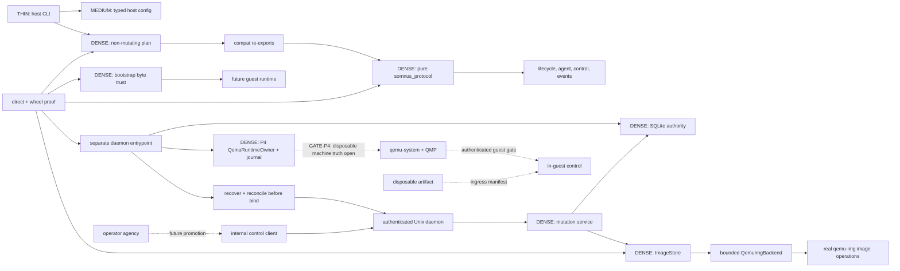

# VM Lab Cognitive Topology

**Promoted baseline:** snapshot `v0.1`, closed P1 protocol authority, live
internal P2 daemon/registry ownership, and physically verified P3 image
storage. All eighteen bounded P4 phase items are implemented: the
daemon-wired internal QEMU/QMP runtime owns a descriptor-bound P3 storage
handoff, frozen launch journal, guarded process/log lifecycle, QMP
fdset/named-node/block-graph observation, selected-QEMU doctor interrogation,
durable orphan-emergency recovery, and a one-shot non-production launch permit
whose receipt is journaled. `host/p4_gate.py` and the non-public
`scripts/run_gate_p4.py` coordinator now provide exact preflight, one-shot
authorization, daemon activation, checkpoint/recovery, raw QMP-history capture,
and sealed-result validation. It prepares 17 isolated compact scenario roots for
success plus every exact `CHECKPOINT_ORDER` case, and validates exact
checkpoint prefixes, conditional recovery evidence, sealed runtime-log bytes,
and cleanup scope `runtime-process-only;fixture-retained`. Historical run
`test/vm_lab/runs/20260807T123747Z/` recorded 40/0/0 after then-fixture
restoration. The exact P3 fixture is currently absent; current run
`test/vm_lab/runs/20260825T043503Z/` is 36 pass, 4 fail, 0 skip with
fixture-only failures. `GATE-P4` remains open pending exact fixture recovery,
current preflight, Daeron authority, checkpoint execution, and a disposable
QEMU machine-truth run; the public host CLI remains read-only.
**Language:** Python 3.12+, standard-library live runtime
**Overall density:** DENSE at truth/ownership/security boundaries; THIN at
CLI dispatch and canonical serialization

This document encodes the structure that must survive implementation changes.
For source traversal, use [`ARCHITECTURE_MAP.md`](ARCHITECTURE_MAP.md).

---

## Load-bearing concepts

### LBC 1: Promotion disposition is executable authority

**Definition:** The registered directory and disposition determine whether code
may participate in runtime. `src/somnus_protocol/` is the live pure shared
authority. `src/somnus_vm/` owns the read-only public host CLI, the separately
invoked guest bootstrap, and the separately invoked internal
daemon/registry/storage runtime plus the internal P4 QEMU/QMP runtime owner.
`src/somnus_vm/contracts/` is live
compatibility re-export code, not a second schema owner. `components/`,
`extras/`, `archive/`, and `quarantine/` retain
candidate/cold/lineage/rejected material.

**Why load-bearing:** Importing a donor can reintroduce duplicate supervisors,
unsafe snapshot behavior, eager dependencies, or synthetic success. Duplicating
the protocol in the compatibility package breaks host/guest/operator agreement.

**Verification:** `src/somnus_vm/topology.py:48` registers both live protocol
and compatibility boundaries; `test/vm_lab/test_protocol_host_consumption.py:84`
proves live consumers reach canonical types.

### LBC 2: Lifecycle contract is not lifecycle ownership

**Definition:** `somnus_protocol.vm` contains the full immutable lifecycle
grammar: 16 states, exactly 48 evidence-keyed legal transitions, transition
records, observations, process/storage/image/snapshot references, explicit
terminal destruction, and exact v0 migration. Every non-idempotent edge binds
evidence to VM ID, generation, boot identity when applicable, and a digest of
declaration, planned runtime, and migration provenance. Histories reject reused
evidence, observation, boot, process, and error-cause identities. A later
authoritative observation of the active process core must advance the process
observation timestamp strictly; equal-time reuse is false freshness. It owns no
process, registry, QMP client, filesystem, socket, credential, or timer.

**Why load-bearing:** A state enum or serialized transition must never be
misreported as a running computer. The live internal daemon now composes the
complete bounded P4 runtime path, but no disposable QEMU machine run has yet
produced the external launch/QMP observations required by `GATE-P4` or public
lifecycle behavior. Only the physical owner named by an edge may establish
that edge's evidence.

**Verification:** `src/somnus_protocol/vm.py:323` declares legal edges and
`:562` binds requirements to the same edge set;
`test/vm_lab/test_protocol_vm_lifecycle.py:1690` exercises illegal,
underspecified, cross-identity, replayed, unknown-field, coercive,
future-version, and unsafe-legacy cases. No public CLI action changes VM
lifecycle state. `src/somnus_vm/daemon_runtime.py:49` composes the internal
owner and `QemuRuntimeOwner`; `src/somnus_vm/host/service.py:289` deliberately
keeps the public daemon request vocabulary at registry and P3 storage semantics.

### LBC 3: Observed external truth owns success

**Definition:** Success comes from the nearest external authority: QMP
identity/status, authenticated guest protocol, durable registry ownership,
verified file hashes, observed process exit, or qcow2 backing-chain inspection.

**Why load-bearing:** Intention-derived state survives superficial tests while
lying about the machine. A PID, socket pathname, port, status text, or schema
roundtrip has weaker semantics than the physical observation it represents.

**Verification:** P3 now observes immutable base bytes, exact manifests,
filesystem identity/allocation/mode, qcow2 format and backing chain, ownership
markers, durable registry rows, and real `qemu-img` exit/output through
`src/somnus_vm/host/storage.py:435` and
`src/somnus_vm/host/images.py:696`. The gate integration bundle at
`test/vm_lab/runs/20260805T211740Z/` proves those storage facts only. A future
QMP-running state must still correlate process start identity, executable,
command hash, VM UUID, QMP UUID, greeting, and status; guest-ready additionally
requires authenticated VM ID, boot ID, and protocol version.

### LBC 4: Host, guest, operator, Artifact, and protocol are separate authorities

**Definition:** The host's live internal daemon owns durable registry and image
mutation. Future host phases own QEMU/QMP lifecycle only after their gates;
guest owns authenticated in-guest control/runtime; Kerminal/operator owns
agency; Artifact workers transform disposable work outside the persistent AIPC;
`somnus_protocol` owns only typed cross-boundary vocabulary.

**Why load-bearing:** Cross-imports create circular boot paths and second
owners for processes, identity, or cognition. A pure schema package is an
interface membrane, not an orchestrator.

**Verification:** Protocol import performs no host/guest/operator I/O. Host
import succeeds without guest cognition or operator modules. Guest import
succeeds without registry, QMP, image, or lease modules. The internal
`UnixControlClient` reaches `UnixControlDaemon` through authenticated local
transport; Kerminal is not yet promoted as that client and never constructs
QEMU.

### LBC 5: Persistent AIPC identity includes storage and generation lineage

**Definition:** An AIPC is a persistent full computer. Its identity spans VM
ID, immutable resource declaration, disk/storage reference, active generation,
boot identity, observed transitions, guest identity, and recovery history—not
one QEMU process. `VMRecord` is secret-free and uses explicit schema versioning.

**Why load-bearing:** Process-centric designs make restart adoption, snapshot
rollback, destructive cleanup, and credential handling unsafe. Raw agent
secrets do not belong in protocol records or error payloads.

**Verification:** `src/somnus_protocol/vm.py:2341` rejects invalid records;
legacy migration at `:3314`/`:3427` accepts only a historyless `DECLARED`
record, records `migration_source=legacy_v0`, drops historical raw token
material, and rejects legacy weak states that cannot truthfully become stronger
observed states. P3 binds a published base and each overlay to registry-owned
device/inode, file and allocated sizes, mode, qemu-img version, chain digest,
operation ID, and marker digest through
`src/somnus_vm/host/registry.py:2992` and `:3206`.

### LBC 6: Bootstrap trust is a one-read byte contract

**Definition:** Each local payload has exact byte size, unpacked size, SHA256,
archive type, and allowed source list. Bootstrap copies and hashes once into a
private path, then installs only from that verified copy.

**Why load-bearing:** Reopening the original source after validation restores
TOCTOU; permissive extraction restores traversal, link, device, collision, and
expansion attacks.

**Verification:** `src/somnus_vm/guest/bootstrap.py:336` materializes private
verified bytes; extractors reject non-regular or ambiguous members before
placement. Protocol envelopes do not change this bootstrap boundary.

### LBC 7: One-active-AIPC is policy; multi-VM isolation is correctness

**Definition:** Normal operation may permit one active AIPC, while types and
future implementations must still isolate IDs, generations, state roots,
storage, sockets, ports, and leases.

**Why load-bearing:** Fixed global resources collide in tests, recovery, and
future multi-VM support. A policy limit cannot replace allocation correctness.

**Verification:** `src/somnus_vm/config.py:502` owns the policy; concurrent
port/definition tests and the live registry's unique ownership constraints
prove that separate declarations cannot collide even though activation remains
a later phase.

### LBC 8: The guest is a cooperating system, not one cognition owner

**Definition:** Foundational intent retains two distinct memory owners, ASPS as
the cognitive workspace closest to the resident model/harness path, ACE as the
separate OS-agency pillar, system cache as parallel result infrastructure, a
digital twin for operations, and Kerminal as the human/model master control
surface. Candidate implementations remain outside the live import graph.

**Why load-bearing:** Collapsing ACE into a memory mediator, cache into model
cognition, or shell into lifecycle ownership destroys the intended physical
authority partition before those systems are actually composed and tested.

**Verification:** `src/somnus_vm/topology.py:172-176` keeps these components
candidate. `Somnus-Core-Ideals.md` and `NOTEPAD.md` preserve intent/questions;
only a named promotion gate and consumed physical proof make a candidate live.

### LBC 9: Pairwise negotiation and local decode support are different checks

**Definition:** `ProtocolCapabilities` commits one explicit minimum/maximum
offer to a caller-owned negotiation ID. `ProtocolNegotiation` commits both
offer fingerprints and the highest version the two ranges share. Offer hashes
detect transcript mismatch but neither authenticate a peer nor store replay
state. Independently, every ordinary P1 envelope requires a version within the
current package's supported range and the exact current persisted schema.

**Why load-bearing:** Treating a self-consistent transcript as authenticated
lets an untrusted peer substitute or replay an offer. Treating pairwise overlap
as permission for the current decoder to accept arbitrary historical/future
wire or persisted shapes silently widens the implementation boundary.

**Verification:** Pairwise offer/transcript types live at
`src/somnus_protocol/version.py:246` and `:397`; current-package enforcement is
at `:212` and `:228`. The control protocol proof exercises mismatch, replay,
downgrade, unsupported-range, and schema rejection. The live Unix transport
authenticates the local peer UID, but negotiation-offer authentication and a
negotiation replay store are not properties of these value types.

### LBC 10: Public errors are closed projections; generic machine bags are not

**Definition:** Public error code, category, exit class, detail, retryability,
remediation, evidence kind, and evidence summary are derived from closed
registries. P1 error `details` is always empty. Raw diagnostics remain private
and cross the public envelope only as a rigid `diag:<non-nil UUID>` identifier
whose resolver and authorization policy do not yet exist. By contrast,
`ControlRequest.payload` and `ControlResponse.result` are bounded,
machine-keyed, authenticated operation data. Their operation owner defines
semantics, and neither bag is inherently redacted or safe to log.

**Why load-bearing:** Caller-controlled prose, paths, URLs, headers, payloads,
tracebacks, or subprocess output inside public errors leaks data and destroys
machine stability. Assuming a generic success/request bag is public because it
is structurally bounded creates the same leak through a different envelope.

**Verification:** Registries begin at `src/somnus_protocol/control.py:124` and
`:161`; request/response bags at `:449`/`:572`; diagnostic references and
closed errors at `:685`/`:723`/`:771`. The public root exports
`ProtocolValidationError` and all supported contract names so consumers do not
reach into private validation implementation.

### LBC 11: Storage recovery replays authority, not intent

**Definition:** A storage operation is recoverable only from an exact persisted
checkpoint prefix. Each checkpoint binds ordinal, name, canonical payload
bytes, and payload SHA256. Once a checkpoint claims staged or published
physical state, recovery must re-observe that exact device/inode and evidence;
it must not recreate a missing candidate or adopt replacement bytes. A
post-publication exception remains `recovery_required`, never terminal
`failed`.

**Why load-bearing:** A path, valid qcow2 header, matching content hash, or
familiar checkpoint name does not prove ownership. Recreating or adopting from
weak evidence can bless a foreign file and make destructive cleanup target the
wrong object.

**Verification:** Exact checkpoint comparison begins at
`src/somnus_vm/host/service.py:1159`; resume prefixes are projected at `:1194`,
and startup recovery/reconciliation run at `:1542` and `:1569` before the
control socket accepts work. `RegisteredBase` at
`src/somnus_vm/host/storage.py:266` is re-observed before and after overlay
creation. The eight adversarial checks beginning at
`test/vm_lab/test_storage_p3_adversarial.py:194` prove foreign-file
non-adoption, checkpoint tamper rejection, inode-bound base authority,
post-publication recovery state, symlink safety, and native-child containment.

---

## Interface map

### Inputs

| Input | Contract | Owner |
| --- | --- | --- |
| CLI argv | explicit subcommand and bounded values; no shell strings | `src/somnus_vm/cli.py` |
| Host TOML/profile | strict types, disjoint roots, profile-scoped runtime sockets, secret references only | `src/somnus_vm/config.py` |
| VM declaration/lifecycle wire data | strict versioned schemas, exact unknown-field rejection, no raw secrets | `src/somnus_protocol/vm.py` |
| Guest endpoint/results | seven fixed endpoints; bounded health, command, and file-write result data | `src/somnus_protocol/agent.py` |
| Negotiation wire data | two exact same-ID range offers plus highest-shared transcript; hashes are mismatch detection only | `src/somnus_protocol/version.py` |
| Control/event wire data | correlated current-version envelopes; operation-owned machine bags; closed public errors and ordered events | `src/somnus_protocol/control.py`, `events.py` |
| Authenticated internal control request | one bounded frame over a private Unix socket, current protocol envelope, kernel `SO_PEERCRED`, UID allowlist | `src/somnus_vm/transport.py`, `daemon.py`, `client.py` |
| Base import intent | canonical local source path plus exact immutable image manifest; no URL or caller-selected final path | `src/somnus_vm/host/service.py`, `storage.py`, `images.py` |
| Overlay materialization intent | registry-bound VM/generation/disk/base identities, expected revision, ownership token, and bounded virtual size | `src/somnus_vm/host/service.py`, `storage.py` |
| Local guest payload | exact size/hash, safe name, bounded archive | `src/somnus_vm/guest/bootstrap.py` |
| Snapshot/source claims | immutable JSON and file hashes | `snapshots/`, `source-manifest.json` |

### Outputs

| Output | Guarantee | Non-guarantee |
| --- | --- | --- |
| Protocol value | immutable, strict, versioned, JSON-safe vocabulary | observed machine action or durable persistence |
| Negotiation transcript | exact offers, selected highest overlap, and mismatch-detecting fingerprints | peer authentication, replay storage, or permission for unsupported local decoding |
| Public error envelope | stable registry-derived presentation and closed diagnostic references | caller prose, raw diagnostics, diagnostic resolution, or authorization |
| Request/success machine bag | bounded canonical machine-keyed data under its authenticated operation | generic semantic validation, redaction, or log safety |
| Doctor report | read-only observed preflight with failure detail | readiness when required checks fail |
| Topology report | registered placement/disposition | promotion outside registry |
| QEMU plan | deterministic shell-free argv and bounded paths | reserved ports or a running VM |
| Internal registry response | idempotent, checkpointed SQLite mutation under one writer | public CLI exposure, lifecycle transition, or machine readiness |
| Registered base evidence | immutable bytes/manifest plus exact registry-bound filesystem and qemu-img observations | a booted VM or permission to replace the file |
| Materialized overlay evidence | independent sparse qcow2, exact base chain, ownership marker, registry row, and startup reconciliation | mounted filesystem, guest writes, QEMU launch, or mutable-runtime reconciliation |
| Bootstrap result | verified local payload placement and idempotency state | network acquisition or arbitrary commands |
| Proof bundle | exact checked observations for that run | physical lifecycle capability not exercised |

### Live internal P2/P3/P4 handoffs

- **Daemon composition → P4/runtime and storage recovery → listener:**
  `daemon_runtime.run()` opens the registry, constructs `QemuRuntimeOwner`,
  settles incomplete/completed runtime launches, then recovers nonterminal P2/P3
  operations and reconciles registered storage before it constructs the Unix
  listener.
- **Authenticated Unix peer → service:** one bounded canonical request crosses
  `SO_PEERCRED` and the UID membrane before `RegistryMutationService` owns its
  semantics.
- **Service → registry:** one process-held writer and one mutation lock own
  intent, resources, idempotency, checkpoints, base records, and disk records.
- **Service → ImageStore → qemu-img:** only base import and overlay creation are
  live. `QemuImgBackend` uses argv-only bounded subprocesses, and
  `exec_guard.py` arms Linux parent-death containment before `exec`.
- **Runtime owner → storage descriptors → QEMU exec guard:** the P4 owner pins
  the P3-owned overlay read/write plus immutable base and owner marker
  read-only; binds the overlay/base descriptors into two QEMU fdsets and four
  explicit block nodes; and passes all three storage authorities through
  `qemu_exec_guard.py`. The guard validates complete stable metadata before
  `READY`, revalidates it at release, rehashes the immutable base and marker,
  and makes only the overlay/base descriptors inheritable for QEMU.
- **Disposable fixture authority → runtime launch journal:** before any launch
  mutation, `QemuRuntimeOwner.launch()` consumes exactly one typed permit
  minted from a private marked fixture, six bound configuration roots, the
  P3 overlay/base identity, and explicit production exclusions. The permit
  burns on success or failure, and its canonical receipt is frozen into the
  `runtime.launch` intent. Ambient path names, profiles, environment variables,
  and test locations confer no launch authority.
- **Python-only daemon activation → runtime owner:** the ordinary daemon
  composition may accept an in-process activation callback after recovery and
  before listener service. The installed daemon CLI and authenticated AF_UNIX
  vocabulary cannot select that hook or request QEMU launch.
- **Authenticated QMP peer → fdset/block graph → P3 storage:** typed
  `query-fdsets`, `query-named-block-nodes`, and recursive `query-blockstats`
  observations prove the two fdsets, four-node root/backing graph, and
  read-only roles. The QMP peer PID's `/proc/<pid>/fd` and `fdinfo` observations
  bind QEMU's internal descriptors back to the exact registered P3 inodes and
  access modes.

### Physical handoff contracts still gated

- **Kerminal → control client → daemon:** operator intent uses protocol
  envelopes; the internal client exists, but Kerminal integration is not yet
  promoted and Kerminal never constructs QEMU.
- **Daemon → QEMU/QMP:** all bounded P4 phase items are implemented. The
  internal non-daemonized owner consumes the exact descriptor handoff above,
  persists launch and QMP graph evidence, retains serial output, and can adopt,
  clean, or durably classify an ambiguous child as an orphan emergency before
  listener bind. Its direct tests are non-launch implementation proof. The
  internal activation, disposable permit, and physical-gate coordinator are
  now present. The coordinator's matrix suite is preflight-tested 8/8 and
  fail-closed, but `GATE-P4` remains open until it consumes the exact fixture
  with a valid full-matrix execution phrase/Daeron-authorized `qemu-system-*` run,
  explicit production exclusions, drives every checkpoint kill/restart, and
  supplies actual emitted QMP shapes and external machine truth. Its
  deterministic phrase is an accidental-execution fence only, not
  authentication or proof of authority.
- **Daemon → guest agent:** authenticated request/response ties VM ID, boot ID,
  generation, protocol version, bounds, and operation-specific schemas to real
  guest evidence; generic bags are never logged wholesale.
- **Artifact worker → ingress manifest → guest:** only approved measured output
  crosses the persistent AIPC boundary.
- **VM-Go ↔ compatibility contract:** behavioral parity is measured without
  merger or import-by-convenience.

---

## Dependency graph

The public CLI and internal daemon entrypoint are separate roots. No arrow from
candidate, cold, lineage, or quarantine code enters either live root. The
internal P4 owner is live code, while its dashed `qemu-system-*` edge remains a
physical gate rather than a public capability claim.

---

## Complexity distribution

| Component | Density | Why |
| --- | --- | --- |
| `somnus_protocol/_validation.py` | DENSE | exact types, bounds, canonical JSON, immutable decoding |
| `somnus_protocol/vm.py` | DENSE | lifecycle/evidence/migration/secret-free generation invariants |
| `somnus_protocol/version.py` | DENSE | pairwise transcript integrity versus local decode support |
| `somnus_protocol/agent.py` | MEDIUM | endpoint/result bounds and serialization |
| `somnus_protocol/control.py`, `events.py` | DENSE | correlation, machine-data bounds, closed public errors, diagnostic references |
| `config.py` | DENSE | strict ownership roots, profile isolation, configuration policy |
| `host/ports.py` | DENSE | bind-check versus durable lease distinction |
| `host/qemu.py` | DENSE | argv safety, networking, path delimiters |
| `daemon.py`, `transport.py`, `client.py` | DENSE | Unix ownership, `SO_PEERCRED`, bounded framing, deadlines, canonical correlation |
| `daemon_runtime.py` | THIN | internal composition, recovery-before-bind ordering, signal shutdown |
| `host/registry.py` | DENSE | schema migration, single writer, CAS, idempotency, checkpoints, durable physical identities |
| `host/service.py` | DENSE | operation semantics, serialization, exact recovery prefixes, registry/storage commit ordering |
| `host/images.py`, `host/storage.py` | DENSE | manifest trust, no-replace publication, qcow2/backing truth, sparse allocation, physical ownership |
| `host/exec_guard.py` | THIN but critical | Linux parent-death signal immediately before native `exec` |
| `host/qemu_runtime.py`, `qemu_runtime_journal.py`, `p4_gate.py` | DENSE | one runtime authority, frozen launch prefix, 17-scenario matrix preparation/preflight/execution/sealing, exact gate activation, checkpointed completion, and restart recovery |
| `host/qmp.py`, `qmp_identity.py`, `qemu_process.py`, `qemu_logs.py`, `qemu_exec_guard.py`, `qemu_log_guard.py` | DENSE | QMP framing/identity, process identity, log capture, and native-child containment |
| `guest/bootstrap.py` | DENSE | TOCTOU, archive safety, atomicity, recovery |
| `cli.py`, `__main__.py` | THIN | dispatch/presentation only |
| `topology.py` | MEDIUM | promotion authority and disposition checking |
| `test/vm_lab/test_protocol_*.py` | DENSE | exact boundary, negative, migration, and import proof |
| `test/vm_lab/test_*_p2.py`, `test_*_p3.py` | DENSE | real process, SQLite, filesystem, qemu-img, kill-point, tamper, and daemon composition proof |
| `test/vm_lab/test_*_p4.py` | DENSE | internal runtime-owner, journal, QMP, process, log, guard, coordinator preflight, and recovery proof; not a physical gate pass |
| candidate/lineage trees | VARIABLE | preserved evidence only |

---

## Anti-concepts and false-success taxonomy

| Wrong model | Required model | Why it fails |
| --- | --- | --- |
| Schema transition equals VM action | Evidence-keyed protocol plus physical observation | schemas do not operate QEMU |
| `VMRecord` carries agent token | host-owned secret reference outside protocol | serialized records/logs leak credentials |
| Old `running` upgrades to QMP-running | explicit rejection/reconciliation | legacy state lacked QMP identity/status proof |
| Port probe reserves a machine endpoint | temporary availability only | socket is released and no lease exists |
| Compatibility re-export is protocol authority | canonical `somnus_protocol` owner | duplicate schema evolution diverges |
| Negotiation fingerprint authenticates peer | mismatch detection plus future authenticated transport/replay store | a digest proves content consistency, not sender authority or freshness |
| Pairwise overlap widens current decoder | transcript selection plus independent local range/schema enforcement | negotiated claims cannot add code or migrations the package lacks |
| Bounded machine bag is log-safe | operation-specific projection/redaction before logging | values may remain sensitive despite structural bounds |
| Caller supplies public error detail | closed registry plus private diagnostic reference | arbitrary prose and paths leak secrets and destabilize automation |
| `diag:` reference authorizes access | opaque identifier resolved by a future private store | possession of an ID is not authorization |
| Candidate shell owns host lifecycle | Kerminal control client through daemon | splits mutation authority |
| ACE mediates model memory | separate OS-agency pillar | conflates distinct runtime functions |
| Cache is model-near cognition | parallel result/cache infrastructure | collapses the multi-system architecture |
| Container Artifact becomes AIPC | disposable worker with recorded ingress | persistent identity belongs to qcow2/guest |
| Public lifecycle from plan output | named physical gate with observed truth | intent and argv are not external machine truth |
| Valid qcow2 at the expected path is owned | registry identity plus exact manifest/marker/checkpoint evidence | a foreign file can be valid and correctly named |
| Matching base bytes are the registered base | device/inode and all registered physical facts must match | same bytes at a new inode are a replacement, not continuity |
| Checkpoint name permits recreation | exact ordered checkpoint payload plus re-observed candidate identity | replaying intent can overwrite or adopt foreign state |
| Storage exception becomes terminal `failed` | every post-intent storage exception remains `recovery_required` until reconciled | bytes may already be published when SQLite/finalization fails |
| `st_size` proves a sparse 100 GiB overlay | logical size, `st_blocks * 512`, and qemu `actual-size` must agree below the bound | qcow2 logical length is not physical allocation |
| Native image child may outlive daemon | parent-death signal armed immediately before `exec` | orphan writers can mutate storage after authority exits |
| P4 journal/QMP fixture/direct test closes the machine gate | a disposable QEMU run with external machine truth is required | implementation proof is not the consumed physical boundary |
| P3 overlay evidence is already write-era evidence | P4 runtime observation must preserve a write-aware disk truth policy | P3 proves initial materialization; direct P4 tests do not prove a live guest write |

---

## Verification hierarchy

1. **Protocol direct proof:** strict roundtrip, export identity, negotiation,
   current-version enforcement, closed-error, negative, replay, and migration
   tests under `test/vm_lab/test_protocol_*.py` establish the type boundary
   only.
2. **Public/guest consumed proof:** `PYTHONPATH=src python
   test/vm_lab/smoke.py` establishes the read-only CLI/planner/config/bootstrap
   and installed-wheel boundary.
3. **P2 internal ownership proof:** real Unix processes, `SO_PEERCRED`, SQLite
   writer locking/migration/CAS, multi-process races, and SIGKILL recovery prove
   the separately invoked daemon/registry boundary without VM launch.
4. **P3 physical storage proof:** the six core storage checks, eight
   adversarial checks, and one real-daemon composition check prove 7 base plus
   7 overlay kill checkpoints, one pinned base, and two independent sparse
   100-GiB overlays through real `/usr/bin/qemu-img` 8.2.2. The complete
   26/26 aggregate is sealed at `test/vm_lab/runs/20260805T211740Z/`; its source
   fixture SHA256 is
   `b3064efb500d71d6ccbe619b1716062b803e285116e040627b430aaee14cced6`.
5. **Repository integrity:** `python scripts/verify_repository.py` validates
   linked packet, topology fingerprint, anchors, JSON, source preservation, and
   declared state.
6. **P4 direct implementation proof:** all eighteen bounded implementation
   items have current source and direct proof. `test/vm_lab/test_*_p4.py`
   covers the daemon-wired runtime owner, descriptor-bound storage handoff,
   release-time exec guard, journal, QMP transport/identity/fdsets/named
   nodes/recursive graph, process/log ownership, selected-QEMU doctor
   consumption, storage-runtime composition, and durable orphan-emergency
   recovery without claiming a physical launch.
7. **P4 physical machine proof:** `GATE-P4` still requires a disposable
   non-daemonized QEMU run with external QMP identity/status and runtime disk
   truth. Guest readiness, shutdown/reconcile, snapshot/rollback, and measured
   guest-visible writes remain later named gates.

Do not promote a lower level as proof of a higher one.
