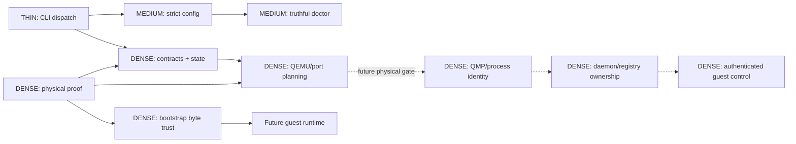
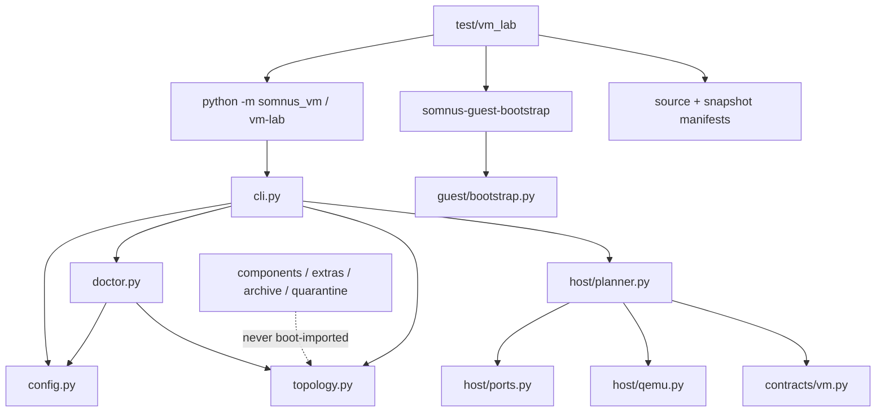

# VM Lab Cognitive Topology

**Extracted from:** snapshot `v0.1`, commit `a2c7b9d`, 2026-08-04  
**Language:** Python 3.12+, standard-library live runtime  
**Overall density:** DENSE at truth/ownership/security boundaries; THIN at CLI
dispatch and serialization

This document encodes the structure that must survive implementation changes.
For source navigation, use [`ARCHITECTURE_MAP.md`](ARCHITECTURE_MAP.md).

---

## Load-bearing concepts

### LBC 1: Promotion disposition is executable authority

**Definition:** A file's directory and registered disposition determine whether
it may participate in runtime. Only `src/somnus_vm/` is live in v0.1.

**Why load-bearing:** Importing candidate, cold, lineage, or quarantined code can
silently reintroduce duplicate supervisors, unsafe snapshot behavior, eager
dependencies, or synthetic success.

**Common misunderstanding:** “The implementation already exists under
`components/`, so wiring it is promotion.”

**Verification:** Compare imports against `src/somnus_vm/topology.py:48` and
prove that host boot reaches no non-live path.

### LBC 2: Planning is not lifecycle ownership

**Definition:** v0.1 may validate configuration, bind-check candidate ports, and
emit QEMU argv. It does not create state directories, reserve ports, create
images, start QEMU, or own lifecycle transitions.

**Why load-bearing:** Turning a planner into a launcher without a durable
single-owner daemon creates split authority across CLI processes and makes
recovery, leases, and process adoption incoherent.

**Common misunderstanding:** “A complete QEMU command means `start` is nearly
implemented.”

**Verification:** `src/somnus_vm/host/qemu.py:43` returns a frozen
`QemuLaunchPlan`; no host-planning call creates or mutates an external resource.

### LBC 3: Observed external truth owns success

**Definition:** Success comes from the nearest external authority: QMP
identity/status, authenticated guest protocol, durable registry ownership,
verified file hashes, observed process exit, or qcow2 backing-chain inspection.

**Why load-bearing:** Intention-derived state survives superficial tests while
lying about the machine.

**Common misunderstanding:** “PID alive + QMP socket exists + port accepts a
connection means this VM is ready.”

**Verification:** A future running state must correlate process start identity,
executable, command hash, VM UUID, QMP UUID, QMP status, and a stabilization
window. Guest-ready requires authenticated VM ID, boot ID, and protocol version.

### LBC 4: Host, guest, operator, and Artifact workers are separate authorities

**Definition:** Host code owns lifecycle; guest code owns in-guest control and
cognition; Kerminal/operator code owns agency; Artifact workers inspect and
transform disposable files outside the persistent AIPC.

**Why load-bearing:** Cross-imports create circular boot paths and second owners
for processes, state, or identity.

**Common misunderstanding:** “They are all Somnus runtime, so a shared package
can coordinate them directly.”

**Verification:** Host import succeeds without guest cognition or operator
modules. Guest import succeeds without registry, QMP, image, or lease modules.
Kerminal reaches the VM only through a stable client contract.

### LBC 5: Persistent AIPC identity includes storage lineage

**Definition:** An AIPC is a persistent full computer. Its identity spans VM ID,
disk ownership, active disk generation, state transitions, guest identity, and
recovery history—not one QEMU process.

**Why load-bearing:** Process-centric designs make restart adoption, snapshot
rollback, and destructive cleanup unsafe.

**Common misunderstanding:** “The VM is the QEMU PID; its disk is just a launch
argument.”

**Verification:** Future registry constraints must prevent duplicate VM IDs,
normalized names, writable disk paths, QMP sockets, and endpoint leases, while
reconciliation can distinguish stopped, running, crashed, foreign, stale, and
orphaned states.

### LBC 6: Bootstrap trust is a one-read byte contract

**Definition:** Each local payload has an exact byte size, unpacked size, SHA256,
archive type, and allowed source list. Bootstrap copies and hashes the source
once into a private path, then installs only from that verified copy.

**Why load-bearing:** Reopening the original path after validation restores a
TOCTOU window; permissive extraction restores traversal, link, device,
collision, and expansion attacks.

**Common misunderstanding:** “Checking a checksum before normal extraction is
equivalent.”

**Verification:** `src/somnus_vm/guest/bootstrap.py:336` materializes the private
verified copy; extractors reject every non-regular or ambiguous archive member
before placement.

### LBC 7: One-active-AIPC is policy, multi-VM isolation is correctness

**Definition:** Normal operation may allow one active AIPC, but implementation
must still allocate distinct state, storage, sockets, ports, and identities.

**Why load-bearing:** Encoding “one active VM” as global fixed resources makes
tests, recovery, imports, and future policy changes collide.

**Common misunderstanding:** “Because policy allows one, hard-coded ports and
paths are safe.”

**Verification:** Concurrent disposable declarations and allocations must
produce no duplicates even when policy later rejects the second activation.

---

## Interface map

### Inputs

| Input | Contract | Owner |
| --- | --- | --- |
| CLI argv | explicit subcommand and bounded values; no shell strings | `src/somnus_vm/cli.py` |
| Host TOML | strict types, resolved paths, no quarantined enablement | `src/somnus_vm/config.py` |
| VM definition | validated name, resources, absolute disk, state machine | `src/somnus_vm/contracts/vm.py` |
| Local guest payload | exact size/hash, safe name, bounded archive | `src/somnus_vm/guest/bootstrap.py` |
| Snapshot/source claims | immutable JSON and file hashes | `snapshots/`, `source-manifest.json` |

### Outputs

| Output | Guarantee | Non-guarantee |
| --- | --- | --- |
| Doctor report | read-only observed preflight with failure detail | host readiness when required checks fail |
| Topology report | registered placement/disposition | runtime promotion outside the registry |
| QEMU plan | deterministic shell-free argv and bounded paths | reserved ports or a running VM |
| Bootstrap result | verified local payload placement and idempotency state | network acquisition or arbitrary install commands |
| Proof bundle | exact harness observations for that run | untested future lifecycle capability |

### Future handoff contracts

- **Kerminal → control client → daemon:** operator intent enters through a stable
  protocol; Kerminal never constructs QEMU.
- **Daemon → QEMU/QMP:** daemon owns process and lifecycle truth.
- **Daemon → guest agent:** authenticated request/response with VM ID, boot ID,
  protocol version, bounds, and redaction.
- **Artifact worker → ingress manifest → guest:** only approved measured outputs
  cross the boundary.
- **VM-Go ↔ compatibility contract:** measured parity without repository merger.

---

## Complexity distribution



| Component | Density | Why |
| --- | --- | --- |
| `cli.py`, `__main__.py` | THIN | dispatch and presentation only |
| `config.py` | MEDIUM | strict types, path safety, component policy |
| `contracts/vm.py` | DENSE | legal state, identity, resource invariants |
| `host/ports.py` | DENSE | bind-check vs. durable lease distinction |
| `host/qemu.py` | DENSE | argv safety, networking, path delimiters |
| `doctor.py` | MEDIUM | observation classification; fail honesty |
| `guest/bootstrap.py` | DENSE | TOCTOU, archive safety, atomicity, recovery |
| `topology.py` | MEDIUM | runtime promotion authority |
| `test/vm_lab/test_vm_lab.py` | DENSE | semantic proof and false-success resistance |
| candidate/lineage trees | VARIABLE | evidence only until separately archaeologized |

---

## Dependency graph



The dotted edge is descriptive registration, not an import license.

---

## Baked-in decisions

1. The v0.1 host package is non-mutating.
2. The live runtime has no third-party dependencies.
3. QEMU argv is shell-free, non-daemonized, and uses JSON `-blockdev`.
4. Default network forwarding binds to `127.0.0.1`.
5. Plan-time ports are availability probes, not leases.
6. Guest bootstrap is local-payload-only and rejects arbitrary post-install work.
7. Snapshot and rollback APIs remain withheld after lineage showed backing-chain
   corruption risk.
8. VM-Go, Kerminal, guest cognition, and Artifact processors retain separate
   ownership.
9. Quarantine is one-way until a replacement passes its current gate.
10. Source preservation and snapshot manifests are immutable claims; state lives
    elsewhere.

---

## Anti-concepts

| Looks like it belongs | Actually does not | Why |
| --- | --- | --- |
| Container orchestration | Persistent AIPC lifecycle | AIPC identity and disk history outlive processes |
| QEMU command builder as supervisor | Planner only | no durable registry, adoption, or recovery owner |
| Libvirt-style `192.168.122.x` address | Current user-network forwarding | v0.1 exposes loopback host forwards |
| Open port as guest readiness | Authenticated guest protocol | wrong process can accept a connection |
| PID existence as VM identity | QMP + process identity correlation | PID reuse and daemonization invalidate it |
| Candidate module import | Promotion | provenance location is not runtime proof |
| Sleep-based benchmark | VM performance evidence | measures scheduler delay, not VM work |
| Passing doctor on missing metal | User friendliness | converts a truthful gate into false success |
| Warm-pool optimization | Current policy | one-active-AIPC first; isolation correctness remains |
| Cloud bootstrap convenience | v0.1 bootstrap | external acquisition is outside current trust boundary |

---

## Temporal structure

| Surface | Mutability | Change rule |
| --- | --- | --- |
| `src/somnus_vm/` | active | one gated implementation unit at a time |
| `test/vm_lab/` | active | grows with every promoted claim |
| `PLAN.md` | living authority | gates may strengthen; weakening requires decision record |
| `TASK.md` | volatile | exactly one current unit |
| `STATE.md` | volatile | exact current phase/unit/command/blocker/evidence only |
| `docs/plan-index.json` | living machine authority | every phase, dependency, gate, owner, status, and evidence path must validate |
| `CONTEXT.md` | living index | update when current architecture/state changes |
| `MEMORY.md` | append/curate | durable decisions and corrected history only |
| `PROVENANCE.md` | chronological | append factual decisions and sessions |
| `ARCHITECTURE_MAP.md` | living navigation | repair anchors after structural/line movement |
| `snapshots/v0.1/` | immutable | superseded by a new snapshot, never rewritten as task state |
| source archive mapping | immutable | every original remains represented once |

---

## Failure attractors

1. **Intent becomes state:** a method or log names a lifecycle action, so callers
   treat it as executed.
2. **Identity collapses to PID:** recovery signals or adopts a foreign process.
3. **Port availability becomes ownership:** parallel clients receive the same
   endpoint.
4. **Candidate gravity:** sophisticated preserved modules attract imports before
   their boundaries are repaired.
5. **Snapshot familiarity:** file-copy intuitions overwrite qcow2 chain rules.
6. **Doctor cosmetics:** expected environmental failures are softened until the
   report lies.
7. **Bootstrap convenience:** network/post-install functionality weakens the
   one-read payload contract.
8. **Evidence inflation:** a clean plan, schema, or smoke subcheck is described
   as real lifecycle completion.

Project-specific detection and recovery: [`FAILURE_GRAMMAR.md`](FAILURE_GRAMMAR.md).

---

## Config file spine

| File/surface | Present | Encodes |
| --- | --- | --- |
| `pyproject.toml` | yes | Python 3.12, two entrypoints, stdlib-only runtime |
| `configs/*.toml` | yes | host paths, QEMU profile, port intervals, component policy |
| `source-manifest.json` | yes | exact 33-file source preservation |
| `snapshots/v0.1/manifest.json` | yes | promoted capabilities, proof path, system hash |
| `AGENTS.md` | yes | repository operator kernel and navigation |
| `PLAN.md` | yes | full destination and physical gates |
| `STATE.md` | yes | current execution phase and exact unit |
| `docs/plan-index.json` | yes | strict phase DAG, owners, statuses, gates, and evidence |
| `.sovereign/` | yes | warm-state hint, topology fingerprint, golden paths |
| `.github/` | yes | event-driven integrity enforcement |
| `.codex/skills/vm-lab/` | yes | conditional repo skill router |
| `.codegraph/` | local/ignored | regenerable structural code index |
| `requirements*.txt` | yes | candidate/cold dependency evidence, not live boot deps |

---

## Topology verification

```bash
python scripts/verify_repository.py
PYTHONPATH=src python -m somnus_vm topology
PYTHONPATH=src python test/vm_lab/smoke.py
```

The first checks the living packet and fingerprint, the second checks the
machine-readable disposition registry, and the third proves current runtime
behavior. None substitutes for the others.
