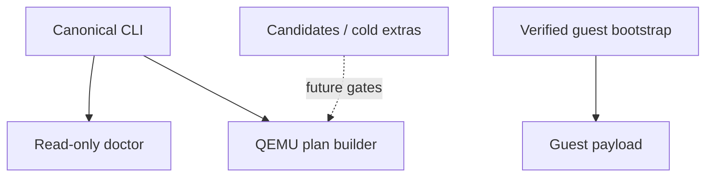

# VM Lab Reconstitution Audit

## Verdict

I like the experiment. The original selection is not random backend debris; it is a compressed three-runtime assembly:

1. host QEMU and image control;
2. persistent in-guest cognition and services;
3. an operator-facing shell and tool surface.

The old layout exposed that intuition but did not enforce it. Mixed imports, duplicate schemas, multiple supervisor owners, and fallback classes allowed each layer to impersonate the others. All 30 Python files compile, but the uploaded host backend cannot honestly run.

The correct v0.1 is therefore a reconstitution and proof boundary, not a fake “working VM” badge.

## Evidence that forced the cut

| Finding | Consequence | Decision |
| --- | --- | --- |
| QEMU used `-daemonize` while recording the launcher PID | pause and shutdown target the exited wrapper | withhold lifecycle; retain non-daemonized argv planning |
| every VM defaulted to ports 2222, 9901, and 5900 | second VM collides | bind-check candidates during planning; durable allocation awaits one owner |
| user networking was configured, then code fabricated `192.168.122.x` | guest-agent requests cannot reach the forwarded service | plan localhost host forwarding only |
| snapshot child was never activated; rollback copied child over its backing disk | chain corruption risk | snapshot API withheld |
| resource scaling returned true without applying anything | state lied about the machine | scaling API withheld |
| `vm_orchestrator.py` embedded fake sessions and logged package installs | orchestration reported work it did not perform | quarantine rather than wrap |
| `AIActionOrchestrator` constructed a second supervisor and called async creation synchronously | split state plus coroutine dereference | preserve as candidate lineage, not live host code |
| expected `somnus_agent.py` was absent | image provisioning cannot produce the documented guest | retain the protocol contract; do not expose readiness |
| digital-twin candidate lacked execute/write endpoints and recursively acquired its lock | monitor and host bridge cannot satisfy one another | no agent promotion |
| the only benchmark timed `asyncio.sleep` placeholders | published latency had no relation to VM work | quarantine; never treat as evidence |
| architecture report validated files absent from the archive | its 9/9 result described another tree | evidence quarantine |
| file-processing modules had no caller from the shell or backend | boot paid no current benefit | cold addon, disabled |

The final adversarial pass also rejected a first lifecycle draft created during reconstitution. It lacked a real-QMP gate for process identity, graceful shutdown, crash adoption, interprocess registry ownership, and guest-token provisioning. Rather than ship that draft, I removed `declare`, `start`, `ready`, `stop`, `list`, `reconcile`, and `destroy` from the promoted CLI.

## File-processing judgment

The file stack is worth retaining, especially `advanced_files.py`; its scientific, medical, geospatial, forensic, publishing, and industrial processors are the strongest capability material in that folder. It is not a runtime system yet.

The shell expects `FileUploadManager`, `IntelligentFileProcessor.start()`, and `queue_file()`. The archive provides a different `EnhancedFileUploadManager.upload_file_stream()` contract, an isolated persistent queue, a base processor library with no dispatcher, and semantic code that eagerly downloads NLP assets while performing synchronous work behind async methods. No repository caller imports `src/file_system` at all.

I therefore preserve universal and advanced processors under `extras/file_processing/processors/`. Enhanced ingress, the queue, the semantic facade, and the 3,569-line rewrite remain under `extras/file_processing/legacy/`. Setuptools packages only `src/`, and the live package has no loader into either directory.

## New executable boundary

The promoted host code describes a safe launch boundary but does not own a process yet. Guest bootstrap is separately executable and integrity-bound. The operator shell, guest cognition, file ingress, agent, image builder, and lifecycle owner remain outside boot.

## What is actually implemented

- one `VMState`, `VMDefinition`, `VMPorts`, and `VMRecord` contract authority;
- strict TOML config with absolute path resolution and install-safe per-user defaults;
- source-aware versus installed-runtime doctor behavior;
- bind-checked, explicitly non-reserved plan-time ports;
- fully structured QEMU argv without shell interpolation or daemonization;
- JSON `-blockdev` encoding that preserves comma-bearing disk paths;
- length validation for Linux QMP Unix-socket paths;
- localhost-only SSH and agent host-forward plans;
- hash-and-size-required local payload bootstrap with one-read private verification;
- ZIP/TAR traversal, link, device, and duplicate-destination rejection;
- bounded archive members/bytes, collision-free staging, and configuration-bound mode-0600 completion markers;
- a machine-readable topology containing live, candidate, cold, lineage, and quarantine surfaces;
- a source manifest proving all 33 uploaded files by SHA256;
- eleven direct integration checks, including a real wheel build, isolated install, and a 405-ID execution-plan contract.

## What I refuse to claim

I have not booted a VM in this environment. QEMU, `qemu-img`, KVM, and a base image are absent. I have not promoted persistent lifecycle, image building, a guest agent, memory/ASPS, shell, native tools, file processing, snapshots, or live resource changes. Plan-time ports are not reservations. A QMP path in argv is not a QMP handshake. Those distinctions are part of the interface.

## Next physical gate

The next promotion is one disposable cloud image on actual QEMU metal:

1. inspect the base and backing chain with `qemu-img info`;
2. create an instance overlay and prove cleanup on every failure edge;
3. serialize concurrent operators behind one daemon or interprocess transaction owner;
4. boot without daemonization, verify pidfile, complete the QMP handshake, and query UUID/status;
5. adopt the process after forced supervisor crashes at each lifecycle checkpoint;
6. provision a per-VM agent token and prove authenticated readiness on localhost forwarding;
7. execute an argv command and round-trip a bounded file;
8. stop through QMP/ACPI, reserve force-kill as an explicit separate action, and reconcile truth after restart;
9. only then add quiesced snapshot and rollback tests.

That sequence does not shrink the architecture. It gives the architecture a floor that cannot lie.
