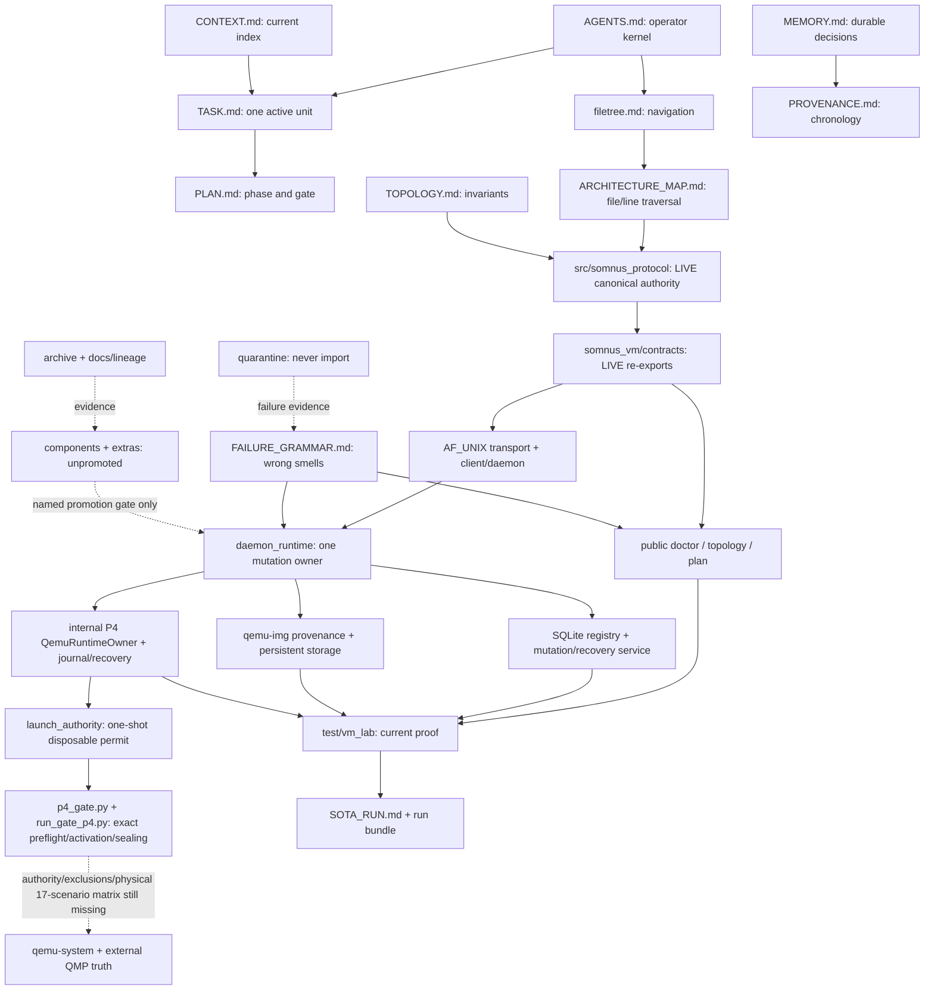

# VM Lab Living File Tree

**Root:** `vm-lab/`
**Baseline:** snapshot `v0.1` plus closed P1 protocol, P2 daemon/registry, and
P3 image/storage authority; internal P4 runtime implementation and its
fail-closed disposable launch-authority seam plus physical-gate coordinator are
live, all 18 bounded items are complete, and `GATE-P4` remains open pending the
exact authorized disposable-machine proof
**Entry:** [`AGENTS.md`](AGENTS.md) → [`TASK.md`](TASK.md) → one route below

This is a semantic navigation/dependency map, not an automatically generated
directory dump. Arrows show authority or consumption. Disposition labels tell
you whether a path may execute.

---

## Entry kit

| Need | Open | Then |
| --- | --- | --- |
| Operate in repository | [`AGENTS.md`](AGENTS.md) | [`TASK.md`](TASK.md) |
| Locate source owner | [`ARCHITECTURE_MAP.md`](ARCHITECTURE_MAP.md) | exact `file:line` anchor |
| Understand invariants | [`TOPOLOGY.md`](TOPOLOGY.md) | relevant interface/failure owner |
| Diagnose suspicious success | [`FAILURE_GRAMMAR.md`](FAILURE_GRAMMAR.md) | smallest discriminating observation |
| Reconstruct current state | [`CONTEXT.md`](CONTEXT.md) | current promoted source/proof |
| Externalize active observations/questions | [`NOTEPAD.md`](NOTEPAD.md) | move settled decision to canonical owner |
| Recover foundational intent | [`Somnus-Core-Ideals.md`](Somnus-Core-Ideals.md) | [`CONTEXT.md`](CONTEXT.md) → relevant gate |
| Resume P4 | [`TASK.md`](TASK.md) | [`STATE.md`](STATE.md) → `docs/plan-index.json` |
| Inspect protocol truth | [`src/somnus_protocol/`](src/somnus_protocol/) | direct P1 test module |
| Inspect daemon/registry truth | [`src/somnus_vm/daemon_runtime.py`](src/somnus_vm/daemon_runtime.py) | P2 owner tests |
| Inspect image/storage truth | [`src/somnus_vm/host/images.py`](src/somnus_vm/host/images.py) → [`src/somnus_vm/host/storage.py`](src/somnus_vm/host/storage.py) | focused P3 tests and fixture manifest |
| Inspect current proof | [`SOTA_RUN.md`](SOTA_RUN.md) | latest `test/vm_lab/runs/` bundle |
| Confirm point-in-time file presence | [`tree-codebase.md`](tree-codebase.md) | this map for authority |

---

## Dependency lanes



### Runtime flow

```text
pyproject entrypoint
  -> src/somnus_vm/cli.py
     -> config.py -> doctor.py / topology.py / host/planner.py
     -> somnus_vm/contracts compatibility imports
     -> src/somnus_protocol (canonical strict protocol)

somnus-vm-daemon internal entrypoint
  -> src/somnus_vm/daemon_runtime.py
     -> daemon.py -> transport.py (AF_UNIX + SO_PEERCRED)
     -> host/registry.py <-> host/service.py
     -> host/images.py -> host/exec_guard.py -> real qemu-img
     -> host/storage.py -> immutable base + owned sparse overlays
     -> host/qemu_runtime.py -> QMP/process/log/journal/recovery owners
        -> daemon Python-only activation seam (no public launch command)
        -> launch_authority.py -> one-shot fixture/production-bound permit
        -> p4_gate.py -> exact 17-scenario preflight/activation/checkpoint/recovery/sealing
        -> scripts/run_gate_p4.py (non-public operator driver)
        -> pin P3 overlay/base/marker descriptors
        -> host/qemu_exec_guard.py -> release-time metadata/hash fence
        -> two QEMU fdsets + four explicit block nodes
        -> QMP fdset/named-node/blockstats + peer /proc descriptor truth
        -> exact-child adoption/cleanup or durable orphan emergency

somnus-guest-bootstrap entrypoint
  -> src/somnus_vm/guest/bootstrap.py
     -> private verified bytes -> bounded extraction -> atomic staged target

test/vm_lab/smoke.py
  -> test/vm_lab/test_vm_lab.py
     -> direct protocol + CLI/package/config/planner/bootstrap/manifest evidence
     -> P2 transport/registry/daemon physical modules
     -> P3 core/adversarial/real-daemon storage modules
     -> P4 direct component modules + coordinator preflight (non-launch; gate remains open)
```

No candidate, lineage, cold, or quarantine path enters host boot. The canonical
protocol performs no boot or I/O at import. The public `vm-lab` CLI remains
non-mutating even though the separately composed internal daemon/registry/
storage owner and internal P4 runtime owner are live. No public command reaches
that launch path, and no current proof closes the disposable-machine gate.

---

## Physical tree with authority

### Repository control plane

```text
vm-lab/
├── AGENTS.md                    LIVE ENTRY — rules, boundaries, routes
├── filetree.md                  LIVE NAVIGATION — semantic ownership map
├── tree-codebase.md             POINT-IN-TIME INVENTORY — no promotion authority
├── ARCHITECTURE_MAP.md          LIVE TRAVERSAL — question -> file:line
├── TOPOLOGY.md                  LIVE COGNITION — invariants/interfaces/density
├── FAILURE_GRAMMAR.md           LIVE DIAGNOSIS — false-success taxonomy
├── CONTEXT.md                   LIVE INDEX — promoted architecture/state
├── NOTEPAD.md                   OPERATOR SCRATCH — unresolved observations
├── MEMORY.md                    DURABLE NOTES — decisions/rejections/lessons
├── TASK.md                      ACTIVE STATE — exactly one execution unit
├── STATE.md                     PHASE STATE — exact unit/command/blocker/evidence
├── PLAN.md                      EXECUTION AUTHORITY — full phases/gates
├── PROVENANCE.md                LINEAGE LEDGER — decisions and sessions
├── SCOPE.md                     IMPLEMENTATION SCOPE — WRAP/EDIT/COMPOSE
├── SNAPSHOT.md                  SNAPSHOT CLAIM — v0.1 boundary
├── SOTA_RUN.md                  PROOF LEDGER — latest sealed run pointer
├── Somnus-Core-Ideals.md        FOUNDATIONAL INTENT — governing product direction
└── README.md                    HUMAN OVERVIEW — promoted surface
```

### Live shared protocol — canonical P1 authority

- [`src/somnus_protocol/`](src/somnus_protocol/)
  - [`__init__.py`](src/somnus_protocol/__init__.py) → pure public contract
    root, exact exports, and root-public `ProtocolValidationError`
  - [`_validation.py`](src/somnus_protocol/_validation.py) → strict/bounded JSON
    and immutable validation primitives
  - [`version.py`](src/somnus_protocol/version.py) → semantic versions,
    same-ID pairwise offer/transcript negotiation, and independent
    current-package range/schema enforcement
  - [`vm.py`](src/somnus_protocol/vm.py) → immutable VM definitions, 16
    states/48 evidence-keyed edges, intent/identity binding, strict
    process-observation freshness, replay-resistant transition history,
    secret-free records, and exact DECLARED-only v0 migration
  - [`agent.py`](src/somnus_protocol/agent.py) → seven endpoint names and
    bounded health/command/file-write result contracts
  - [`control.py`](src/somnus_protocol/control.py) → correlated requests,
    successes with operation-owned machine bags, and registry-derived public
    errors with rigid diagnostic references
  - [`events.py`](src/somnus_protocol/events.py) → ordered events

This package is **LIVE** but owns no daemon/lifecycle action. It is the sole
schema authority; no host, guest, shell, or filesystem implementation belongs
inside it. Negotiation fingerprints are mismatch detectors, not authentication.
Generic request/success bags are authenticated bounded machine data, not
log-safe projections. P1 errors accept no caller prose or nonempty `details`.

### Live host and guest boundary

- [`src/somnus_vm/`](src/somnus_vm/)
  - [`__main__.py`](src/somnus_vm/__main__.py) → module entry
  - [`cli.py`](src/somnus_vm/cli.py) → `doctor`, `topology`, `plan` only
  - [`client.py`](src/somnus_vm/client.py) → internal identity-matched local
    control client; no lifecycle authority
  - [`config.py`](src/somnus_vm/config.py) → strict typed daemon/storage/network/
    agent/security/policy settings and profile roots
  - [`daemon.py`](src/somnus_vm/daemon.py) → private authenticated AF_UNIX
    listener and bounded dispatch shell
  - [`daemon_runtime.py`](src/somnus_vm/daemon_runtime.py) → executable
    single-owner composition of daemon, registry, service, storage, and the
    internal P4 runtime/recovery owner; Python-only activation hooks exercise
    the owner without widening the public CLI
  - [`doctor.py`](src/somnus_vm/doctor.py) → read-only host observations
  - [`topology.py`](src/somnus_vm/topology.py) → disposition registry
  - [`transport.py`](src/somnus_vm/transport.py) → bounded framing and Linux
    `SO_PEERCRED`
  - [`contracts/`](src/somnus_vm/contracts/)
    - [`__init__.py`](src/somnus_vm/contracts/__init__.py) → compatibility
      package projection; no schema definitions
    - [`vm.py`](src/somnus_vm/contracts/vm.py) → **compatibility re-exports**
    - [`agent.py`](src/somnus_vm/contracts/agent.py) → **compatibility re-exports**
  - [`host/`](src/somnus_vm/host/)
    - [`__init__.py`](src/somnus_vm/host/__init__.py) → deliberately exports only
      the non-mutating planning API
    - [`planner.py`](src/somnus_vm/host/planner.py) → non-mutating canonical
      record/QEMU-plan composition
    - [`ports.py`](src/somnus_vm/host/ports.py) → temporary bind-check only
    - [`qemu.py`](src/somnus_vm/host/qemu.py) → deterministic shell-free argv
      plus the existing two-fdset/four-node block-plan binder
    - [`qemu_runtime.py`](src/somnus_vm/host/qemu_runtime.py) → internal launch,
      QMP/process/disk observation, completion, and restart recovery owner
    - [`qemu_runtime_journal.py`](src/somnus_vm/host/qemu_runtime_journal.py) →
      frozen launch facts and durable checkpoint prefix
    - [`qmp.py`](src/somnus_vm/host/qmp.py) /
      [`qmp_identity.py`](src/somnus_vm/host/qmp_identity.py) → bounded QMP
      transport and machine-identity interpretation
    - [`qemu_process.py`](src/somnus_vm/host/qemu_process.py) /
      [`qemu_logs.py`](src/somnus_vm/host/qemu_logs.py) → exact process identity
      and bounded redacted log ownership
    - [`qemu_exec_guard.py`](src/somnus_vm/host/qemu_exec_guard.py) /
      [`qemu_log_guard.py`](src/somnus_vm/host/qemu_log_guard.py) → native target
      and log-guardian containment
    - [`launch_authority.py`](src/somnus_vm/host/launch_authority.py) → fail-closed,
      one-shot disposable-fixture permit and production-root exclusion fence;
      this is pre-launch safety, not physical gate closure
    - [`p4_gate.py`](src/somnus_vm/host/p4_gate.py) → non-public canonical
      17-scenario matrix specification/preflight, authorization, daemon
      activation, strict serial execution/resume, checkpoint/recovery,
      canonical QMP-history capture, and sealed-result validation; it is not
      public lifecycle authority
    - [`scripts/run_gate_p4.py`](scripts/run_gate_p4.py) → explicit operator
      `prepare-matrix`/`preflight-matrix`/`execute-matrix` driver; not installed
    - [`registry.py`](src/somnus_vm/host/registry.py) → schema-v3 single-writer
      SQLite records/resources/journal/migration authority
    - [`service.py`](src/somnus_vm/host/service.py) → serialized authenticated
      metadata/storage mutation, idempotency, checkpoints, and recovery
    - [`images.py`](src/somnus_vm/host/images.py) → strict qcow2 manifest and
      shell-free `qemu-img` provenance/inspection boundary
    - [`storage.py`](src/somnus_vm/host/storage.py) → immutable-base and
      independently owned sparse-overlay publication/reconciliation
    - [`exec_guard.py`](src/somnus_vm/host/exec_guard.py) → Linux parent-death
      containment for daemon-owned image subprocesses
  - [`guest/`](src/somnus_vm/guest/)
    - [`bootstrap.py`](src/somnus_vm/guest/bootstrap.py) → separate one-read
      verified installer

### Current proof — authoritative for promoted claims

- [`test/vm_lab/`](test/vm_lab/)
  - [`smoke.py`](test/vm_lab/smoke.py) → thin direct harness entry
  - [`test_vm_lab.py`](test/vm_lab/test_vm_lab.py) → consumed integration and
    installed-wheel aggregation
  - [`test_protocol_vm_primitives.py`](test/vm_lab/test_protocol_vm_primitives.py)
    → VM primitives strict boundary
  - [`test_protocol_agent.py`](test/vm_lab/test_protocol_agent.py) → agent
    endpoint/result protocol
  - [`test_protocol_control.py`](test/vm_lab/test_protocol_control.py) → control,
    pairwise negotiation/current enforcement, operation-owned machine bags,
    registry-derived errors, diagnostic references, events, public exports,
    and cold import
  - [`test_protocol_settings.py`](test/vm_lab/test_protocol_settings.py) → typed
    configuration/profile contract
  - [`test_protocol_host_consumption.py`](test/vm_lab/test_protocol_host_consumption.py)
    → planner/CLI consumption and secret absence
  - [`test_protocol_vm_lifecycle.py`](test/vm_lab/test_protocol_vm_lifecycle.py)
    → lifecycle/evidence/intent binding, equal/stale process-observation
    rejection, replay resistance, exact migration, and negative proof
  - [`test_daemon_transport_p2.py`](test/vm_lab/test_daemon_transport_p2.py) →
    bounded real AF_UNIX peers and exclusive daemon ownership
  - [`test_registry_p2.py`](test/vm_lab/test_registry_p2.py) → normalized SQLite
    ownership, schema/integrity/migration, and process-held writer locking
  - [`test_registry_service_p2.py`](test/vm_lab/test_registry_service_p2.py) →
    strict metadata mutations and abrupt-writer recovery
  - [`test_daemon_registry_p2.py`](test/vm_lab/test_daemon_registry_p2.py) →
    independent process races and real SIGKILL recovery at every P2 checkpoint
  - [`test_storage_p3.py`](test/vm_lab/test_storage_p3.py) → six core real-image
    cases, two independent sparse 100 GiB overlays, schema-v2-to-v3 storage
    migration, and seven base plus seven overlay kill checkpoints
  - [`test_storage_p3_adversarial.py`](test/vm_lab/test_storage_p3_adversarial.py)
    → eight foreign-adoption, alias/tamper, and parent-death cases
  - [`test_daemon_storage_p3.py`](test/vm_lab/test_daemon_storage_p3.py) → one
    real daemon/client storage and startup-reconciliation case
  - [`test_disposable_launch_authority_p4.py`](test/vm_lab/test_disposable_launch_authority_p4.py)
    → real-file fixture topology, marker, path-identity, production-exclusion,
    and one-shot permit denial proofs; it never launches QEMU
  - [`test_qemu_planning_p4.py`](test/vm_lab/test_qemu_planning_p4.py),
    [`test_qemu_runtime_p4.py`](test/vm_lab/test_qemu_runtime_p4.py),
    [`test_daemon_runtime_p4.py`](test/vm_lab/test_daemon_runtime_p4.py), and
    the other `test_*_p4.py` owners → direct P4 component proof; these modules
    do not launch a disposable QEMU machine or close `GATE-P4`
  - [`test_doctor_p4.py`](test/vm_lab/test_doctor_p4.py) → bounded no-launch
    interrogation of the selected QEMU's exact TCG/KVM option projection and
    fail-loud unavailable/rejecting/silent/output-flood behavior
  - [`fixtures/protocol/v0_vm_record.json`](test/vm_lab/fixtures/protocol/v0_vm_record.json)
    → exact legacy migration input
  - [`fixtures/images/ubuntu-minimal-noble-amd64-20260801.json`](test/vm_lab/fixtures/images/ubuntu-minimal-noble-amd64-20260801.json)
    → pinned qemu-img 8.2.2 manifest for SHA-256
    `b3064efb500d71d6ccbe619b1716062b803e285116e040627b430aaee14cced6`
  - [`runs/20260805T211740Z/`](test/vm_lab/runs/20260805T211740Z/) → sealed 26/26
    aggregate JSON/Markdown/log proof with zero failures and zero skips
  - [`runs/20260807T123747Z/`](test/vm_lab/runs/20260807T123747Z/) → historical
    aggregate: 40 pass, 0 fail, 0 skip after then-fixture restoration
  - [`runs/20260807T121437Z/`](test/vm_lab/runs/20260807T121437Z/) → historical
    36/4 missing-fixture setup evidence retained for provenance
  - [`runs/20260825T043503Z/`](test/vm_lab/runs/20260825T043503Z/) → current
    aggregate: 36 pass, 4 fail, 0 skip; exact fixture authority is absent; see
    [`SOTA_RUN.md`](SOTA_RUN.md)
- [`scripts/verify_repository.py`](scripts/verify_repository.py) → linked
  packet, anchors, fingerprint, JSON, and source-preservation integrity
- [`docs/decisions/0005-errors-and-exit-codes.md`](docs/decisions/0005-errors-and-exit-codes.md)
  → closed public error, private diagnostic-reference, generic machine-data,
  and exit-class decision

### Configuration spine — inputs, not lifecycle claims

- [`pyproject.toml`](pyproject.toml) → Python 3.12, stdlib runtime, entrypoints
- [`configs/lab.toml`](configs/lab.toml) → lab profile
- [`configs/host.toml`](configs/host.toml) → host profile
- [`configs/guest-bootstrap.example.toml`](configs/guest-bootstrap.example.toml)
  → local-only payload contract example
- [`requirements.txt`](requirements.txt) → live dependency record
- [`requirements-candidates.txt`](requirements-candidates.txt) → candidate-only
  dependencies
- [`requirements-file-processing.txt`](requirements-file-processing.txt) → cold
  file-processing dependencies

### Candidate surfaces — preserved, never boot-imported

- [`components/contracts/`](components/contracts/) → mixed original schemas;
  vocabulary/reference only, never canonical protocol authority
- [`components/host/vm_image_manager.py`](components/host/vm_image_manager.py)
  → image-manager donor
- [`components/guest/agent/digital_twin.py`](components/guest/agent/digital_twin.py)
  → digital-twin lineage candidate
- [`components/guest/runtime/`](components/guest/runtime/) → two memory owners,
  ASPS, ACE, and cache candidates
- [`components/operator/ai_advanced_shell.py`](components/operator/ai_advanced_shell.py)
  → advanced Kerminal/master-control candidate
- [`components/operator/ai_action_orchestrator.py`](components/operator/ai_action_orchestrator.py)
  → operator-host API lineage
- [`components/operator/native_tools/`](components/operator/native_tools/) →
  distinct browser/research/git candidate adapters

Promotion route: [`docs/MIGRATION_MAP.md`](docs/MIGRATION_MAP.md) → relevant
[`PLAN.md`](PLAN.md) gate → bounded new owner → actual consumer → physical proof.
No candidate becomes live by copy/import convenience.

### Cold, lineage, quarantine, and agent ecosystem

- [`extras/file_processing/`](extras/file_processing/) → cold disposable
  Artifact/file-processing lineage; outside host/AIPC boot.
- [`archive/`](archive/) and [`docs/lineage/`](docs/lineage/) → historical
  evidence; read via [`docs/RECONSTITUTION_AUDIT.md`](docs/RECONSTITUTION_AUDIT.md).
- [`quarantine/`](quarantine/) → rejected runtime/evidence; never import.
- [`.codex/skills/vm-lab/SKILL.md`](.codex/skills/vm-lab/SKILL.md) → conditional
  repository router.
- [`.sovereign/`](.sovereign/) → last-close hint, golden paths, topology hash,
  and canonical provenance link.
- [`.github/`](.github/) → repository integrity event enforcement and bounded
  GitHub-agent projection.

---

## Verification ownership

| Claim | Nearest verifier |
| --- | --- |
| Markdown owners/links and anchors | `python scripts/verify_repository.py` |
| Topology/session fingerprint agreement | `python scripts/verify_repository.py` |
| P1 schema roundtrip/rejection/migration | direct `test_protocol_*.py` owner |
| Pairwise negotiation versus current decoder support | `test_protocol_control.py` |
| Equal/stale active-process re-observation rejection | `test_protocol_vm_lifecycle.py` |
| Compatibility export identity | protocol control/agent/host-consumption checks |
| Protocol consumed by host/wheel | `PYTHONPATH=src python test/vm_lab/smoke.py` |
| Existing CLI/config/planner/bootstrap boundary | `PYTHONPATH=src python test/vm_lab/smoke.py` |
| P2 real transport/registry/daemon ownership and recovery | four focused `*_p2.py` modules above |
| P3 pinned image/overlay ownership, all 14 kill checkpoints, and adversarial recovery | `test_storage_p3.py` + `test_storage_p3_adversarial.py` |
| P3 real daemon/client storage composition | `test_daemon_storage_p3.py` |
| Closed aggregate boundary | `test/vm_lab/runs/20260805T211740Z/` — 26/26 |
| Host has usable QEMU/KVM/image | `python -m somnus_vm doctor --json` |
| Disposable launch permit rejects production/symlink/hardlink/mount escapes | `test_disposable_launch_authority_p4.py` |
| P4 coordinator matrix preflight/validation/denial | `test_p4_gate_coordinator.py` — 8/8; no QEMU launch |
| QEMU launch/QMP/guest readiness/public lifecycle works | P4 and later named physical `GATE-*`; unresolved now; coordinator and exact source exist, but authority/exclusions/17-scenario physical matrix are unconsumed |

## Maintenance contract

Update this map when an owner, dependency edge, promotion disposition, or
direct proof surface changes. Do not use generated inventory presence or a
passing structural verifier as proof that a physical VM capability exists.

After topology movement, the root execution owner recomputes the fingerprint,
runs repository integrity, the proportional consumed proof, and records the
factual state in the correct plan/task/provenance surfaces.
