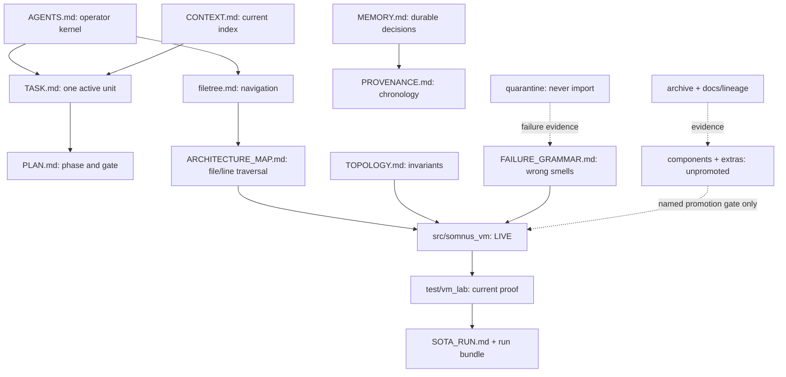

# VM Lab Living File Tree

**Root:** `vm-lab/`
**Baseline:** snapshot `v0.1`, commit `a2c7b9d`
**State:** CTMv3 living repository
**Entry:** [`AGENTS.md`](AGENTS.md) → [`TASK.md`](TASK.md) → one route below

This is a navigation and dependency map, not an automatically generated directory dump. Arrows show authority or consumption. Disposition labels tell you whether a path may execute.

---

## Entry kit

| Need | Open | Then |
| --- | --- | --- |
| Operate in the repository | [`AGENTS.md`](AGENTS.md) | [`TASK.md`](TASK.md) |
| Locate a source owner | [`ARCHITECTURE_MAP.md`](ARCHITECTURE_MAP.md) | exact `file:line` anchor |
| Understand invariants | [`TOPOLOGY.md`](TOPOLOGY.md) | relevant interface/failure owner |
| Diagnose suspicious success | [`FAILURE_GRAMMAR.md`](FAILURE_GRAMMAR.md) | smallest discriminating observation |
| Reconstruct current state | [`CONTEXT.md`](CONTEXT.md) | current promoted source/proof |
| Recover prior decisions | [`MEMORY.md`](MEMORY.md) | [`PROVENANCE.md`](PROVENANCE.md) if chronology matters |
| Resume work | [`TASK.md`](TASK.md) | relevant phase in [`PLAN.md`](PLAN.md) |
| Inspect snapshot claims | [`SNAPSHOT.md`](SNAPSHOT.md) | [`snapshots/v0.1/manifest.json`](snapshots/v0.1/manifest.json) |
| Inspect current proof | [`SOTA_RUN.md`](SOTA_RUN.md) | latest [`test/vm_lab/runs/`](test/vm_lab/runs/) bundle |
| Understand a source placement | [`docs/MIGRATION_MAP.md`](docs/MIGRATION_MAP.md) | registered disposition in `topology.py` |

---

## Dependency lanes



### Runtime flow

```text
pyproject entrypoint
  -> src/somnus_vm/cli.py
     -> config.py
     -> doctor.py -> topology.py
     -> host/planner.py -> host/ports.py + host/qemu.py + contracts/vm.py

somnus-guest-bootstrap entrypoint
  -> src/somnus_vm/guest/bootstrap.py
     -> private verified bytes -> bounded extraction -> atomic staged target

test/vm_lab/smoke.py
  -> test/vm_lab/test_vm_lab.py
     -> direct CLI/package/contracts/planner/bootstrap/manifest evidence
```

No arrow from candidate, lineage, cold, or quarantine paths enters live boot.

---

## Physical tree with authority

### Repository control plane

```text
vm-lab/
├── AGENTS.md                    LIVE ENTRY — rules, boundaries, routes
├── filetree.md                  LIVE NAVIGATION — this map
├── ARCHITECTURE_MAP.md          LIVE TRAVERSAL — question -> file:line
├── TOPOLOGY.md                  LIVE COGNITION — invariants/interfaces/density
├── FAILURE_GRAMMAR.md           LIVE DIAGNOSIS — false-success taxonomy
├── CONTEXT.md                   LIVE INDEX — current architecture/state
├── MEMORY.md                    DURABLE NOTES — decisions/rejections/lessons
├── TASK.md                      ACTIVE STATE — exactly one execution unit
├── PLAN.md                      EXECUTION AUTHORITY — full phases/gates
├── PROVENANCE.md                LINEAGE LEDGER — decisions and sessions
├── SCOPE.md                     IMPLEMENTATION SCOPE — WRAP/EDIT/COMPOSE
├── SNAPSHOT.md                  SNAPSHOT CLAIM — v0.1 boundary
├── SOTA_RUN.md                  PROOF LEDGER — latest sealed run pointer
└── README.md                    HUMAN OVERVIEW — promoted surface
```

Rendered links:

- [`AGENTS.md`](AGENTS.md)
- [`filetree.md`](filetree.md)
- [`ARCHITECTURE_MAP.md`](ARCHITECTURE_MAP.md)
- [`TOPOLOGY.md`](TOPOLOGY.md)
- [`FAILURE_GRAMMAR.md`](FAILURE_GRAMMAR.md)
- [`CONTEXT.md`](CONTEXT.md)
- [`MEMORY.md`](MEMORY.md)
- [`TASK.md`](TASK.md)
- [`PLAN.md`](PLAN.md)
- [`PROVENANCE.md`](PROVENANCE.md)
- [`SCOPE.md`](SCOPE.md)
- [`SNAPSHOT.md`](SNAPSHOT.md)
- [`SOTA_RUN.md`](SOTA_RUN.md)
- [`README.md`](README.md)

### Live runtime — promoted v0.1

- [`src/somnus_vm/`](src/somnus_vm/)
  - [`__main__.py`](src/somnus_vm/__main__.py) → module entry
  - [`cli.py`](src/somnus_vm/cli.py) → `doctor`, `topology`, `plan`
  - [`config.py`](src/somnus_vm/config.py) → strict TOML and installed defaults
  - [`doctor.py`](src/somnus_vm/doctor.py) → read-only host observations
  - [`topology.py`](src/somnus_vm/topology.py) → machine-readable disposition registry
  - [`contracts/`](src/somnus_vm/contracts/)
    - [`vm.py`](src/somnus_vm/contracts/vm.py) → identity, resources, state
    - [`agent.py`](src/somnus_vm/contracts/agent.py) → future guest response shapes
  - [`host/`](src/somnus_vm/host/)
    - [`planner.py`](src/somnus_vm/host/planner.py) → non-mutating preview orchestration
    - [`ports.py`](src/somnus_vm/host/ports.py) → temporary bind-check only
    - [`qemu.py`](src/somnus_vm/host/qemu.py) → deterministic shell-free argv
  - [`guest/`](src/somnus_vm/guest/)
    - [`bootstrap.py`](src/somnus_vm/guest/bootstrap.py) → separate one-read verified installer

### Current proof — authoritative for promoted claims

- [`test/vm_lab/`](test/vm_lab/)
  - [`smoke.py`](test/vm_lab/smoke.py) → thin direct harness entry
  - [`test_vm_lab.py`](test/vm_lab/test_vm_lab.py) → 11 current integration checks
  - [`runs/`](test/vm_lab/runs/) → timestamped JSON/Markdown/log evidence
- [`scripts/verify_repository.py`](scripts/verify_repository.py) → living-repository, link, fingerprint, anchor, JSON, and preservation integrity
- [`source-manifest.json`](source-manifest.json) → 33 original file hashes
- [`snapshots/v0.1/manifest.json`](snapshots/v0.1/manifest.json) → v0.1 system claim and proof path

### Configuration spine — inputs, not capability claims

- [`pyproject.toml`](pyproject.toml) → Python 3.12, stdlib runtime, two entrypoints
- [`configs/lab.toml`](configs/lab.toml) → lab profile
- [`configs/host.toml`](configs/host.toml) → host profile
- [`configs/guest-bootstrap.example.toml`](configs/guest-bootstrap.example.toml) → local-only payload contract example
- [`requirements.txt`](requirements.txt) → live boundary dependency record
- [`requirements-candidates.txt`](requirements-candidates.txt) → candidate-only dependencies
- [`requirements-file-processing.txt`](requirements-file-processing.txt) → cold file-processing dependencies

### Candidate surfaces — preserved, never boot-imported

- [`components/contracts/`](components/contracts/) → mixed original schemas
- [`components/host/vm_image_manager.py`](components/host/vm_image_manager.py) → image-manager donor
- [`components/guest/agent/digital_twin.py`](components/guest/agent/digital_twin.py) → guest-agent lineage candidate
- [`components/guest/runtime/`](components/guest/runtime/) → ACE, memory, prompts, cache candidates
- [`components/operator/`](components/operator/) → advanced shell and action-orchestrator candidates
- [`components/operator/native_tools/`](components/operator/native_tools/) → browser/search/git tool candidates

Promotion route:
[`docs/MIGRATION_MAP.md`](docs/MIGRATION_MAP.md) → [`MEMORY.md`](MEMORY.md) rejected paths → relevant [`PLAN.md`](PLAN.md) gate → bounded new owner → physical proof.

### Cold and legacy addons — explicit future adapter only

- [`extras/file_processing/processors/`](extras/file_processing/processors/) → useful cold processors
- [`extras/file_processing/sovereignty.py`](extras/file_processing/sovereignty.py) → policy lineage
- [`extras/file_processing/legacy/`](extras/file_processing/legacy/) → disconnected/eager legacy surfaces

These remain outside the AIPC and host boot.

### Lineage — historical intent, not current truth

- [`archive/lineage/host/vm_supervisor.py`](archive/lineage/host/vm_supervisor.py)
- [`archive/lineage/guest/vm_bootstrap.py`](archive/lineage/guest/vm_bootstrap.py)
- [`docs/lineage/somnus_vm_architecture.md`](docs/lineage/somnus_vm_architecture.md)
- [`docs/lineage/vm_architecture_iteration_2_additions.md`](docs/lineage/vm_architecture_iteration_2_additions.md)

Read through [`docs/RECONSTITUTION_AUDIT.md`](docs/RECONSTITUTION_AUDIT.md), not as direct implementation authority.

### Quarantine — never import

- [`quarantine/runtime/`](quarantine/runtime/) → duplicate/broken/simulated authorities
- [`quarantine/tests/benchmark_vm_system.py`](quarantine/tests/benchmark_vm_system.py) → synthetic sleep benchmark
- [`quarantine/evidence/vm_agent_integration_report.md`](quarantine/evidence/vm_agent_integration_report.md) → report for absent surfaces

Quarantine is failure evidence. Re-entry requires a replacement behind a current gate; moving a file is not promotion.

### Agent and automation ecosystem

- [`.codex/skills/vm-lab/SKILL.md`](.codex/skills/vm-lab/SKILL.md) → thin conditional repository router
- [`.sovereign/session_state.json`](.sovereign/session_state.json) → last-close hint
- [`.sovereign/golden_paths.json`](.sovereign/golden_paths.json) → known-good repository routes
- [`.sovereign/topology_fingerprint.txt`](.sovereign/topology_fingerprint.txt) → topology/map hash
- [`.sovereign/PROVENANCE.md`](.sovereign/PROVENANCE.md) → canonical provenance link
- [`.github/copilot-instructions.md`](.github/copilot-instructions.md) → bounded GitHub-agent context
- [`.github/instructions/live-runtime.instructions.md`](.github/instructions/live-runtime.instructions.md) → live-path rules
- [`.github/instructions/preserved-surfaces.instructions.md`](.github/instructions/preserved-surfaces.instructions.md) → non-live path rules
- [`.github/workflows/repository-integrity.yml`](.github/workflows/repository-integrity.yml) → push/PR/manual structural and v0.1 proof
- [`.pre-commit-config.yaml`](.pre-commit-config.yaml) → optional local structural gate

---

## Verification ownership

| Claim | Nearest verifier |
| --- | --- |
| Markdown owners and links exist | `python scripts/verify_repository.py` |
| Architecture anchors point inside files | `python scripts/verify_repository.py` |
| Topology and session fingerprint agree | `python scripts/verify_repository.py` |
| All 33 source files remain exact | repository verifier + smoke harness |
| Contract/config/planner/bootstrap/CLI work | `PYTHONPATH=src python test/vm_lab/smoke.py` |
| Installed wheel works outside checkout | smoke `check_wheel_runtime` |
| Host has usable QEMU/KVM/image | `python -m somnus_vm doctor --json` |
| Real VM lifecycle works | future named physical `GATE-*`; currently unresolved |

---

## Maintenance contract

Update this map when a file is added, moved, removed, promoted, demoted, or given a new dependency edge. Do not rewrite it for internal refactors that leave navigation and ownership unchanged.

After topology movement:

```bash
python scripts/verify_repository.py --write-fingerprint
python scripts/verify_repository.py
```

Then append the factual change to [`PROVENANCE.md`](PROVENANCE.md). If consumed runtime changed, run the proportional focused check and the full v0.1 smoke proof.
